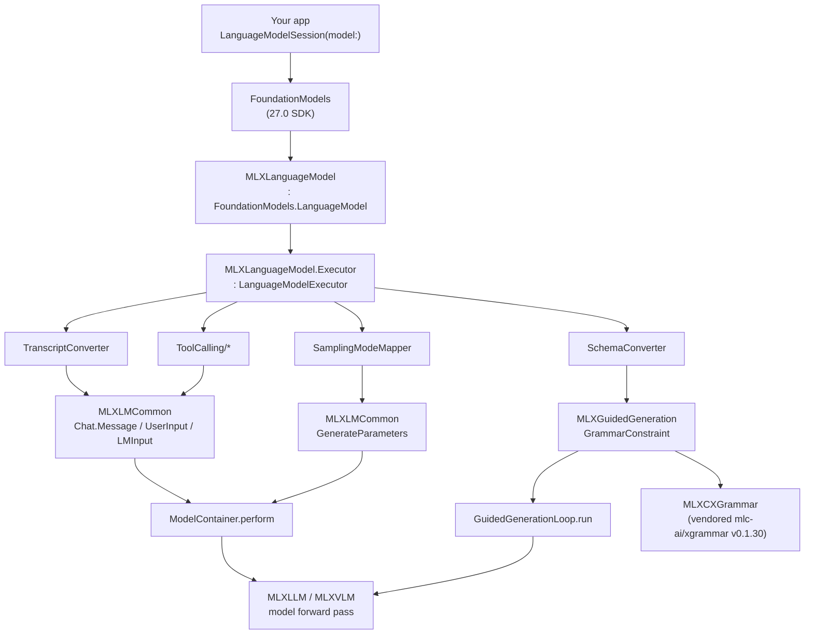
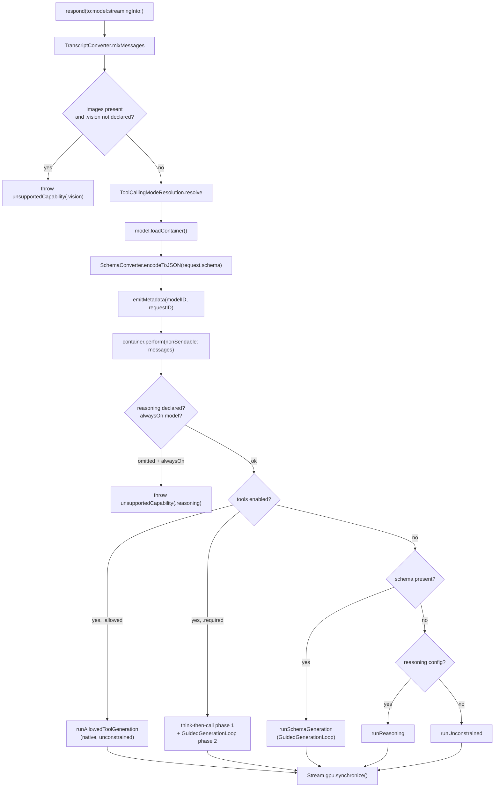

# MLXFoundationModels and MLXGuidedGeneration: backing `LanguageModelSession` with an MLX model

**Part 13 · MLX in Swift · Reference 03**

---

## Where is `MLXFoundationModels`? (Answer first.)

On 2026-06-27 a developer opened Apple Developer Forums thread **836264**, titled *"Bring an LLM
provider to the Foundation Models, missing MLX dependencies."* They had watched WWDC26 session 339
(*"Bring an LLM provider to the Foundation Models framework"*), seen `import MLXFoundationModels` on
a slide, and gone looking for it. Their words, as captured in our forum notes: *"Where is this
framework, there are no BETA branches on the MLX framework either."*

Here is the answer, stated plainly, because it is the single most useful paragraph in this guide:

> **`MLXFoundationModels` is not a framework. It is not an Apple SDK module, it is not something you
> add in the Xcode "Frameworks, Libraries, and Embedded Content" pane, and there is no beta branch to
> check out.** It is a **library target inside the `ml-explore/mlx-swift-lm` Swift package**, at the
> path `Libraries/MLXFoundationModels`, exposed as the SwiftPM product `MLXFoundationModels`. You get
> it by adding `https://github.com/ml-explore/mlx-swift-lm` as a package dependency and listing that
> product on your target. It compiles **only** when you build against the **macOS / iOS / visionOS
> 27.0 SDK** — on the 26 SDK the entire target compiles down to an empty module and every symbol in
> it vanishes, which is exactly what "I can't find it" feels like from the outside.

✅ **VERIFIED.** `Package.swift:15-43` declares nine library products, `MLXFoundationModels` among
them; `Package.swift:243-262` defines the target at `path: "Libraries/MLXFoundationModels"`. The
target's own `README.md:3` opens: *"An MLX adapter conforming to Apple's
`FoundationModels.LanguageModel`. It provides `MLXLanguageModel` (analogous to
`SystemLanguageModel`), usable directly with `LanguageModelSession`, so existing FoundationModels
code (guided `@Generable` output, tool calling, streaming) works unchanged. **Requires the
macOS/iOS/visionOS 27.0 SDK.**"* All read this session from the clone at commit `3cbf928`.

✅ **VERIFIED (forum).** An Apple **Engineer/DTS** answered thread 836264 with: *"This is being
introduced to `mlx-swift-lm` in **PR#334** (see here:
https://github.com/ml-explore/mlx-swift-lm/pull/334)."* That PR is now merged — it is commit
`f1573a9`, *"Add MLXFoundationModels: an MLX-backed FoundationModels LanguageModel (#334)"*. On a
separate thread (831197) an Apple Designer said only: *"I would suggest heading over to
https://github.com/ml-explore/mlx-swift-lm to see if that package has what you're looking for."*
Neither answer names the target path or the SDK gate, which is why the confusion outlived the reply.
Source: `notes/forums/forum-pain-points.md` §3.27.

The rest of this guide is the long version of that paragraph, plus the two things that make the
adapter worth reading even if you never ship an MLX model: it is **the most readable complete
implementation of the `LanguageModel` / `LanguageModelExecutor` protocol pair that exists**, and it
ships **`MLXGuidedGeneration`**, the grammar-constrained decoder that makes `@Generable` work against
a model Apple never saw.

---

## Version floor

- **`MLXFoundationModels` requires the iOS 27.0 / macOS 27.0 / visionOS 27.0 SDK to compile**, and
  every public symbol it exports is annotated `@available(iOS 27.0, macOS 27.0, visionOS 27.0, *)`.
  Two independent gates, and you need both. ✅ VERIFIED (`MLXLanguageModel.swift:3-12`, `:344`).
- **`MLXGuidedGeneration` has no such floor.** It is a standalone target with *"no FoundationModels
  coupling and no `@available` floor beyond the package's macOS 14 / iOS 17 minimum"* — quoted from
  the comment above its target declaration, `Package.swift:232-239`. Its README repeats it: *"It
  works with any MLX language model and runs on macOS 14 / iOS 17 and later."* This split matters:
  you can have grammar-constrained JSON on iOS 17 without touching Foundation Models at all.
- **Package floor**: `swift-tools-version: 6.1`; `platforms: [.macOS(.v14), .iOS(.v17), .tvOS(.v17),
  .visionOS(.v1)]`. ✅ VERIFIED `Package.swift:1-68`.
- **Package version**: this is the **3.x** line. The recommended consumer pin, from the repo's own
  README, is `.upToNextMajor(from: "3.31.3")`.
- **Everything below was read from the clone at HEAD `3cbf928b5eb24190e8952725699ae6a3bb02824d`**
  ("Integration tests: build on both macOS 26 and 27 SDKs (#464)", authored 2026-07-24 by an
  apple.com address), in this session. That is the strongest evidence class available for this
  material — shipping source you can `git checkout` — and it outranks the WWDC narration everywhere
  the two disagree. Where they disagree, this guide says so.

⚠️ **`@available` alone will not save you.** This is stated in the adapter's own header comment and
it is the number-one packaging mistake for consumers: *"A plain `canImport(FoundationModels)` is
insufficient — the module also ships in 26 — and `@available` cannot help, since it gates **runtime**
availability, not the **compile-time** presence of a symbol in the SDK."*
(`MLXLanguageModel.swift:8-11`.) Your own call sites need `#if canImport(FoundationModels,
_version: 2)`, not just `if #available(...)`.

---

## What this covers

1. **The two gates** — the `FoundationModelsIntegration` SwiftPM trait and
   `canImport(FoundationModels, _version: 2)` — and the four-cell matrix of what you get.
2. **Both construction paths**, complete and copyable: the `#huggingFaceLanguageModel` macro, and
   the direct `MLXLanguageModel(configuration:capabilities:configurationResolver:weightsLocation:load:)`
   initializer the macro expands into.
3. **Capabilities** — the four cases, what each actually switches on inside the executor, and why
   the adapter refuses to infer them.
4. **Availability, preload, prewarm, eviction** — the model-cache actor, the `.downloading` state,
   and the disk-space pre-flight.
5. **A file-by-file walk of the implementation**, because the file layout maps one-to-one onto the
   protocol's demands. This is the concrete companion to
   [Part 4 guide 3](https://github.com/hbmartin/Foundation-Models-and-Core-AI-and-MLX-skills/blob/main/guides/part-04-beyond-the-built-in-model/references/03-authoring-a-languagemodel-provider.md),
   which teaches the protocol abstractly.
6. **`MLXGuidedGeneration`** — how a JSON Schema becomes a token mask, the zone-based budget policy,
   fast-forward tokens, and the standalone API you can use without Foundation Models.
7. **The convergent design**: Apple's own `apple/coreai-models` and `ml-explore/mlx-swift-lm`
   independently chose the same third-party library — `mlc-ai/xgrammar` — for constrained decoding.
   Two teams, one answer, documented in no Apple material.
8. **The architectural constraint that follows**: constrained decoding needs engine logits, and
   GPU-pipelined Core AI bundles never expose them.
9. **Failure modes**, including six silent ones, and the SDK-drift log from the 27 betas.

## What this does *not* cover

- **The `LanguageModel` protocol itself** — its members, the executor store, the generation channel,
  the request type. That is
  [Part 4 guide 3](https://github.com/hbmartin/Foundation-Models-and-Core-AI-and-MLX-skills/blob/main/guides/part-04-beyond-the-built-in-model/references/03-authoring-a-languagemodel-provider.md)
  and [Part 4 guide 4](https://github.com/hbmartin/Foundation-Models-and-Core-AI-and-MLX-skills/blob/main/guides/part-04-beyond-the-built-in-model/references/04-executor-lifecycle-and-kv-reuse.md).
  This guide assumes you know what `respond(to:model:streamingInto:)` is for and shows you a real one.
- **MLX generation, tool-call formats, KV caches, `ChatSession`.** That is
  [Part 13 guide 2](02-generation-tools-and-caching.md). This guide sits on top of it and cross-refers.
- **Package setup, concurrency, wired memory, media input.** [Part 13 guide 1](01-mlx-swift-lm-in-an-app.md).
- **Core AI's own guided decoding.** [Part 7 guide 4](https://github.com/hbmartin/Foundation-Models-and-Core-AI-and-MLX-skills/blob/main/guides/part-07-coreai-swift-runtime/references/04-bundles-engines-and-guided-decoding.md).
  Referenced here only for the convergence and the logits constraint.

## What you need

- **Xcode 27** (or any toolchain shipping the 27.0 SDK). On Xcode 26 the package still builds — the
  adapter just isn't in it.
- **Apple silicon.** `MLXLanguageModel.availability` returns `.unavailable(.deviceNotCapable)` when
  `MTLCreateSystemDefaultDevice()` is nil. ✅ VERIFIED `MLXLanguageModel+Availability.swift:169-171`.
- **Three packages**, not one, if you take the macro path: `mlx-swift-lm`,
  `huggingface/swift-huggingface`, `huggingface/swift-transformers`. The 3.x redesign removed the
  tokenizer and downloader dependencies from the package itself; you supply them.
- **`MLXLLM` linked into your own target.** `MLXFoundationModels` deliberately does not depend on it.
  Skip this and you get `ModelFactoryError.noModelFactoryAvailable` at load, before the network is
  ever touched. (§3.3.)
- Roughly 500 MB–5 GB of disk per model, depending on what you point it at.

---

## Contents

- [§1 · The two gates, and the four-cell matrix](#1--the-two-gates-and-the-four-cell-matrix)
- [§2 · What the adapter is, in one diagram](#2--what-the-adapter-is-in-one-diagram)
- [§3 · Package setup, complete](#3--package-setup-complete)
- [§4 · Construction path A: the `#huggingFaceLanguageModel` macro](#4--construction-path-a-the-huggingfacelanguagemodel-macro)
- [§5 · Construction path B: the direct initializer](#5--construction-path-b-the-direct-initializer)
- [§6 · Capabilities: four cases, all load-bearing](#6--capabilities-four-cases-all-load-bearing)
- [§7 · Availability, preload, prewarm, eviction](#7--availability-preload-prewarm-eviction)
- [§8 · Walking the implementation](#8--walking-the-implementation)
- [§9 · `MLXGuidedGeneration`: from JSON Schema to token mask](#9--mlxguidedgeneration-from-json-schema-to-token-mask)
- [§10 · The convergent design: two teams, one xgrammar](#10--the-convergent-design-two-teams-one-xgrammar)
- [§11 · The constraint: guided generation needs logits](#11--the-constraint-guided-generation-needs-logits)
- [§12 · Failure modes, including six silent ones](#12--failure-modes-including-six-silent-ones)
- [§13 · The 27-beta SDK-drift log](#13--the-27-beta-sdk-drift-log)
- [§14 · Gaps, and what would close them](#14--gaps-and-what-would-close-them)
- [§15 · Source inventory](#15--source-inventory)

---

## 1 · The two gates, and the four-cell matrix

Every file in `Libraries/MLXFoundationModels` opens with the same two lines and closes with their
matching `#endif`s. Here is the top of `MLXLanguageModel.swift`, verbatim and complete, because the
comment between them is the best explanation of the design that exists anywhere:

```swift illustrative
// Copyright © 2026 Apple Inc.

#if FoundationModelsIntegration
// `_version: 2` gates on the FoundationModels *framework* major version, which
// is 1.4.x on the macOS/iOS 26 SDK and 2.0.x on 27. The third-party-model
// surface this adapter uses (`LanguageModel`, `LanguageModelCapabilities`, the
// generic `LanguageModelSession(model:)` init) only exists on the 27 SDK, so
// this excludes the whole adapter from older SDKs where those symbols are
// absent. A plain `canImport(FoundationModels)` is insufficient — the module
// also ships in 26 — and `@available` cannot help, since it gates runtime
// availability, not the compile-time presence of a symbol in the SDK.
#if canImport(FoundationModels, _version: 2)

import Foundation
import FoundationModels
import MLXLMCommon
import MLX
import os.log
import MLXGuidedGeneration
```

✅ **VERIFIED** — `Libraries/MLXFoundationModels/MLXLanguageModel.swift:1-19`, read in full this
session.

Three facts fall out of those eleven lines, and each one is worth its own paragraph.

**The FoundationModels module ships in *both* SDKs.** It is version **1.4.x** on 26 and **2.0.x** on
27. So `canImport(FoundationModels)` — the check almost everyone writes first — is **true on iOS 26**
and tells you nothing. `_version: 2` is the discriminator, and it discriminates on the *framework*
version, not the OS version.

**`@available` is the wrong tool and the comment says why.** `@available` is a *runtime* gate: it
tells the compiler "this symbol exists in the SDK, but don't call it on old OSes." It cannot express
"this symbol does not exist in the SDK I am compiling against." When the symbol is absent, you get a
compile error, and no amount of `if #available` will suppress it. This is the distinction that trips
up consumers who dutifully wrap their call sites in `if #available(iOS 27.0, *)` and then discover
their CI runner on Xcode 26 still fails to build.

**The trait is the outer gate.** `FoundationModelsIntegration` is the package's only SwiftPM trait,
and it is on by default. Its declaration carries the rationale (`Package.swift:76-92`, verbatim):

```swift illustrative
    traits: [
        // Gates the MLXLanguageModel adapter for Apple's FoundationModels
        // framework. Default-on. Disabling the trait compiles MLXFoundationModels
        // to an empty library: the entire `MLXLanguageModel` / `MLXLanguageModel.Executor`
        // surface requires FoundationModels types that are not available on platforms
        // older than iOS/macOS/visionOS 27.0, and the MLXDownloadProgress observable
        // (whose only producer is that adapter) is gated alongside it. Consumers
        // targeting older OS versions can still use this package for MLXLLM /
        // MLXLMCommon / MLXEmbedders etc. by turning the trait off.
        .trait(
            name: "FoundationModelsIntegration",
            description:
                "Enables the MLXLanguageModel adapter for Apple's FoundationModels framework. Disabling removes the MLXLanguageModel / MLXLanguageModel.Executor types."
        ),
        .default(enabledTraits: ["FoundationModelsIntegration"]),
    ],
```

### 1.1 The matrix

The target's own README states the four cells (`Libraries/MLXFoundationModels/README.md:92-96`,
reproduced verbatim):

| Trait | SDK | What you get |
|---|---|---|
| On (default) | 27.0 | The full `MLXLanguageModel` adapter bridging to `FoundationModels.LanguageModel`. |
| On (default) | Older | Nothing; the adapter (and its download-progress observable) is compiled out. |
| Off (`.disableDefaultTraits`) | Any | Nothing compiled in. Use this for iOS-17-era consumers that want `MLXLLM` / `MLXLMCommon` without the adapter. |

The fourth cell — trait off, 27 SDK — collapses into row three: the trait is the outer `#if`, so
turning it off removes the adapter regardless of SDK.

There is a repo test that pins this. `Tests/MLXFoundationModelsTests/TraitMatrixTests.swift` is
structured so that *compiling* it under a given trait state is the assertion:

```swift illustrative
// Copyright © 2026 Apple Inc.
//
// TraitMatrixTests: symbol-surface + behavioral checks across the
// `FoundationModelsIntegration` trait, the package's only trait.
//
// Each `#if` block below is active for exactly one trait state. Successfully
// compiling this file under a given trait set is the primary structural
// assertion: the test bodies reference the symbols that must be present.
//
// The `FoundationModelsIntegration`-on arm additionally requires
// `canImport(FoundationModels, _version: 2)`: the adapter surface
// (`MLXLanguageModel` et al.) only exists on the 27 SDK, so on the 26 SDK that
// arm compiles to nothing even when the trait is on. Guided generation is no
// longer trait-gated: whenever the adapter exists, the engine is present.

#if FoundationModelsIntegration && canImport(FoundationModels, _version: 2)
@Test("FM on: MLXLanguageModel + guided-generation primitives compile")
func fmOnSurface() {
    guard #available(iOS 27.0, macOS 27.0, visionOS 27.0, *) else { return }
    _ = MLXLanguageModel.self
    _ = MLXLanguageModel.Executor.self
    _ = GuidedGenerationLoop.self
    _ = GrammarConstraint.self
    _ = MLXDownloadProgress.self
}
#endif
```

✅ **VERIFIED** — `Tests/MLXFoundationModelsTests/TraitMatrixTests.swift:1-41`. Note the last line of
the header comment: *"Guided generation is no longer trait-gated: whenever the adapter exists, the
engine is present."* The `MLXGuidedGeneration` **dependency** of the adapter target is
trait-conditional (`Package.swift:250-253`, `.condition: .when(traits: ["FoundationModelsIntegration"])`),
but `MLXGuidedGeneration` itself is an unconditional product you can depend on directly.

### 1.2 Turning the trait off

```swift illustrative
// In a consumer Package.swift — iOS 17 target that wants MLX but not the FM adapter.
dependencies: [
    .package(
        url: "https://github.com/ml-explore/mlx-swift-lm",
        .upToNextMajor(from: "3.31.3"),
        traits: [.defaults]      // or omit `traits:` entirely for the default set
    ),
]
```

🟡 **RECONSTRUCTED** — the *spelling* of trait-disabling syntax in a consumer manifest. The repo
documents the effect (`.disableDefaultTraits` in the README table) but the clone contains no consumer
manifest that actually disables it, so the exact SwiftPM argument label above is inferred from the
declared trait name and the README's parenthetical. The **behaviour** is ✅ VERIFIED; the *syntax* is
not. If you need this, check `swift package --help` on your toolchain rather than trusting the line
above.

### 1.3 What CI does about it, and why you should copy it

The repo's own integration-test workflow has to run on machines that may or may not have Xcode 27.
Its solution is worth stealing verbatim (`.github/workflows/integration_tests.yml:21-42`):

```bash
dev=""
for app in /Applications/Xcode_27*.app /Applications/Xcode-27*.app /Applications/Xcode.app; do
  [ -d "$app" ] || continue
  v=$("$app/Contents/Developer/usr/bin/xcodebuild" -version 2>/dev/null | head -1)
  case "$v" in "Xcode 27"*) dev="$app/Contents/Developer" ;; esac
  [ -n "$dev" ] && break
done
if [ -n "$dev" ]; then
  echo "DEVELOPER_DIR=$dev" >> "$GITHUB_ENV"
else
  echo "FoundationModels tests will be compiled out (macOS 27 SDK required)."
fi
```

✅ **VERIFIED.** The commit that introduced it, `3cbf928` (the current HEAD), explains the failure it
fixes, verbatim from the commit message:

> The nightly IntegrationTesting job failed to compile on the Xcode 26.5 runner: the FoundationModels
> adapter (MLXFoundationModels) is gated behind `canImport(FoundationModels, _version: 2)` (macOS 27
> SDK only), but the integration test files gated only on the always-set FoundationModelsIntegration
> trait, so they referenced symbols absent on the 26 SDK.
>
> - Extend the 37 FoundationModels-gated test files' top-level guard to
>   `'#if FoundationModelsIntegration && canImport(FoundationModels, _version: 2)'`, mirroring the
>   library so they compile out on the 26 SDK and stay active on 27.

**Thirty-seven files.** That is the size of the mistake if you gate only on the trait. The trait is
"always set" — it is on by default and nobody turns it off — so gating on it alone is equivalent to
not gating at all.

One more CI detail with a consumer lesson in it: `scripts/verify-docs.sh` **filters
`MLXFoundationModels` out** of the DocC generation list, with the comment *"gated on the
FoundationModels v2 SDK, so its DocC catalog can't be verified on SDKs that lack it."* And `.spi.yml`
lists `documentation_targets: [MLXLLM, MLXVLM, MLXLMCommon, MLXEmbedders]` — **neither
`MLXFoundationModels` nor `MLXGuidedGeneration` is in the Swift Package Index documentation set.**
✅ VERIFIED. That is a second, quieter reason thread 836264 happened: there is no rendered API
reference for this target on the usual sites. The source and its doc comments are the documentation.

---

## 2 · What the adapter is, in one diagram



Read that as three layers of translation:

1. **Transcript in, prompt out.** `TranscriptConverter` turns Foundation Models' `Transcript.Entry`
   values into MLX's `Chat.Message` values, which the model's own `UserInputProcessor` then renders
   through the model's own chat template.
2. **Options in, sampler out.** `SamplingModeMapper` and `ToolCallingModeResolution` turn
   `GenerationOptions` into `GenerateParameters` and a routing decision.
3. **Schema in, mask out.** `SchemaConverter` turns a `GenerationSchema` into JSON Schema text or an
   xgrammar structural tag; `MLXGuidedGeneration` compiles that into a grammar and masks the logits.

Everything else — the model cache, availability, download progress — is plumbing around those three.

### 2.1 The one-line version, from the README

```swift prelude:external-module
import Foundation
import FoundationModels
import HuggingFace
import MLXFoundationModels
import MLXHuggingFace
import MLXLLM
import MLXLMCommon
import Tokenizers

if #available(iOS 27.0, macOS 27.0, visionOS 27.0, *) {
    let model = #huggingFaceLanguageModel(
        configuration: LLMRegistry.qwen3_0_6b_4bit,
        capabilities: [.reasoning])
    let session = LanguageModelSession(model: model)

    let answer = try await session.respond(
        to: "I have three hours near the Loop in Chicago. Is the Art Institute or the Field Museum the better use of my time?")
    print(answer.content)
}
```

✅ **VERIFIED** — `Libraries/MLXFoundationModels/README.md:9-29`, verbatim including the import block
and the prompt. Eight imports for two statements. That is not an accident and §3.2 explains it.

### 2.2 What "works unchanged" actually means

The README's claim is that *"existing FoundationModels code (guided `@Generable` output, tool
calling, streaming) works unchanged."* Reading the executor, that claim holds with three asterisks,
all of which are covered later in this guide:

| Feature | Works? | Caveat |
|---|---|---|
| `session.respond(to:)` | ✅ | — |
| `session.respond(to:generating:)` with `@Generable` | ✅ | Requires `.guidedGeneration` declared; §6.1 |
| `session.streamResponse(to:)` | ✅ | Streaming is per-detokenized-chunk, `tokenCount: 1` per event; §8.7 |
| `Tool` calling | ✅ | Multi-round since `#456`; `.required` mode goes through the grammar; §8.5 |
| Reasoning traces | ✅ | Requires `.reasoning` declared *and* a model whose config the factory recognises; §8.4 |
| Image attachments | ✅ | Requires `.vision` declared **and** a VLM-capable model; §6.4 |
| **Usage reporting** | ❌ **on this SDK** | Deliberately not forwarded. §12.2 — this is a silent failure. |
| Dynamic Profiles | 🔴 GAP | Session 339 claims the protocol gets you these; nothing in this adapter references them. §14 |

---

## 3 · Package setup, complete

### 3.1 `Package.swift`

The 3.x line decoupled `mlx-swift-lm` from the Hugging Face ecosystem. `Package.swift:98-104` has
exactly two dependencies — `mlx-swift` and `swift-syntax` — and *"there is no dependency on
swift-transformers / swift-huggingface"*, because in 3.x the tokenizer and downloader are protocols
**you** supply. The consequence is that a working consumer manifest lists three packages, not one.
Here is the canonical block, ✅ VERIFIED verbatim from the repo root `README.md:63-100`, with the
`MLXFoundationModels` product added (the root README's block is the non-FM quick start):

```swift prelude:external-module
// swift-tools-version: 6.1
import PackageDescription

let package = Package(
    name: "YourApp",
    platforms: [.iOS(.v17), .macOS(.v14)],
    dependencies: [
        .package(url: "https://github.com/ml-explore/mlx-swift-lm", .upToNextMajor(from: "3.31.3")),
        .package(url: "https://github.com/huggingface/swift-huggingface", from: "0.9.0"),
        .package(url: "https://github.com/huggingface/swift-transformers", from: "1.3.0"),
    ],
    targets: [
        .target(
            name: "YourTargetName",
            dependencies: [
                .product(name: "MLXLLM", package: "mlx-swift-lm"),
                .product(name: "MLXLMCommon", package: "mlx-swift-lm"),
                .product(name: "MLXHuggingFace", package: "mlx-swift-lm"),
                .product(name: "MLXFoundationModels", package: "mlx-swift-lm"),
                .product(name: "HuggingFace", package: "swift-huggingface"),
                .product(name: "Tokenizers", package: "swift-transformers"),
            ]),
    ])
```

✅ VERIFIED for the three dependency URLs, the version floors, and five of the six products (root
`README.md:63-100`). 🟡 RECONSTRUCTED for the `MLXFoundationModels` product line specifically —
the product exists (`Package.swift:15-43`) and the adapter README's usage block imports the module,
but the repo ships no consumer manifest that lists it, so the line above is assembled by analogy.
The spelling `.product(name: "MLXFoundationModels", package: "mlx-swift-lm")` is the only form
SwiftPM accepts for a library product of that name, so the risk here is essentially zero — but it is
assembled, not quoted, and this series marks the difference.

Add `.product(name: "MLXGuidedGeneration", package: "mlx-swift-lm")` **only** if you want the
standalone constrained decoder (§9.7). If you are going through `MLXFoundationModels`, it comes along
as a trait-conditional dependency and you do not need to name it.

`MLXVLM` is a fourth product to add if you intend to run a vision-language model. The adapter target
deliberately depends on neither `MLXLLM` nor `MLXVLM`, for the reason in §3.3.

### 3.2 The eight imports, and why the macro needs them

That eight-import block in §2.1 looks like cargo cult. It is not. The
`#huggingFaceLanguageModel` macro is a **freestanding expression macro**: it expands, at the call
site, into source text that references symbols from five different modules. Those symbols must be
in scope **where you wrote the macro**, not where the macro was declared. The macro's own doc comment
enumerates them (`Libraries/MLXHuggingFace/FoundationModelsMacros.swift:17-25`, verbatim):

```swift illustrative
/// The expansion references symbols the caller must have in scope:
/// ```swift
/// import Foundation          // URL, Progress (via #hubDownloader)
/// import MLXHuggingFace       // this macro + #hubDownloader / #huggingFaceTokenizerLoader
/// import MLXFoundationModels  // MLXLanguageModel
/// import MLXLMCommon          // ModelConfiguration, loadModelContainer
/// import HuggingFace          // HubClient (via #hubDownloader) + HubCache (synthesized weightsLocation)
/// import Tokenizers           // AutoTokenizer (via #huggingFaceTokenizerLoader)
/// ```
```

✅ **VERIFIED.** Add `import FoundationModels` for `LanguageModelSession` and `@Generable`, and
`import MLXLLM` for the reason in §3.3, and you have the eight.

⚠️ **The error message when you get this wrong is bad.** A missing import at a macro call site
surfaces as `cannot find type 'X' in scope` pointing at *expanded* source you did not write. This is
gotcha #24 in the consolidated list in our repo notes: *"The `#huggingFaceLanguageModel` /
`#hubDownloader` expansions need explicit imports at the call site (`HuggingFace`, `Tokenizers`,
`Foundation`, …) or you get confusing 'cannot find type' errors."*

### 3.3 ⚠️ SILENT FAILURE (almost): `noModelFactoryAvailable`

`MLXFoundationModels` does not depend on `MLXLLM`. Its own doc comment says so, and says why
(`MLXLanguageModel.swift:339-343`, verbatim):

> **Factory registration**: this target deliberately does not depend on `MLXLLM`. Consumers who want
> LLM inference must import `MLXLLM` (or another factory provider) in their own target so that
> `MLXLLM.TrampolineModelFactory` is linked into the binary; otherwise `loadModelContainer` fails
> with `noModelFactoryAvailable`.

The mechanism is dynamic discovery. `MLXLMCommon`'s `ModelFactoryRegistry` finds factories with
`NSClassFromString` (`ModelFactory.swift:484-497`), so there is **no compile-time reference** from
`MLXLMCommon` to `MLXLLM` or `MLXVLM` — and therefore nothing for the linker to keep alive unless
your own target names the module.

This one *does* throw, so it is not a true silent failure. But it fails at a confusing place: the
error surfaces from `loadModelContainer` — inside your `load:` closure, wrapped in an actor hop,
during what looks like a download — for a reason that has nothing to do with downloading. The
package's own test target carries a comment describing the worst version of it
(`Package.swift:272-283`, verbatim):

> MLXLLM is linked here (not by MLXFoundationModels itself) so its module-init registers a factory
> with MLXLMCommon's ModelFactoryRegistry. Without it, loadModelContainer throws
> `.noModelFactoryAvailable` before ever reaching the downloader, **which deadlocks AvailabilityTests'
> in-flight gate.**

**Safe default:** put `import MLXLLM` in the same file as your model construction, even if you never
reference an `MLXLLM` symbol, and add `import MLXVLM` too if you might load a VLM. A dead import is
the cheapest possible insurance here. If your linter strips unused imports, add a
`_ = MLXLLM.LLMRegistry.self` or reference a registry constant so it survives.

### 3.4 Building and testing

Two commands, both ✅ VERIFIED from `CONTRIBUTING.md:22-55`:

```bash
# ⚠️ `swift test` DOES NOT WORK on this package. Use xcodebuild.
xcodebuild test -scheme mlx-swift-lm-Package -destination 'platform=macOS' \
  -skipPackagePluginValidation
```

The flag is not optional and the reason is upstream (commit `d242429`): *"mlx-swift 0.31.5 added the
CudaBuild build-tool plugin, which xcodebuild refuses to run non-interactively without this flag."*
Consumers building an app that depends on this package need `-skipPackagePluginValidation` in CI too,
and typically `-skipMacroValidation` as well because the `MLXHuggingFace` macros are a compiler
plugin.

To run only the FM-adapter and guided-generation unit tests:

```bash
xcodebuild test -scheme mlx-swift-lm-Package -destination 'platform=macOS' \
  -skipPackagePluginValidation \
  -only-testing:MLXFoundationModelsTests \
  -only-testing:MLXGuidedGenerationTests
```

🟡 **RECONSTRUCTED** — the `-only-testing:` target names are the SwiftPM test-target names from
`Package.swift` (`MLXFoundationModelsTests`, `MLXGuidedGenerationTests`), and the surrounding
invocation is quoted from `CONTRIBUTING.md`; the combination was not run this session.

**Important:** the `MLXFoundationModelsTests` target is **model-free**. Its `Package.swift` comment
says: *"Model-free: the tests inject a stub downloader — no network, no real weights."* Nineteen test
files run without downloading anything. That is why this target is such a good place to learn the
protocol — you can single-step the whole executor against a stub.

---

## 4 · Construction path A: the `#huggingFaceLanguageModel` macro

### 4.1 The declaration

```swift illustrative
@available(iOS 27.0, macOS 27.0, visionOS 27.0, *)
@freestanding(expression)
public macro huggingFaceLanguageModel(
    configuration: ModelConfiguration,
    capabilities: [LanguageModelCapabilities.Capability] = [.guidedGeneration],
    configurationResolver: any ModelConfigurationResolver = DefaultConfigurationResolver()
) -> MLXLanguageModel =
    #externalMacro(module: "MLXHuggingFaceMacros", type: "LanguageModelMacro")
```

✅ **VERIFIED** — `Libraries/MLXHuggingFace/FoundationModelsMacros.swift:31-44`, verbatim, including
the availability line and the `#externalMacro` clause. The whole file is wrapped in
`#if FoundationModelsIntegration && canImport(FoundationModels, _version: 2)`.

There is a subtlety in the defaults that the source calls out explicitly and that you should read
before you rely on either default (`FoundationModelsMacros.swift:35-40`, verbatim):

```swift illustrative
    // The `capabilities` / `configurationResolver` defaults mirror
    // `MLXLanguageModel.init(configuration:capabilities:configurationResolver:weightsLocation:load:)`.
    // The expansion forwards each argument only when the caller supplies it, so
    // an omitted argument falls through to the initializer's own default rather
    // than the value written here — keep the two in sync so this signature does
    // not advertise a default the expansion never applies.
```

In other words: the defaults printed in the macro signature are **documentation**, not behaviour. The
expansion omits the argument entirely when you omit it, so the *initializer's* default is what
actually applies. They happen to be identical today. If they ever drift, the macro signature is the
one that lies.

### 4.2 What it expands to, exactly

This is the macro implementation's return statement, read from
`Libraries/MLXHuggingFaceMacros/HuggingFaceIntegrationMacros.swift:243-272`. The expansion is
assembled as a string, so what follows is what your compiler actually sees:

```swift illustrative
MLXLanguageModel(
    configuration: <your configuration>,
    // capabilities: <yours>            — only if you passed it
    // configurationResolver: <yours>   — only if you passed it
    weightsLocation: { id in
            let cache = HuggingFace.HubCache.default
            guard let repo = HuggingFace.Repo.ID(rawValue: id) else {
                return cache.cacheDirectory
            }
            if let commit = cache.resolveRevision(repo: repo, kind: .model, ref: "main"),
                let snapshot = try? cache.snapshotPath(repo: repo, kind: .model, commitHash: commit) {
                return snapshot
            }
            return cache.repoDirectory(repo: repo, kind: .model)
        },
    load: { configuration, progressHandler in
            try await loadModelContainer(
                from: #hubDownloader(),
                using: #huggingFaceTokenizerLoader(),
                configuration: configuration,
                progressHandler: progressHandler)
        })
```

✅ **VERIFIED** — verbatim from the macro's own source, including the indentation, which is baked
into the multi-line string literals. Note that `weightsLocation:` is fully qualified
(`HuggingFace.HubCache`, `HuggingFace.Repo.ID`) while `loadModelContainer`, `#hubDownloader()` and
`#huggingFaceTokenizerLoader()` are not — hence §3.2's import list.

If the caller omits `configuration:`, the macro throws at expansion time with
`"#huggingFaceLanguageModel requires a configuration"` (`HuggingFaceIntegrationMacros.swift:228-231`).

**Nested macros.** `#hubDownloader()` and `#huggingFaceTokenizerLoader()` are themselves freestanding
expression macros from the same plugin, and they expand in turn. `#hubDownloader()` produces an
immediately-applied closure containing a local `struct HubBridge: MLXLMCommon.Downloader` that wraps
`HuggingFace.HubClient` — the full expansion is in
[Part 13 guide 1](01-mlx-swift-lm-in-an-app.md). What matters here is that the *entire* Hugging Face
coupling of the adapter lives inside those two macro expansions at your call site. The
`MLXFoundationModels` target itself has zero HuggingFace dependency, which is the whole point of the
injected-closure design.

### 4.3 A complete, copyable program

```swift illustrative
// GuidedRecommendation.swift
//
// Build: requires the iOS 27 / macOS 27 SDK. On the 26 SDK the whole file
// compiles out and `main` does nothing — that is deliberate, see §1.
//
// Package products required on this target:
//   MLXLLM, MLXLMCommon, MLXHuggingFace, MLXFoundationModels  (mlx-swift-lm)
//   HuggingFace  (swift-huggingface)
//   Tokenizers   (swift-transformers)

import Foundation

#if canImport(FoundationModels, _version: 2)

import FoundationModels
import HuggingFace
import MLXFoundationModels
import MLXHuggingFace
import MLXLLM          // links MLXLLM.TrampolineModelFactory — see §3.3
import MLXLMCommon
import Tokenizers

// @Generable is a 26.0 feature. The *session* is 27.0. Two different floors,
// and the README's own example marks them separately.
@available(iOS 26.0, macOS 26.0, visionOS 26.0, *)
@Generable
struct Recommendation {
    let attraction: String
    let neighborhood: String
    let tip: String
}

@available(iOS 27.0, macOS 27.0, visionOS 27.0, *)
func recommend() async throws -> Recommendation {
    let model = #huggingFaceLanguageModel(
        configuration: LLMRegistry.gemma3_1B_qat_4bit,
        capabilities: [.guidedGeneration])

    let session = LanguageModelSession(model: model)

    let response = try await session.respond(
        to: "Recommend one thing to do in Chicago.",
        generating: Recommendation.self)

    return response.content
}

#endif
```

✅ **VERIFIED** — the `@Generable` struct, the two availability floors, the
`#huggingFaceLanguageModel` call with `capabilities: [.guidedGeneration]`, the
`LanguageModelSession(model:)` init and the `respond(to:generating:)` call are all quoted from the
repo root `README.md:104-141`. The `#if canImport` wrapper, the `import MLXLLM` line and the function
wrapper are this guide's additions, each justified above.

Two things to notice.

**The two availability floors are different, and the README marks them separately.**
`@Generable` is annotated `@available(iOS 26.0, macOS 26.0, visionOS 26.0, *)` — the macro shipped
with iOS 26. The `LanguageModelSession(model:)` generic initializer that takes an arbitrary
`LanguageModel` is `27.0`. So your `@Generable` types can be shared with code that also runs on 26;
only the session construction is gated.

**`LLMRegistry.gemma3_1B_qat_4bit` is a `ModelConfiguration`, not a string.** It resolves to
`mlx-community/gemma-3-1b-it-qat-4bit` with `extraEOSTokens: ["<end_of_turn>"]`. The registry entries
matter more than they look: `extraEOSTokens` feeds `GuidedGenerationLoop.buildStopTokenIDs` (§9.5),
and `toolCallFormat` selects the parser the allowed-tool path uses (§8.5). Passing a bare
`ModelConfiguration(id: "…")` for a model that needs either of those gives you a model that generates
correctly and then does not stop. See [Part 13 guide 2](02-generation-tools-and-caching.md) for the
full registry.

---

## 5 · Construction path B: the direct initializer

### 5.1 The signature

```swift illustrative
@available(iOS 27.0, macOS 27.0, visionOS 27.0, *)
public struct MLXLanguageModel: FoundationModels.LanguageModel, Sendable {

    public let configuration: ModelConfiguration
    public let capabilities: LanguageModelCapabilities
    public let configurationResolver: any ModelConfigurationResolver
    public let weightsLocation: @Sendable (String) -> URL

    public typealias ContainerLoader =
        @Sendable (
            _ configuration: ModelConfiguration,
            _ progressHandler: @Sendable @escaping (Progress) -> Void
        ) async throws -> ModelContainer

    public var modelID: String { configuration.name }

    public init(
        configuration: ModelConfiguration,
        capabilities: [LanguageModelCapabilities.Capability] = [.guidedGeneration],
        configurationResolver: any ModelConfigurationResolver =
            DefaultConfigurationResolver(),
        weightsLocation: @Sendable @escaping (String) -> URL,
        load: @escaping ContainerLoader
    ) { … }
}
```

✅ **VERIFIED** — assembled from `MLXLanguageModel.swift:344-345` (the type declaration), `:354`
(`configuration`), `:520` (`capabilities`), `:525` (`configurationResolver`), `:360`
(`weightsLocation`), `:365-369` (`ContainerLoader`), `:376` (`modelID`), and `:556-569` (the
initializer). Every line above is a direct quote; only the ordering is editorial.

Five parameters, two of them closures. The design intent is stated on `weightsLocation` (`:357-359`):
*"Injected so this module needs no HuggingFace path-resolution dependency"* — and on `load`
(`:362-364`): *"Injected so this module carries no HuggingFace or swift-transformers dependency; the
HuggingFace wiring lives in callers."*

**⚠️ Reality check against WWDC26 session 339.** The session narrated the MLX path as *"if you want
to try the latest open source models, simply pass in a model ID, and let the framework handle the
rest"* — reconstructed in our transcript notes as `MLXLanguageModel(configuration:
ModelConfiguration(id: "mlx-community/…"))`. **That initializer does not exist.** There is no
one-argument init. `weightsLocation:` and `load:` have no defaults, so the compiler will demand them.
The macro is what makes the session's claim roughly true in practice. Where the transcript and the
shipping source disagree, the source wins, and this is a case where a reader coding from the session
alone will not compile. Source for the reconstruction: `notes/transcripts/fm-ecosystem.md` §B.2.

### 5.2 `weightsLocation:` — what it is *not* used for

This is the most misread parameter in the API. Its doc comment (`:357-359`):

> Resolves a model identifier to its on-disk weights directory. **Used by the availability checks
> (`modelExistsOnDisk()`, `freeDiskSpaceBytes`), not by the load path.**

`weightsLocation` never downloads anything and never loads anything. It answers one question — "if
this model were on disk, where would it be?" — and two things consume the answer:

- `modelExistsOnDisk()` checks whether `config.json` exists there (§7.3).
- `freeDiskSpaceBytes` walks up from there to the first extant ancestor and queries the volume.

The actual loading happens entirely inside `load:`. Which means: **if your `weightsLocation` and your
`load:` disagree about where weights live, everything still works — but `availability` lies.** The
adapter's own doc comment on the example flags this (`:315-316`): *"Resolve against the same
HubClient cache the loader below downloads into, so the availability checks see the downloaded
weights."*

The simplest possible `weightsLocation`, straight from the initializer's doc comment (`:551-555`):

```swift illustrative
weightsLocation: { id in
    URL(fileURLWithPath: "/Volumes/SharedCache/models/\(id)")
}
```

### 5.3 Complete: a model from a directory you already have

The most common reason to reach past the macro is that you ship weights yourself — bundled, or
downloaded through Background Assets, or sitting in an app-group container — and you have no Hugging
Face repo at all. Here is that, complete:

```swift illustrative
import Foundation

#if canImport(FoundationModels, _version: 2)

import FoundationModels
import MLXFoundationModels
import MLXLLM
import MLXLMCommon

/// A tokenizer loader over a local directory. In the macro path this is
/// `#huggingFaceTokenizerLoader()`; here you supply your own conformance.
struct MyTokenizerLoader: MLXLMCommon.TokenizerLoader {
    func load(from directory: URL) async throws -> any MLXLMCommon.Tokenizer {
        // Your Tokenizer conformance. See Part 13 guide 1 for the protocol.
        try await MyTokenizer(directory: directory)
    }
}

@available(iOS 27.0, macOS 27.0, visionOS 27.0, *)
func localModel(at directory: URL) -> MLXLanguageModel {
    MLXLanguageModel(
        configuration: ModelConfiguration(directory: directory),
        capabilities: [.guidedGeneration, .toolCalling],
        weightsLocation: { _ in directory },
        load: { configuration, _ in
            // No download: the weights are already here. The progress handler
            // is simply never called.
            try await loadModelContainer(
                from: directory,
                using: MyTokenizerLoader())
        })
}

#endif
```

✅ **VERIFIED** for every API named: `ModelConfiguration(directory:)` (`ModelConfiguration.swift:703`),
`TokenizerLoader` (`Libraries/MLXLMCommon/TokenizerLoader.swift`, the whole file is the three-line
protocol), and the directory overload `loadModelContainer(from directory: URL, using tokenizerLoader:
any TokenizerLoader)` (`ModelFactory.swift:279-411`). 🟡 **RECONSTRUCTED** for the assembly: the repo
contains no example that combines a directory-based `ModelConfiguration` with `MLXLanguageModel`, so
the *composition* is this guide's, built from verified parts.

`MyTokenizer` is a placeholder — you must supply a `MLXLMCommon.Tokenizer` conformance. That protocol
is nine members and is covered in [Part 13 guide 1](01-mlx-swift-lm-in-an-app.md); the key one is
`applyChatTemplate(messages:tools:additionalContext:)`, because the FM adapter's tool path and
reasoning path both drive the model through `additionalContext`.

⚠️ **Note the `progressHandler` is ignored in the local case, and that is fine** — but it means
`MLXDownloadProgress.shared` never activates and any UI you built on it stays idle. That is correct
behaviour (there is no download), not a bug, but it surprises people who wire up a progress bar and
then test with local weights.

### 5.4 `ContainerLoader`, and why it is a closure and not a protocol

`MLXLMCommon` uses `any Protocol`-injected-at-init for `Downloader` and `TokenizerLoader`. The
adapter uses a **closure** for `load:`. That asymmetry is deliberate and its shape tells you what the
adapter needs: not "a downloader", but "one function from (configuration, progress) to container,"
so the caller can compose a downloader and a tokenizer loader — or neither — however they like. The
`#huggingFaceLanguageModel` expansion in §4.2 is exactly one such composition; §5.3 is another.

The closure is called through one indirection worth knowing about
(`MLXLanguageModel.swift:406-419`):

```swift prelude:guide-context
private func makeContainerLoader() -> @Sendable () async throws -> ModelContainer {
    let configuration = self.configuration
    let load = self.load
    return {
        // Configure the buffer pool once per process rather than on every
        // load, so a consumer's own `Memory.cacheLimit` survives our loads.
        _ = Self.configureGPUCacheOnce
        let container = try await load(configuration) { progress in
            MLXDownloadProgress.report(progress: progress, modelID: configuration.name)
        }
        MLXDownloadProgress.reportCompleted()
        return container
    }
}
```

✅ VERIFIED, verbatim. Three observations:

1. **Your `progressHandler` is supplied for you.** Whatever you pass to `load:` receives a handler
   that funnels into the `MLXDownloadProgress` observable. You do not get to choose it, and you
   should not shadow it.
2. **`configureGPUCacheOnce` is a `static let`**, which in Swift means lazy and exactly-once and
   thread-safe. Its body is `MLX.Memory.cacheLimit = 256 * 1024 * 1024` and its comment explains the
   choice (`:397-401`): *"Higher = less allocator thrash at the cost of slightly higher resident GPU
   memory. 256MB comfortably holds activations and KV cache for a 3B model without forcing pool
   evictions mid-forward-pass."* **Apple/MLX-authored source comment; no benchmark accompanies it.**
   If you set `Memory.cacheLimit` yourself, note that the adapter sets it once on first load, so
   ordering matters — set yours *after* your first model load, or accept 256 MB.
3. **`MLXDownloadProgress.reportCompleted()` fires on every load**, including cache hits, which is
   why `reportProgress` guards `fraction < 1.0` (§8.8).

---

## 6 · Capabilities: four cases, all load-bearing

### 6.1 The four

| Capability | What it enables (from the target README) |
|---|---|
| `.guidedGeneration` | *"Grammar-constrained output. Pass a `GenerationSchema` to `respond(to:schema:)` or a `@Generable` type to `respond(to:generating:)`, and the result always matches the schema."* |
| `.toolCalling` | *"Expose Swift `Tool`s to the model."* |
| `.reasoning` | *"Run 'thinking' models that emit a reasoning trace."* |
| `.vision` | *"Accept image inputs."* |

✅ **VERIFIED** — `Libraries/MLXFoundationModels/README.md:75-80`, verbatim. The same four cases are
independently confirmed across three separate conformances (Apple's `CoreAILanguageModel`, MLX's
`MLXLanguageModel`, and a community `ZooLanguageModel`) in `notes/transcripts/fm-ecosystem.md`
§B.5.2. Membership is tested with `.contains(.vision)` (`MLXLanguageModel.swift:957`); construction
in this adapter is `LanguageModelCapabilities(capabilities: capabilities)` (`:565`), while Apple's
own adapter uses the positional `LanguageModelCapabilities(caps)`. Both spellings exist.

### 6.2 The adapter refuses to infer them, and says so twice

```swift illustrative
    /// Capabilities are declared explicitly by the caller at ``init(configuration:capabilities:configurationResolver:weightsLocation:load:)``
    /// and stored verbatim. The caller includes
    /// `.guidedGeneration`/`.toolCalling`/`.reasoning` as appropriate; the
    /// adapter does not consult ``ReasoningHeuristics`` (which remains a
    /// standalone helper a caller may use to compute their own capability set).
    public let capabilities: LanguageModelCapabilities
```

✅ VERIFIED `MLXLanguageModel.swift:509-520`. The README says the same thing in one sentence:
*"Declaration is explicit: the adapter does not infer capabilities from the model id; it defaults to
`[.guidedGeneration]`. A request that exceeds the declared capabilities fails with a typed error."*
There is even a unit test named for it — `TraitMatrixTests.capabilitiesStoredVerbatim`, whose comment
reads *"Capabilities are authoritative: the adapter stores what the caller passes, never inferring
from the model id."*

This is a design decision with teeth, and it is the right one. A model id is a string on a hub; it
tells you nothing reliable about whether the checkpoint can see images or emit `<think>`. Inference
would be a guess, and a wrong guess would surface as garbled output rather than an error.

`ReasoningHeuristics` is mentioned as a *"standalone helper a caller may use to compute their own
capability set."* 🔴 **GAP:** we have the file name (`Libraries/MLXLMCommon/ReasoningHeuristics.swift`,
32 lines) and this reference, but did not read its contents this session, so its API is unknown.
**Safe default:** do not rely on it. Declare capabilities from what you know about the checkpoint you
chose. To close this gap: read `Libraries/MLXLMCommon/ReasoningHeuristics.swift`.

### 6.3 What `.reasoning` actually switches — the sharpest doc comment in the repo

```swift illustrative
    /// Declaring `.reasoning` matters for request routing: the framework only
    /// forwards a `reasoningLevel` to executors that declare `.reasoning`, and
    /// auto-rejects one otherwise (on the developer's behalf) before `respond`
    /// runs. The executor in turn emits `.reasoning` events only when this
    /// capability was declared.
```

✅ VERIFIED `MLXLanguageModel.swift:515-519`, verbatim. Read it twice: **the framework rejects the
request before your executor runs.** Capabilities are not a hint to the backend; they are a contract
the framework enforces upstream of you. That is a materially different mental model from "declare
what you support and hope."

Inside the executor, `declaresReasoning` (`:1002`) then gates four things:

1. Whether a `.alwaysOn` reasoning model is **rejected outright** with
   `LanguageModelError.unsupportedCapability` before any weights load (`:1060-1072`).
2. Whether a `.templateFlag` model gets `enable_thinking: false` forced into its chat template to
   **suppress** thinking on the unconstrained path (`:1090-1102`).
3. Whether the tool path runs the **think-then-call two-phase** flow (`:1149-1157`).
4. Whether `.reasoning` events reach the channel at all.

The two failure messages are worth memorising because they are what your users will report:

> `"This model always reasons; .reasoning must be declared at MLXLanguageModel init to receive its
> output."`

> `"This model always reasons; reasoning cannot be disabled via reasoningLevel."`

✅ VERIFIED `:1069` and `:1115`. The first fires when you omit `.reasoning` and load a DeepSeek-R1
style model whose `ReasoningConfig.promptStrategy` is `.alwaysOn`; the second when you declared
`.reasoning` but asked for `reasoningLevel: .custom("no_think")` on the same model.

### 6.4 ⚠️ SILENT FAILURE, prevented: the `.vision` gate the SDK does not do

This is the single best-commented defensive check in the adapter, and it exists because the SDK's own
guard has a hole:

```swift prelude:guide-context
            // Vision capability gate (adapter-side). Labeled image
            // attachments arrive as public `.attachment` segments that
            // the SDK's own vision guard never inspects, so the adapter
            // is the only place that can enforce `.vision` for this path.
            // Throw the same typed error the SDK would, before loading
            // any weights, so a model declared without `.vision` fails
            // fast and identically across the tool / schema / plain paths.
            if !model.capabilities.contains(.vision),
                messages.contains(where: { !$0.images.isEmpty })
            {
                throw LanguageModelError.unsupportedCapability(
                    LanguageModelError.UnsupportedCapability(
                        capability: .vision,
                        debugDescription:
                            "This request includes an image, but .vision was not declared at MLXLanguageModel init. Declare .vision to accept image inputs."
                    ))
            }
```

✅ VERIFIED `MLXLanguageModel.swift:950-966`, verbatim.

Read the first sentence again: **"Labeled image attachments arrive as public `.attachment` segments
that the SDK's own vision guard never inspects."** Without this eleven-line block, an image attached
to a prompt on a model declared without `.vision` would flow straight through the framework's checks
into `TranscriptConverter`, into a `Chat.Message` with a non-empty `images` array, into a text-only
model's `UserInputProcessor` — and out the other side as a response that silently ignored the image.
No error. The user asks "what's in this photo," the model answers from the text alone, and nothing
anywhere reports a problem.

This is the shape of defect this series exists to catalogue, and here the adapter authors caught it.
There is a dedicated test file for it (`Tests/MLXFoundationModelsTests/VisionCapabilityGateTests.swift`).

**The lesson generalises to anyone writing a `LanguageModel` conformance:** the framework's
capability enforcement is not exhaustive. If your backend has a mode it cannot serve, check for it
yourself, throw the framework's own typed error, and throw it *before* you load weights.

### 6.5 The capability/failure matrix

| Declared | Request contains | Result |
|---|---|---|
| `[.guidedGeneration]` | a `@Generable` type | ✅ grammar-constrained output |
| `[]` (empty) | a `@Generable` type | 🔴 GAP — untested; see below |
| `[.guidedGeneration]` | an image attachment | ❌ `unsupportedCapability(.vision)`, before weights load |
| `[.vision]` + LLM (not VLM) model | an image attachment | 💥 see §13.3 — this was a process abort, fixed in `#435` |
| `[.guidedGeneration]` | `reasoningLevel: .deep` | ❌ rejected by the **framework**, before `respond` |
| `[]` + an `.alwaysOn` reasoning model | anything | ❌ `unsupportedCapability(.reasoning)` |
| `[.toolCalling]` | `toolCallingMode: .required`, no tools | ❌ `ToolCallingModeResolution.Error.requiredToolsMissing` |

🔴 **GAP on row 2.** The adapter's default is `[.guidedGeneration]`, so an *empty* capability set is
reachable only by passing `capabilities: []` explicitly. Nothing in the source or tests we read this
session describes what happens then — the executor's schema branch (`:1432`) does not re-check
`.guidedGeneration` the way the vision branch re-checks `.vision`, so the most likely behaviour is
that guided generation simply runs. **Safe default: never pass `capabilities: []`.** To close this
gap: run `MLXLanguageModelCapabilitiesTests` on a 27 SDK and add a `capabilities: []` + schema case.

---

## 7 · Availability, preload, prewarm, eviction

### 7.1 The `Availability` enum

```swift illustrative
@available(iOS 27.0, macOS 27.0, visionOS 27.0, *)
extension MLXLanguageModel {

    public enum Availability: Sendable, Equatable {
        /// Weights are downloaded; the model can serve a request.
        case available
        /// Weights are actively being fetched.
        case downloading
        /// The model cannot serve a request right now.
        case unavailable(UnavailableReason)

        public enum UnavailableReason: Sendable, Equatable {
            /// The current device cannot run MLX models because no Metal GPU
            /// is available.
            case deviceNotCapable
            /// Model weights are not present at the configured on-disk location.
            case modelNotDownloaded
            /// A previous attempt to download the model failed.
            case downloadFailed
        }
    }

    public var availability: Availability { get async }
    public var isAvailable: Bool { get async }
    public var freeDiskSpaceBytes: Int64? { get }
}
```

✅ **VERIFIED** — `MLXLanguageModel+Availability.swift:10-160`, verbatim including the doc comments,
which are abridged here. Three states, three reasons, all `Sendable & Equatable`.

The design note at the top of the file is the framing you want (`:13-19`): *"MLX models depend on
three things to serve a request: a Metal-capable device, the model weights present in the on-disk
location supplied at construction, and no in-flight download already running. `availability` rolls
all three into a single value you can use to drive UI affordances ('Tap to download', 'Downloading…',
'Ready')."*

Note `isAvailable`'s doc comment: *"Mirrors `isAvailable` on `SystemLanguageModel`."* The adapter is
deliberately shaped to be swappable with the system model in a UI layer.

### 7.2 The resolution order, and why it is that order

```swift prelude:guide-context
    public var availability: Availability {
        get async {
            guard Self.isDeviceCapable else {
                return .unavailable(.deviceNotCapable)
            }
            if await Self.isDownloadingInCache(modelID: modelID) {
                return .downloading
            }
            if modelExistsOnDisk() {
                return .available
            }
            if await Self.lastLoadErrorInCache(modelID: modelID) != nil {
                return .unavailable(.downloadFailed)
            }
            return .unavailable(.modelNotDownloaded)
        }
    }
```

✅ VERIFIED `:84-117`, verbatim minus the interleaved comments. Four checks, in a fixed order, and
each order decision is documented:

- **Device first**, because *"Without Metal, nothing else MLX needs is going to work."* The check is
  `MTLCreateSystemDefaultDevice() != nil`. The doc comment on `.deviceNotCapable` narrows when you
  will actually see it: *"In practice this only occurs on the iOS Simulator running on Intel Macs and
  on a small number of legacy devices. All supported iOS 27 hardware satisfies this check."*
- **Download-in-flight before disk**, because *"the bytes may not be there yet, or only partially."*
- **`downloadFailed` vs `modelNotDownloaded`** exists purely so your UI can show *retry* instead of
  *download*: *"Distinguish 'tried and failed' from 'never tried' so callers can show a retry vs. a
  first-time download affordance."* The failed state clears on the next successful load.

And the honesty note (`:80-83`): *"The returned value is a snapshot. Between you reading it and
acting on it, another caller can change the underlying state — for example, by starting or completing
a download. **Treat the value as advisory.**"*

### 7.3 ⚠️ SILENT FAILURE: `.available` does not mean the weights are complete

```swift prelude:guide-context
    /// Whether `config.json` is present at this model's configured on-disk
    /// location.
    ///
    /// `config.json` is the canonical entry point for an MLX-converted
    /// model -- its presence is a strong signal that the snapshot completed.
    /// A partial download that finished `config.json` but not the weight
    /// shards will report `.available` here and fail at load time; that's an
    /// acceptable trade-off versus walking the full file list on every check.
    func modelExistsOnDisk() -> Bool {
        let configPath = weightsLocation(modelID).appending(path: "config.json")
        return FileManager.default.fileExists(atPath: configPath.path)
    }
```

✅ VERIFIED `MLXLanguageModel+Availability.swift:173-184`, verbatim.

**One file. That is the entire availability check.** A download interrupted after `config.json`
landed but before the `.safetensors` shards did will report `.available`, your UI will say "Ready",
and the failure surfaces later — from `loadModelContainer`, inside the first `respond()`, as
whatever error the weight loader raises.

The source calls this *"an acceptable trade-off"* and it is a defensible one: walking a multi-GB
snapshot's file list on every UI refresh is not free. But it is a documented lie in the availability
contract and you should design around it:

**Safe default.** Treat `.available` as "probably ready" and keep a `try/catch` around the first
`respond()` that can fall back to `preload()` and a re-download. If you control the download, write
`config.json` **last** — rename or move it into place after the shards land — and this failure mode
disappears entirely.

There is a second, subtler consequence documented inside `warmUp()` (`:614-619`): the reason a
background warmup suppresses the `.downloading` state *by tagging the load* rather than by reordering
the availability checks is precisely *"to keep the partial-download guard intact: we suppress the
in-flight `.downloading` signal rather than reorder the availability checks (reordering would let a
partial download with only `config.json` present falsely report `.available`)."* Somebody thought
about this carefully.

### 7.4 Disk-space pre-flight

```swift prelude:guide-context
    public var freeDiskSpaceBytes: Int64? {
        var probe = weightsLocation(modelID)
        while !FileManager.default.fileExists(atPath: probe.path) {
            let parent = probe.deletingLastPathComponent()
            if parent == probe { break }
            probe = parent
        }
        do {
            let values = try probe.resourceValues(
                forKeys: [.volumeAvailableCapacityForImportantUsageKey]
            )
            return values.volumeAvailableCapacityForImportantUsage
        } catch {
            return nil
        }
    }
```

✅ VERIFIED `:139-160`, verbatim. Two details worth stealing:

- It **walks up to the first extant ancestor**, because the per-model directory does not exist until
  after a download. The `if parent == probe { break }` guard exists because
  `deletingLastPathComponent()` is a fixed point at the filesystem root and would otherwise spin
  forever.
- It returns `nil`, **not `0`**, on lookup failure — *"so callers can distinguish 'low' from
  'unknown'."*

The availability doc comment tells you what to compare it against (`:24-26`): *"compare
`freeDiskSpaceBytes` against a pre-flight size estimate from your model source (e.g. summing the
remote file sizes reported by your `Downloader` / hub client)."* The adapter deliberately does not
do that estimate for you — it has no hub dependency.

### 7.5 `preload()` vs `warmUp()` vs `prewarm()` — three different things

This trips people up, so here is the distinction in a table, all ✅ VERIFIED from doc comments:

| Call | Public? | Sync/async | Downloads? | Loads weights? | Compiles Metal shaders? |
|---|---|---|---|---|---|
| `model.preload()` | ✅ public | `async throws` | yes | yes | **no** |
| `model.warmUp()` | internal | `async throws` | yes | yes | yes |
| `Executor.prewarm(model:transcript:)` | ✅ public (protocol witness) | **sync, non-throwing** | yes | yes | yes |
| `session.prewarm()` | ✅ public (framework) | sync | yes | yes | yes |

`preload()`'s doc comment is explicit about what it does *not* do (`:571-587`):

> This is a **weights-only load**: it runs no forward pass, compiles no Metal shaders, and performs no
> GPU work, so **the first generation request after `preload()` still pays the one-time Metal shader
> JIT cost.** The call is awaitable and fully caller-owned — you decide when it runs and handle any
> error it throws.

`warmUp()` is the one that pays the shader cost, and the reason it needs a real forward pass is a
genuinely non-obvious Metal fact (`:590-596`):

> Metal kernels JIT-compile lazily on the first *synchronous* readback (`.item()` inside the generate
> loop) — **scheduling work with `asyncEval` alone does not compile them** — so this runs a minimal
> throwaway forward pass to force compilation ahead of a real request.

The throwaway pass is a one-token generation on the literal prompt `"warmup"`:

```swift prelude:guide-context
        try await container.perform { context in
            // Exactly one synchronize on every exit path (success or throw),
            // per the Metal teardown invariant.
            defer { Stream.gpu.synchronize() }
            let input = try await context.processor.prepare(
                input: UserInput(chat: [.user("warmup")]))
            let params = GenerateParameters(maxTokens: 1)
            for await _ in try MLXLMCommon.generate(
                input: input, parameters: params, context: context
            ) {
                // Drain to completion.
            }
        }
```

✅ VERIFIED `:647-660`, verbatim. Note that it runs inside `container.perform` — the same
`SerialAccessContainer` lock a `respond` holds — *"so a warmup cannot race a concurrent `respond` on
the process-global `Stream.gpu`"*, and that the stream is **drained to completion, never cancelled**:
*"so a Metal command buffer is never cancelled after commit and the stream is drained before
teardown."* This is the `MLXArray`/Metal concurrency discipline from
[Part 13 guide 1](01-mlx-swift-lm-in-an-app.md), applied.

`warmUp()` also pre-creates the xgrammar tokenizer (§9.2) while it is there, with a good reason for
*not* pre-creating a constraint (`:634-637`):

> We deliberately do NOT pre-build a constraint template here: `makeConstraint` is keyed on
> `modelID:kind:source`, where `source` is the per-request schema/tool grammar that prewarm doesn't
> possess — a pre-built constraint would land under a key no real `respond()` reads.

### 7.6 ⚠️ SILENT FAILURE: the `prewarm` witness must match *exactly*

```swift prelude:guide-context
        /// This is the protocol witness for `LanguageModelExecutor`'s
        /// `prewarm(model:transcript:)`. The signature must match the
        /// requirement *exactly* — concrete `Transcript`, not a generic
        /// `some Collection<Transcript.Entry>` — otherwise it fails to bind as
        /// the witness and the framework's no-op default silently wins instead.
        public func prewarm(model: MLXLanguageModel, transcript: Transcript) {
            Task {
                do {
                    try await model.warmUp()
                } catch {
                    Self.logger.error(
                        "MLX prewarm failed for \(model.modelID, privacy: .public): \(error.localizedDescription, privacy: .public)"
                    )
                }
            }
        }
```

✅ VERIFIED `MLXLanguageModel.swift:899-930`, verbatim.

**This is a first-class silent failure and it applies to every `LanguageModel` conformance, not just
this one.** `LanguageModelExecutor` supplies a default no-op `prewarm`. If your witness's signature
does not match the requirement byte-for-byte, Swift binds the **default** instead of yours. Your code
compiles. Your code runs. Nothing warns. `session.prewarm()` becomes a no-op and every user pays a
cold-start shader JIT on their first response — a cost that is invisible in a debugger because
nothing is wrong, it just never ran.

The specific trap named here — writing `some Collection<Transcript.Entry>` because it looks more
general and more Swifty — is exactly the sort of thing a careful engineer does. Don't.

**How to detect it:** the second half of the doc comment gives you the diagnostic surface
(`:890-895`): *"Logs warmup failures from the fire-and-forget `prewarm` path. A failed warmup is
otherwise invisible (no throw reaches the caller), so this is the only diagnostic surface for a
persistently-failing prewarm (bad id, network gone, OOM)."* Watch the subsystem
`com.apple.FoundationModels-MLX`, category `Prewarm`, in Console. If `session.prewarm()` produces no
log line at all on a model that cannot load, your witness is not bound.

⚠️ And a scope note on that same logger, worth quoting because it bounds what logging can save you
from: *"Note it cannot intercept a Metal command-buffer assertion abort — that is a process crash,
not a catchable Swift error."*

### 7.7 The `ModelCache` actor: the reason any of this is fast

```swift illustrative
    /// Shared model cache - thread-safe via actor isolation.
    /// Without caching, model loading takes 2-30 seconds per request.
    private static let cache = ModelCache()
```

✅ VERIFIED `MLXLanguageModel.swift:347-351`. **"2-30 seconds per request"** is an MLX-authored source
comment with no hardware, OS or model attribution — treat it as an order-of-magnitude claim from the
implementers, not a measurement. Our own corpus has no independent number for this.

The cache is a `private actor` holding **seven** dictionaries, all keyed by model id
(`MLXLanguageModel.swift:56-81`):

| Field | Holds | Why it exists |
|---|---|---|
| `containers` | `ModelContainer` | the loaded weights |
| `loadingTasks` | `LoadTask` (a class box around `Task`) | coalesces concurrent loads |
| `suppressedLoadIDs` | `Set<String>` | warmups that must not report `.downloading` |
| `xgTokenizers` | `GrammarTokenizer` | xgrammar vocab tables; expensive to build |
| `constraintTemplates` | `GrammarConstraint`, keyed `modelID:kind:source` | compiled grammars to clone from |
| `tokenizerBiases` | `TokenizerBias` | closing + whitespace logit biases |
| `lastErrors` | `any Error` | drives `.unavailable(.downloadFailed)` |

Two implementation details are worth reading even if you never touch this code.

**`LoadTask` is a class purely so identity comparison works.** From the source (`:59-63`):

> Class wrapper around `Task` so actor-reentrancy supersession guards can use `===` identity
> comparison. `Task` is a value type; a wrapper lets us detect whether `evictAll()` replaced a loading
> entry mid-flight.

**The supersession guard is the interesting part.** Actors are reentrant: an `await` inside an actor
method lets other calls run. So between starting a load and it finishing, `evictAll()` may have
wiped the table. The code handles it (`:122-144`, verbatim):

```swift prelude:guide-context
        do {
            let loaded = try await loadTask.task.value
            // Supersession guard: `evict()`/`evictAll()` may have removed this
            // load while it was suspended (actor reentrancy). If we are no longer
            // the registered task, hand the awaiter its container but do NOT
            // re-populate the cache — ARC frees the weights when the awaiter
            // releases it.
            guard loadingTasks[modelID] === loadTask else { return loaded }
            containers[modelID] = loaded
            loadingTasks[modelID] = nil
            suppressedLoadIDs.remove(modelID)
            lastErrors[modelID] = nil
            return loaded
        } catch {
            // Same guard on the failure path: a superseded load must not re-add a
            // stale lastErrors entry for a model nobody holds.
            if loadingTasks[modelID] === loadTask {
                loadingTasks[modelID] = nil
                suppressedLoadIDs.remove(modelID)
                lastErrors[modelID] = error
            }
            throw error
        }
```

The awaiter still gets its container — cancelling a load that someone is waiting on would be worse
than letting it complete — but the cache does not adopt it, so ARC frees the weights as soon as that
one request finishes. If you are writing your own provider with a shared cache, this pattern is the
one to copy.

### 7.8 `evict()` and `evictAll()`

```swift illustrative
    public static func evictAll() async
    public func evict() async
```

✅ VERIFIED `:472-486`. Both are documented as safe to call during an in-flight `respond()`:

> Safe to call during in-flight `respond()`/`warmUp()` work: each holds its own strong reference to
> the `ModelContainer` and synchronizes the GPU on exit, so dropping the cache's reference cannot
> free weights out from under a live kernel — the weights free via ARC once that work returns.

`evictAll()` clears all seven dictionaries. `remove(modelID:)` — behind `evict()` — clears the six
per-model entries **and filters `constraintTemplates` by key prefix**, because that dictionary is
keyed `"\(modelID):\(kind):\(source)"` and a plain `removeValue` would miss every compiled schema for
that model (`:288-290`). It also best-effort-cancels an in-flight load, with an honest note that
*"the load path is not cancellation-aware today, so this is a no-op safety net."*

**When to call these:** you are switching models on a memory-constrained device, or you have a
"free up space" affordance. Note that eviction does **not** delete anything from disk — *"Subsequent
requests reload from the on-disk cache."*

---

## 8 · Walking the implementation

`Libraries/MLXFoundationModels` is **eleven Swift files totalling 3,350 lines** (plus a 100-line
README), of which 2,103 lines are `MLXLanguageModel.swift`. That is small enough to read in an afternoon and it is, as far as we can
determine, the most complete readable `LanguageModel` conformance in existence — Apple's own
`CoreAILanguageModel` in `apple/coreai-models` is comparable in quality but is entangled with the
Core AI runtime, and the community `ZooLanguageModel` is smaller but less complete.

The reason to read it is that **the file layout maps one-to-one onto the protocol's demands.** Here
is the map. Line counts are exact, from `wc -l` this session.

| File | Lines | Protocol demand it answers |
|---|---|---|
| `MLXLanguageModel.swift` | 2,103 | `LanguageModel` conformance + the nested `Executor` and its `respond` |
| `MLXLanguageModel+Availability.swift` | 188 | not a protocol requirement — the `SystemLanguageModel`-shaped affordance consumers expect |
| `TranscriptConverter.swift` | 186 | `request.transcript` → the engine's native messages |
| `GuidedGeneration/SchemaConverter.swift` | 294 | `request.schema` → something a grammar engine can compile |
| `SamplingModeMapper.swift` | 103 | `request.generationOptions.samplingMode` → sampler settings |
| `ToolCalling/AllowedToolOutputRouter.swift` | 89 | interleaving text and tool calls in emission order |
| `ToolCalling/ToolCallingConversions.swift` | 72 | `Transcript.ToolDefinition` → the chat template's `tools:` shape |
| `ToolCalling/ToolCallingModeResolution.swift` | 49 | `generationOptions.toolCallingMode` → a routing decision |
| `MLXDownloadProgress.swift` | 155 | not a protocol requirement — download UX |
| `ModelConfigurationResolver.swift` | 66 | the per-call configuration seam |
| `ModelDescriptor.swift` | 45 | the inspection inputs a resolver may branch on |
| `README.md` | 100 | — |

If you are writing your own provider, that table is a checklist. Every one of those files exists
because the protocol hands you a value in the framework's vocabulary and your engine needs it in its
own. **A `LanguageModel` conformance is, structurally, seven translators and a cache.**

### 8.1 `TranscriptConverter` — entries in, `Chat.Message`s out

```swift prelude:guide-context
@available(iOS 27.0, macOS 27.0, visionOS 27.0, *)
struct TranscriptConverter {
    static func mlxMessages(for entries: some Collection<Transcript.Entry>) -> [Chat.Message]
}
```

✅ VERIFIED `TranscriptConverter.swift:12-24`. One static function, a `compactMap` over the entries,
and a `switch` with six named cases plus a `default`. Here is the mapping table:

| `Transcript.Entry` case | Becomes | Note |
|---|---|---|
| `.instructions` | `Chat.Message.system(text, images:)` | images ride along |
| `.prompt` | `Chat.Message.user(text, images:)` | images ride along |
| `.response` | `Chat.Message.assistant(text)` | text only |
| `.reasoning` | **dropped** | deliberate; see below |
| `.toolCalls` | `Chat.Message.assistant("", toolCalls: calls)` | replayed so continuations don't re-issue |
| `.toolOutput` | `Chat.Message.tool(content, id: output.id)` | correlated by id |
| `default` | **dropped**, logged at `.debug` | tripwire for new SDK cases |

✅ VERIFIED — every row from `TranscriptConverter.swift:26-113`.

**Why `.reasoning` is dropped**, verbatim (`:61-68`):

> Prior-turn reasoning is intentionally NOT replayed into the model's chat history (per SKILL.md):
> the answer carries forward, the chain-of-thought does not. Dropped explicitly so a future SDK change
> is reviewed here rather than silently absorbed by the catch-all below.

That is a real design decision with a cost: a multi-turn conversation with a reasoning model does not
get to see its own prior reasoning. It is also the standard convention across the industry, and
replaying chains-of-thought burns context fast. But if your app depends on the model remembering
*how* it concluded something, this is where that memory is thrown away.

**Why `default` returns `nil` explicitly** rather than falling through, verbatim (`:107-112`):

> Skip unsupported entry types. Explicit `return nil` is a tripwire: a newly added SDK entry type
> surfaces here for review rather than being silently coerced into the wrong role.

⚠️ **SILENT FAILURE, partially mitigated.** Both drops are *logged*, and only at `.debug` /
`.warning` on `com.apple.FoundationModels-MLX` / `TranscriptConverter`. An entry type Apple adds in a
future SDK will silently vanish from the prompt in shipping builds. The mitigation is that it vanishes
*at a named place with a log line*, rather than being coerced into a `user` message and confusing the
model. If you fork this adapter, that `default` branch is the first thing to audit after an SDK bump.

Three more details:

**Empty entries are skipped with a warning.** `.instructions` and `.prompt` both do
`guard text != nil || !images.isEmpty else { logger.warning(...); return nil }` — so an
instructions entry carrying only, say, a structured segment produces no system message at all.

**Tool arguments are decoded through `JSONValue` and default to empty on failure** (`:76-92`):

```swift prelude:guide-context
                let calls = toolCalls.map { call -> MLXLMCommon.ToolCall in
                    let argumentsData = Data(call.arguments.jsonString.utf8)
                    let arguments: [String: JSONValue]
                    if let decoded = try? JSONDecoder().decode(
                        [String: JSONValue].self, from: argumentsData)
                    {
                        arguments = decoded
                    } else {
                        logger.warning(
                            "Failed to decode arguments for tool: \(call.toolName, privacy: .public)"
                        )
                        arguments = [:]
                    }
                    return MLXLMCommon.ToolCall(
                        function: .init(name: call.toolName, arguments: arguments),
                        id: call.id)
                }
```

A decode failure yields `[:]` — an argument-less replay of the call — not an error. Logged, again at
`.warning`.

**Tool *output* structure is preserved as JSON.** `extractToolOutputContent` maps `.text` segments to
their content and `.structure` segments to `structuredSegment.content.jsonString`, joined with
newlines, with the rationale (`:117-123`): *"Foundation Models lowers `String` outputs to `.text` and
`GeneratedContent`/`@Generable` outputs to `.structure`. MLX chat templates accept tool results as
strings, so structured values retain their JSON representation."* That is a fix from PR `#456` —
before it, structured outputs were flattened.

**Images.** `extractImages` pulls `.attachment` segments whose `content` is `.image(...)` and hands
over `UserInput.Image.ciImage(imageAttachment.ciImage)` — the already-decoded `CIImage`, no re-decode.
`:171-182`.

### 8.2 `SamplingModeMapper` — three cases, one precedence ladder

This file is 103 lines and it is entirely about one question: **what does `temperature: 0` mean when
the caller also asked for nucleus sampling?**

```swift illustrative
public enum MLXSamplingMode: Sendable, Equatable {
    case greedy
    case topK(Int)
    case nucleus(Double)
}

struct MLXSamplingConfiguration: Sendable, Equatable {
    let mode: MLXSamplingMode
    let seed: UInt64?
}

public struct ResolvedSamplingParameters: Sendable, Equatable {
    public var temperature: Float?
    public var topP: Float?
    public var topK: Int?
    public func apply(to parameters: inout GenerateParameters)
}

public func resolveSamplingParameters(
    mode: MLXSamplingMode?,
    clampedTemperature: Float?
) -> ResolvedSamplingParameters
```

✅ VERIFIED `SamplingModeMapper.swift:12-102`, verbatim. Note this file is gated on
`#if FoundationModelsIntegration` **only** — not on `canImport(FoundationModels, _version: 2)` —
because it references no FoundationModels type. It is pure MLX vocabulary.

The precedence ladder, quoted from the function's own doc comment (`:62-68`):

> Precedence ladder (matches AFM's behavior at the value level — `GenerativeModelInferenceSession`):
> 1. An explicit `clampedTemperature == 0` forces argmax, before the mode is consulted (an explicit
>    zero is a deliberate determinism signal).
> 2. `.greedy` — and a degenerate `.nucleus(p <= 0)`, whose "smallest pool" intent is deterministic —
>    forces argmax, overriding the default temperature.
> 3. Otherwise the mode's filter is applied at the caller's-or-default temperature.

And the reason `ResolvedSamplingParameters.temperature` is an `Optional` rather than defaulting to a
number (`:34-37`, and again at `:70-74`):

> The resolver never emits a concrete temperature default, because that would collapse the
> unset-vs-explicit-zero distinction the explicit-zero-wins rule relies on
> (`GenerateParameters.temperature` defaults to a sampling value).
>
> `GenerateParameters.temperature` defaults to `0.6` (a sampling value), so for top-k / nucleus a
> `nil` temperature output deliberately leaves that default in place — **emitting `0` would route
> `sampler()` to argmax and silently ignore the filter.**

⚠️ That last clause is a silent failure the design *avoids*, and it is worth internalising if you are
writing your own mapper. MLX's `GenerateParameters.sampler()` routes `temperature == 0` to
`ArgMaxSampler` — so a mapper that "helpfully" fills in a default temperature of 0 for an unset value
turns every top-p request into greedy decoding, with no error and plausible-looking output. The
three-valued `Optional` is what prevents it.

`apply(to:)` is correspondingly careful (`:52-56`):

```swift prelude:guide-context
    public func apply(to parameters: inout GenerateParameters) {
        if let temperature { parameters.temperature = temperature }
        if let topP { parameters.topP = topP }
        if let topK { parameters.topK = topK }
    }
```

Three `if let`s. It never touches `minP`, never touches the temperature default, never touches
anything it was not asked about.

**The SDK-side translation** lives back in the executor (`MLXLanguageModel.swift:812-826`):

```swift illustrative
        static func samplingConfiguration(
            from samplingMode: GenerationOptions.SamplingMode?
        ) -> MLXSamplingConfiguration? {
            guard let kind = samplingMode?.kind else { return nil }
            switch kind {
            case .greedy:
                return MLXSamplingConfiguration(mode: .greedy, seed: nil)
            case .randomTopK(let k, let seed):
                return MLXSamplingConfiguration(mode: .topK(k), seed: seed)
            case .randomProbabilityThreshold(let threshold, let seed):
                return MLXSamplingConfiguration(mode: .nucleus(threshold), seed: seed)
            @unknown default:
                return nil
            }
        }
```

✅ VERIFIED, verbatim. `.randomTopK` and `.randomProbabilityThreshold` are the **current** SDK
spellings; they were `.top` and `.nucleus` in an earlier 27 beta. See §13.1 — this churns.

Temperature gets one more guard (`:803-806`):

```swift illustrative
        static func clampedTemperature(_ value: Double?) -> Float? {
            guard let value else { return nil }
            return Float(max(0, value))
        }
```

with the reason (`:797-802`): *"Negative sampling temperatures land in `CategoricalSampler` and
produce inverted distributions; we clamp at 0 so the worst the caller can get is greedy. `0` itself
is honored unchanged because MLXLMCommon's `GenerateParameters.sampler()` routes `temperature == 0`
to `ArgMaxSampler` (greedy) — no division-by-zero hazard."*

### 8.3 `ModelConfigurationResolver` and `ModelDescriptor` — the seam, and its trap

```swift prelude:guide-context
public protocol ModelConfigurationResolver: Sendable {
    func resolve(
        _ configuration: ModelConfiguration,
        for descriptor: ModelDescriptor
    ) -> ModelConfiguration
}

public struct DefaultConfigurationResolver: ModelConfigurationResolver {
    public init() {}
    public func resolve(
        _ configuration: ModelConfiguration,
        for descriptor: ModelDescriptor
    ) -> ModelConfiguration { configuration }
}

extension ModelConfigurationResolver where Self == DefaultConfigurationResolver {
    public static var `default`: Self { DefaultConfigurationResolver() }
}

public struct ModelDescriptor: Sendable {
    public let modelType: String       // `model_type` from config.json
    public let modelId: String         // e.g. "mlx-community/Qwen3-4B-4bit"
    public let configData: Data?       // raw config.json, or nil
    public let tokenizer: any Tokenizer
}
```

✅ VERIFIED — `ModelConfigurationResolver.swift:34-63` and `ModelDescriptor.swift:17-42`, verbatim.

The framing (`ModelConfigurationResolver.swift:9-15`): *"`LLMModelFactory._load` fully infers
reasoning, tool-call format, and eos tokens (passing the load-bearing `modelId`) before the adapter
runs, so the configuration handed to `resolve(_:for:)` is already complete. **A resolver patches a
per-call copy; it does not perform inference.**"*

⚠️ **SILENT FAILURE: most of what you might patch in a resolver is inert.** This is stated as an
`- Important:` block in the source (`:19-27`) and it is the sharpest trap in the whole adapter:

> The returned value is consumed as a per-call local. It is **never** written back to
> `context.configuration`, `Executor.Configuration`, or any cache, so two instances with the same id
> but different resolvers cannot cross-contaminate through the shared container. **The adapter
> consumes only `reasoningConfig` from the resolved value.** Stop tokens come from the loaded
> `ModelConfiguration` (`extraEOSTokens` / `eosTokenIds`), and tool-call format and identity (`id` /
> `tokenizerSource` / `modelDirectory`) are likewise taken from `context.configuration` (read at load
> time before resolution) — **so patching `extraEOSTokens`, `eosTokenIds`, `toolCallFormat`, or any
> identity field in a resolver is inert.** Carry extra stop tokens in the model configuration itself,
> not via a resolver.

So: a resolver that returns a configuration with an extra EOS token added compiles, runs, is called
on every request — and changes nothing. Your model does not stop. There is no error, no warning, no
log line. You will spend an afternoon on this if nobody tells you.

**One field. `reasoningConfig`. That is the entire useful surface of a resolver today.**

A resolver that does the one thing resolvers can do:

```swift prelude:guide-context
/// Forces a `<think>`/`</think>` reasoning config onto a model whose
/// `config.json` the factory does not recognise as a reasoning model.
struct ForceThinkResolver: ModelConfigurationResolver {
    func resolve(
        _ configuration: ModelConfiguration,
        for descriptor: ModelDescriptor
    ) -> ModelConfiguration {
        guard descriptor.modelId.lowercased().contains("my-custom-reasoner") else {
            return configuration
        }
        var patched = configuration
        patched.reasoningConfig = ReasoningConfig(
            startDelimiter: "<think>",
            endDelimiter: "</think>",
            promptStrategy: .templateFlag(key: "enable_thinking", defaultOn: true),
            isSpecialToken: true)
        return patched
    }
}
```

🟡 **RECONSTRUCTED.** The `ModelConfigurationResolver` conformance, the `ModelDescriptor` fields, and
`ModelConfiguration.reasoningConfig` being a `var` are ✅ VERIFIED. `ReasoningConfig`'s four stored
properties and `ReasoningPromptStrategy.templateFlag(key:defaultOn:)` come from our repo notes'
reading of `Libraries/MLXLMCommon/ReasoningConfig.swift:1591-1604` — **but the memberwise initializer's
exact parameter order and labels were not read this session.** If it doesn't compile, construct via
`ReasoningConfig.infer(from:modelId:configData:)` and mutate, or check the header.

Where it is called, and the care taken to keep it local (`MLXLanguageModel.swift:1020-1043`):

```swift prelude:guide-context
                    // Resolve the per-instance configuration. Held strictly as
                    // a local; it never lands in context.configuration or
                    // Executor.Configuration, so two instances with the same id
                    // but different resolvers don't cross-contaminate through
                    // the shared caches.
                    let configData = try? Data(
                        contentsOf:
                            context.configuration.modelDirectory
                            .appendingPathComponent("config.json"))
                    let modelType =
                        configData.flatMap {
                            try? JSONDecoder.json5().decode(
                                BaseConfiguration.self, from: $0
                            ).modelType
                        } ?? ""
                    let descriptor = ModelDescriptor(
                        modelType: modelType,
                        modelId: modelID,
                        configData: configData,
                        tokenizer: context.tokenizer)
                    let resolved = configurationResolver.resolve(
                        context.configuration, for: descriptor)
```

Note the cost: **`config.json` is re-read from disk and re-decoded on every `respond()`.** For a
small JSON file that is cheap, but it is real I/O on the request path, and it happens whether or not
you supplied a resolver, because `DefaultConfigurationResolver` is still called. Worth knowing if you
are profiling time-to-first-token.

---

### 8.4 `Executor.respond` — the dispatch tree

`respond(to:model:streamingInto:)` is roughly 530 lines (`MLXLanguageModel.swift:938-1473`). It is
one function, and its structure is a decision tree. Here it is, as a diagram, then in prose.



**Five terminal paths**, each with its own generation function:

| Path | Function | Generation API used | Constrained? |
|---|---|---|---|
| tools, `.allowed` | `runAllowedToolGeneration` | `generateTokensTask` | no |
| tools, `.required` | inline + `GuidedGenerationLoop.run` | `GuidedGenerationLoop` | **yes** (structural tag) |
| schema, no tools | `runSchemaGeneration` | `GuidedGenerationLoop` | **yes** (JSON schema) |
| no tools, no schema, reasoning | `runReasoning` | `generateTokens` | no |
| no tools, no schema, plain | `runUnconstrained` | `generate` | no |

✅ VERIFIED — all five from `MLXLanguageModel.swift:1136-1453`.

A few structural notes that generalise to any provider:

**Metadata goes first.** `await Self.emitMetadata(["modelID": modelID, "requestID": request.id.uuidString], entryID: entryID, into: channel)`
(`:1007-1009`) before any generation. `request.id` is preserved for tracing by stamping it into
metadata rather than reusing it as an entry id, with the comment (`:991-994`): *"response and
tool-calls entries each need a fresh UUID — they live in separate transcript entries."* **Three
distinct UUIDs** are minted per request: `entryID`, `toolCallsEntryID`, `reasoningEntryID`.

**`perform(nonSendable:)`, not `perform`.** The comment (`:1011-1014`): *"`messages` carries
non-Sendable `Chat.Message` instances (`UserInput.Image` and `.Video` are not Sendable), so route the
array through `perform(nonSendable:_:)` which boxes it across the actor hop."* This is the
`SendableBox` mechanism from [Part 13 guide 1](01-mlx-swift-lm-in-an-app.md), used in anger.

**Exactly one `Stream.gpu.synchronize()` per exit path.** Success (`:1455`), `CancellationError`
(`:1457-1461`), and any other error (`:1462-1471`). The comment explains why it is not optional:
*"Synchronize GPU before rethrowing to ensure in-flight operations complete. Without this, process
teardown can crash with Metal assertions."* And the nested phase-1 helper is explicitly told **not**
to add its own (`:2005-2009`): *"do NOT sync here: respond's outer `catch` is the single GPU-sync
point for this exit path. Keep one clean GPU sync per exit path — cascading syncs across nested
catches can race the Metal command-buffer state during teardown."*

**Errors are re-mapped on the way out, but selectively** (`:845-874`):

```swift illustrative
        static func mapGrammarError(_ grammarError: GrammarError) -> Error {
            switch grammarError {
            case .invalidJSONSchema(let message):
                return LanguageModelError.unsupportedGenerationGuide(
                    .init(schemaName: nil, debugDescription: message)
                )
            default:
                return grammarError
            }
        }
```

One case is mapped. The doc comment for the ones that are not is a small masterclass in error
design:

> `constraintCompilationFailed` is deliberately NOT mapped to `unsupportedGenerationGuide`: its origin
> is ambiguous (could be schema-level, could be an internal shim failure), and **claiming user-fault
> when the cause is actually our infrastructure misleads developers who pattern-match on typed
> errors.**
>
> `tokenizerCreationFailed` and `bitmaskRetrievalFailed` are internal shim failures with no recovery
> path on the developer's side — **surfacing them untyped is honest.**

If you take one thing from this adapter into your own code, take that: map an error to a typed
framework case only when the framework's case is *provably true*. An untyped error the developer must
read is better than a typed error that points them at the wrong file.

**The default token budget is 4096** (`:776-787`):

```swift illustrative
        /// Default `maxTokens` when the caller doesn't set
        /// `GenerationOptions.maximumResponseTokens`. Applied uniformly
        /// across guided-JSON, tool-calling, and unconstrained generation
        /// paths so all three share a single definition.
        ///
        /// The guided paths *require* a budget to activate the zone-based
        /// closing bias in `GuidedGenerationLoop` -- without it, open-source
        /// models tend to wander in JSON whitespace before reaching
        /// structural close. 4096 is generous for typical tool calls and
        /// structured outputs. Consumers can override via
        /// `GenerationOptions(maximumResponseTokens:)`.
        private static let defaultMaxTokens = 4096
```

✅ VERIFIED. Note what it implies: **the guided paths need a finite budget to work correctly**, not
just to bound cost. The zone policy in §9.4 is defined relative to `maxTokens`; with no budget there
are no zones and no closing pressure.

### 8.5 The tool paths

**Mode resolution first** (`ToolCallingModeResolution.swift:14-45`, the whole file is 49 lines):

```swift compile:27 imports:FoundationModels
@available(iOS 27.0, macOS 27.0, visionOS 27.0, *)
enum ToolCallingModeResolution {
    enum Error: Swift.Error, Equatable {
        case requiredToolsMissing
    }

    static func resolve(
        _ mode: GenerationOptions.ToolCallingMode?
    ) -> GenerationOptions.ToolCallingMode {
        mode ?? .allowed
    }

    static func usesAllowedBehavior(
        _ mode: GenerationOptions.ToolCallingMode
    ) -> Bool {
        switch mode.kind {
        case .allowed:
            return true
        case .required, .disallowed:
            return false
        @unknown default:
            return true
        }
    }

    static func enabledToolDefinitions(
        for mode: GenerationOptions.ToolCallingMode,
        from definitions: [Transcript.ToolDefinition]
    ) throws -> [Transcript.ToolDefinition] {
        if usesAllowedBehavior(mode) {
            return definitions
        }
        if mode.kind == .disallowed {
            return []
        }
        guard !definitions.isEmpty else { throw Error.requiredToolsMissing }
        return definitions
    }
}
```

✅ VERIFIED, verbatim and complete. Three cases — `.allowed`, `.required`, `.disallowed` — with
`.allowed` as the default when `nil`, and `@unknown default` falling back to `.allowed` rather than
trapping. ⚠️ Note that `.required` with an empty tool list **throws** rather than degrading to a plain
response; that is deliberate, and it is the fix from PR `#456` (*"including preventing fallback to a
plain response when a tool is required"*).

**`.allowed` mode runs native, unconstrained generation.** The model may answer *or* call a tool, and
the adapter parses whichever it gets using the model's own tool-call format — `ToolCallFormat` from
`MLXLMCommon`, ten wire formats, covered in [Part 13 guide 2](02-generation-tools-and-caching.md). The
router:

```swift prelude:guide-context
struct AllowedToolOutputRouter {
    enum Event: Sendable, Equatable {
        case reasoning(String)
        case response(String)
        case toolCall(MLXLMCommon.ToolCall)
    }

    init(
        format: ToolCallFormat,
        tools: [[String: any Sendable]],
        reasoning: (config: ReasoningConfig, primedInside: Bool)? = nil
    )

    var isInsideReasoning: Bool
    mutating func process(_ chunk: String) -> [Event]
    mutating func finish() -> [Event]
}
```

✅ VERIFIED `AllowedToolOutputRouter.swift:8-70`. It composes a `ReasoningEventEmitter` (outer) with a
`ToolCallProcessor` (inner): reasoning text is routed straight out, response text is fed through the
tool-call scanner. The ordered API — `processChunkOutputs` / `processEOSOutputs` returning
`[ToolCallProcessor.Output]` where `Output` is `.response(String) | .toolCall(ToolCall)` — is what
preserves the *relative order* of text and tool calls. Before PR `#456`, text and tool calls were
returned through separate channels and the interleaving was lost.

⚠️ **SILENT FAILURE: tool calls with an unrecognised name are dropped, silently.**

```swift prelude:guide-context
    private func route(_ outputs: [ToolCallProcessor.Output]) -> [Event] {
        outputs.compactMap { output in
            switch output {
            case .response(let text):
                .response(text)
            case .toolCall(let call):
                allowedToolNames.contains(call.function.name) ? .toolCall(call) : nil
            }
        }
    }
```

✅ VERIFIED `AllowedToolOutputRouter.swift:76-85`, verbatim. `allowedToolNames` is built from the tool
specs at init (`:25-28`). A model that hallucinates a plausible-but-nonexistent tool name — or that
misspells a real one, which small models do — produces a `ToolCall` that is `compactMap`ped out of
existence. **No error, no log, nothing on the channel.** The user sees an empty or truncated
response and there is nothing in the transcript explaining why.

This is a defensible filter — you do not want to dispatch a call to a tool the developer did not
enable — but it is silent, and it interacts badly with the executor's fallback chain: if
`result.toolCalls.isEmpty` and there is no schema, the executor emits `result.responseText`
(`:1252-1258`), which for a model that emitted *only* a bad tool call is the empty string.
**Safe default:** if you see empty responses from a tool-enabled MLX session, bind a
`GuidedGenerationDiagnosticSink` (§9.6) or log `session.transcript` and check whether a tool call was
produced with a name you never registered.

**`.required` mode is the interesting one**, because it is where guided generation and tool calling
meet. The flow (`:1269-1431`):

1. Build tool specs (`ToolCallingConversions.makeToolSpecs`) and render the prompt through the
   model's **native tool-aware chat template** — *"This is what teaches the model **what** tools exist
   and how to decide between them; the grammar constraint below only enforces the **shape** of
   whatever tool call it emits."* (`:1137-1142`.)
2. Build a **structural-tag grammar** (`SchemaConverter.encodeToolCallingGrammar`, §8.6).
3. Optionally run **think-then-call phase 1**: unconstrained reasoning until `</think>`, retaining
   raw token ids.
4. Run `GuidedGenerationLoop.run` on the concatenated prompt + reasoning tokens, constrained.
5. Parse the buffer and emit exactly one tool call.

Step 3's gating is narrow and well-explained (`:1143-1148`): *"Think-then-call is gated to the
`enable_thinking` family (Qwen3/QwQ): their template both renders the tool block AND honors
`enable_thinking`. R1-style `.alwaysOn` models are tool-blind (template ignores `tools:`), so they
fall through to the single-phase path unchanged."*

Phase 2 continues from phase 1's **raw token ids**, not from decoded-and-re-encoded text
(`:1360-1367`) — *"carry the raw IDs (no decode/re-encode) so the grammar starts from the exact
post-`</think>` state."* The concatenation helper is worth quoting because it handles the LLM/VLM
tensor-rank difference that caused a process abort once already (§13.3):

```swift illustrative
        static func continuationInput(
            from input: LMInput, appending tokenIDs: [Int]
        ) -> LMInput {
            let promptTokens = input.text.tokens
            var appended = MLXArray(tokenIDs.map { Int32($0) })
                .asType(promptTokens.dtype)
            if promptTokens.ndim == 2 {
                appended = appended[.newAxis, 0...]
            }
            return LMInput(
                text: .init(tokens: concatenated([promptTokens, appended], axis: -1)),
                image: input.image,
                video: input.video)
        }
```

✅ VERIFIED `:1928-1941`, verbatim. *"The prompt tokens keep whatever rank the model's processor
produced (`[N]` from LLM processors, `[1, N]` from VLM processors — VLM `prepare` requires the batched
form), and processed image/video content is carried through so a VLM's Phase-2 prefill still sees its
pixels."*

⚠️ If phase 1 runs out of budget before `</think>` closes, phase 2 is **skipped entirely** and the
response is marked `incompleteOutput` (`:1349-1357`): *"Don't prefill a truncated thought into the
grammar — signal and finish."*

**`.required` mode never degrades a malformed buffer into a response** (`:2039-2040`). If the parse
fails, `emitRequiredToolCallEvent` records a diagnostic and returns — no tool call, no response text.

### 8.6 `SchemaConverter` — the two grammars, and the `$defs` bug class

Three public entry points, all `static`:

```swift illustrative
@available(iOS 27.0, macOS 27.0, visionOS 27.0, *)
enum SchemaConverter {
    static func encodeToJSON(_ schema: GenerationSchema) throws -> String
    static func encodeToolCallingEnvelopeJSON(tools: [Transcript.ToolDefinition]) throws -> String
    static func encodeToolCallingGrammar(tools: [Transcript.ToolDefinition]) throws -> String

    enum SchemaConversionError: Error { case encodingFailed; case noTools }
}
```

✅ VERIFIED `GuidedGeneration/SchemaConverter.swift:11-290`.

**`encodeToJSON` is three lines and the doc comment is why it can be** (`:18-32`):

```swift illustrative
    /// `GenerationSchema` is itself `Codable`, and its `encode(to:)` internally
    /// calls `jsonSchema()` and encodes the resulting JSON Schema structure.
    /// So `JSONEncoder().encode(schema)` produces the same JSON bytes as
    /// `JSONEncoder().encode(schema.jsonSchema())` would, without needing
    /// to import the framework that owns the `JSONSchema` type.
    static func encodeToJSON(_ schema: GenerationSchema) throws -> String {
        let data = try JSONEncoder().encode(schema)
        guard let jsonString = String(data: data, encoding: .utf8) else {
            throw SchemaConversionError.encodingFailed
        }
        logger.debug("Schema JSON (\(data.count) bytes)")
        return jsonString
    }
```

✅ VERIFIED, verbatim. That is the entire `@Generable`-to-grammar bridge. `GenerationSchema` is
`Codable` and encodes as JSON Schema; xgrammar consumes JSON Schema; there is nothing in between.
**This is the single most reusable fact in this guide for anyone writing a provider.**

**`encodeToolCallingGrammar` builds an xgrammar structural tag**, not a JSON schema, and the doc
comment explaining why is the best piece of failure archaeology in the repo (`:116-133`):

> **Why per-tool tags instead of one `oneOf` json_schema.** The earlier shape embedded a single
> `{oneOf: [{name, arguments}, …]}` json_schema in each arm. The structural-tag path compiles that
> embedded schema with xgrammar's default (non-strict) property ordering, so greedy decoding could
> open `"arguments"` before `"name"` and dive into an unbounded free-text field before ever committing
> to a tool — producing a nameless, unparseable buffer that ran the token budget dry (**observed: Qwen
> filling `response` with `"1234567890…"`**). Making the name a literal tag prefix forces the model to
> commit to a specific tool first, then fill only that tool's arguments. It also removes the JSON
> whitespace wiggle room around the `name`/`arguments` keys that open-source models tend to exploit
> into long whitespace runs.

The resulting shape, from the same doc comment:

```json
{
  "type": "structural_tag",
  "format": {
    "type": "or",
    "elements": [
      {
        "type": "tag",
        "begin": "<tool_call>\n",
        "content": <per-tool or>,
        "end": ["\n</tool_call>"]
      },
      <per-tool or>
    ]
  }
}
```

where `<per-tool or>` is an `or` over one `tag` per tool:

```json
{
  "type": "tag",
  "begin": "{\"name\": \"set_flashlight\", \"arguments\": ",
  "content": { "type": "json_schema", "json_schema": <tool params> },
  "end": ["}"]
}
```

✅ VERIFIED, verbatim from `:83-114`. Two arms — wrapped in Qwen's `<tool_call>` markers, or bare —
because *"Qwen-family models overwhelmingly prefer the wrapped form; the bare arm is a defensive
fallback for models trained on raw JSON."*

And the answer to "why not just write GBNF" (`:135-142`): *"Each tool's `arguments` is a JSON object
whose shape depends on the tool's `parameters` schema. Emitting GBNF for it would require a
Swift-side JSON-schema-to-GBNF compiler — reinventing what xgrammar's `Grammar::FromJSONSchema`
already does in C++."*

**The `$defs` bug class.** `encodeToolCallingEnvelopeJSON` — used to seed the completion reserve, not
to build the grammar — hoists each tool's `$defs` to the envelope root. The doc comment
(`:211-222`):

> `GenerationSchema` serializes named sub-schemas (e.g. a nested `@Generable` type, or a named
> `DynamicGenerationSchema`) as root-level `$defs` plus root-anchored `"$ref": "#/$defs/..."`
> pointers. Embedding a tool's schema as a nested object under `oneOf[i].properties.arguments` buries
> its `$defs` inside `arguments` while the refs stay anchored to the document root — **and xgrammar
> resolves JSON Pointers from the document root, so every ref dangles and grammar compilation
> hard-fails** (`"Cannot find field $defs in {\"oneOf\": ..."`, `json_schema_converter.cc`). Hoist each
> tool's `$defs` to the envelope root instead, namespacing keys per tool (`<tool>__<def>`) so
> same-named defs across tools cannot collide.

✅ VERIFIED (source) and corroborated by our issue notes: swift-lm **#432**, fixed by PR **#434**
(commit `1032402`, merged 2026-07-22). From the issue: *"Flat tools (only primitive fields) work,
which is presumably why this hasn't surfaced — demo-sized tools don't produce `$defs`."* In other
words: **every tutorial-sized tool worked, and any tool with a nested `@Generable` argument type hard
-failed at the first tool-calling turn.**

⚠️ **SILENT FAILURE inside the fix.** The `$ref` rewrite is structure-aware — it only touches the
string directly under a `$ref` key (`:258-285`) — and there is a second, sharper trap that our issue
notes record verbatim from the PR:

> the ref rewrite runs on the raw `JSONEncoder` output, where the `#/$defs/` prefix appears literally.
> **Rewriting a `JSONSerialization` re-serialization does not work — it escapes `/` as `\/`, the prefix
> never matches, and the refs silently survive unrewritten.**

Read that carefully: the *fix* has a silent-failure variant. If you implement the same hoist and
happen to re-serialize before rewriting, `ref.hasPrefix("#/$defs/")` never matches, nothing is
rewritten, no error is raised, and you are back to the original hard failure with a rewrite step that
appears to have run. Attribution: community/repo-maintainer analysis recorded in
`notes/repos/issues-mlx-stack.md` §9.3, from the PR description; not independently reproduced by us.

### 8.7 Streaming, and what the 27 SDK took away

The executor has four emit helpers, all `static`, all funnelling through an internal observer before
touching the channel. The reason is in the header comment (`MLXLanguageModel.swift:668-678`,
verbatim):

> The macOS 27 FoundationModels SDK made the generation-channel event and action types **opaque**: a
> consumer can no longer read back what was streamed. Tests need to read it, and the only place the
> content is available is here, right before it enters the channel. These emit helpers are the sole
> send sites for each event kind; each notifies an optional observer with a readable mirror. The
> observer is nil in shipping builds (only tests attach one via the task-local), so the arguments
> handed to `channel.send` are identical to before and behavior is unchanged.

The mirror enum:

```swift illustrative
            enum GenerationEvent: Sendable {
                enum Destination: Sendable { case response, reasoning }
                case appendText(String, entryID: String?, destination: Destination)
                case toolCall(id: String, name: String, arguments: String)
                case updateMetadata([String: any Sendable & Codable & Equatable], entryID: String?)
                case updateUsage(
                    input: LanguageModelExecutorGenerationChannel.Usage.Input,
                    output: LanguageModelExecutorGenerationChannel.Usage.Output,
                    entryID: String?)
            }

            @TaskLocal static var generationObserver: (@Sendable (GenerationEvent) -> Void)?
```

✅ VERIFIED `:680-696`. This is a **testing technique worth stealing**: when a framework makes its
event types opaque, put a task-local observer at your own send sites, keep it `nil` in production,
and bind it from tests. Zero production cost, full test visibility. Our notes record the PR's own
framing (`#438`): *"a test-only observation shim; tests read readable copies while the framework still
receives identical calls (and the opaque events must still be drained **so that sending into the
framework does not stall**)."*

The actual sends, for reference:

```swift prelude:guide-context
            // text
            await channel.send(.response(entryID: entryID, action: .appendText(text, tokenCount: 1)))
            await channel.send(.reasoning(entryID: entryID, action: .appendText(text, tokenCount: 1)))
            // metadata
            await channel.send(.response(entryID: entryID, action: .updateMetadata(values)))
            // tool call
            await channel.send(
                .toolCalls(
                    entryID: entryID,
                    action: .toolCall(
                        id: id, name: name,
                        action: .appendArguments(arguments, tokenCount: 1))))
```

✅ VERIFIED `:702-774`. Note `tokenCount: 1` is **hardcoded on every text event**. One event per
detokenized chunk, each claiming one token. Since `NaiveStreamingDetokenizer` can emit a chunk
covering several tokens (or `nil` mid-UTF-8), that count is a per-event constant, not a measurement.
Authoritative counts arrive separately via `updateUsage` — which brings us to the biggest wart in the
adapter.

### 8.8 ⚠️ SILENT FAILURE: usage is never forwarded to the framework

```swift illustrative
        static func emitUsage(
            input: LanguageModelExecutorGenerationChannel.Usage.Input,
            output: LanguageModelExecutorGenerationChannel.Usage.Output,
            entryID: String?,
            into channel: LanguageModelExecutorGenerationChannel
        ) async {
            generationObserver?(.updateUsage(input: input, output: output, entryID: entryID))

            // TODO: papering over an FM-27 SDK symbol drift -- restore
            // the channel usage send (the commented-out call at the end of this
            // block) once the shipping dylib matches its own interface.
            //
            // …
            //
            // Effect: the framework does not receive our per-response usage
            // event, so consumer-visible usage for these responses may be
            // absent or zero. Tests still observe usage through
            // `generationObserver` above.
        }
```

✅ VERIFIED `MLXLanguageModel.swift:721-761`, abridged. **The function computes usage, notifies the
test observer, and sends nothing.** Every call site — five of them across the guided, tool, reasoning
and unconstrained paths — carefully assembles prompt-token and generation-token counts, clamps the
reasoning subset to be ≤ the total, and hands them to a function that drops them on the floor.

The full reason is §13.2. What matters here is the *shape* of the failure: your app reads
`response.usage` (or whatever the framework's accessor is), gets nothing or zero, and there is no
error anywhere. This is not a bug in your code and no amount of debugging your call site will find
it. **It is a documented, deliberate, temporary hole in the adapter, with a `TODO` and a restoration
plan.**

**Safe default:** if you need token accounting on the MLX path today, do not read it from the
framework. Count it yourself — either from `GenerateCompletionInfo` if you drive `MLXLMCommon`
directly (see [Part 13 guide 2](02-generation-tools-and-caching.md)), or by binding the internal
observer, which is `@TaskLocal` and `internal`, so **only reachable from `@testable import`**.

### 8.9 `MLXDownloadProgress` — the observable

```swift illustrative
@MainActor
@Observable
public final class MLXDownloadProgress {
    public static let shared = MLXDownloadProgress()

    public private(set) var isActive = false
    public private(set) var fractionCompleted: Double = 0
    public private(set) var modelName: String?
    public private(set) var startedAt: Date?
    public private(set) var completedBytes: Int64 = 0
    public private(set) var totalBytes: Int64 = 0
    public private(set) var throughputBytesPerSec: Double?

    nonisolated public static func report(progress: Progress, modelID: String)
    nonisolated public static func reportCompleted()
}
```

✅ VERIFIED `MLXDownloadProgress.swift:29-93`. A `@MainActor @Observable` singleton with the usage
example from its own doc comment:

```swift prelude:guide-context
struct MyView: View {
    var downloadProgress = MLXDownloadProgress.shared

    var body: some View {
        if downloadProgress.isActive {
            ProgressView(value: downloadProgress.fractionCompleted)
        }
    }
}
```

Two design choices worth noting. **Throughput is a rolling 5-second average, not cumulative**
(`:59-69`): *"Rolling (not cumulative) so a stall shows up immediately as the number dropping toward
0 — consumers can show 'still moving' vs 'stuck' without needing a separate indicator."* It requires
at least two samples spanning >0.1 s, returning `nil` otherwise.

And **`reportProgress` early-returns on an already-complete fraction** (`:97-98`):

```swift prelude:guide-context
        let fraction = progress.fractionCompleted
        // Don't show the progress UI for already-cached models (immediate 100%)
        guard fraction < 1.0 else { return }
```

That is the guard that stops a cache hit from flashing a full progress bar for one frame.

⚠️ Note the file's own gating comment (`:3-6`): *"Gated identically to the MLXLanguageModel adapter.
This observable's only producer is the adapter's download path, so it lives and dies with the adapter
rather than surviving as an orphan when the trait or the 27.0 SDK is absent."* If you build UI on
`MLXDownloadProgress` and later disable the trait, that UI stops compiling — which is correct, but
surprising if you have forgotten why.

---

## 9 · `MLXGuidedGeneration`: from JSON Schema to token mask

### 9.1 The mechanism, in one paragraph

A language model, at each decoding step, produces a **logit** for every token in its vocabulary — a
real number, higher meaning more likely. Sampling picks one. **Grammar-constrained decoding inserts a
step between the two:** a grammar engine tracks the parse state of everything generated so far,
computes the set of tokens that could legally come next, and **adds `-∞` to the logit of every token
outside that set** before sampling runs. Tokens that would break the schema cannot be selected —
not "are unlikely to be", *cannot be*. That is why the README can claim *"the result is always
structurally valid"* without hedging.

From the target README's own first line (`Libraries/MLXGuidedGeneration/README.md:3`, verbatim):

> Guided (constrained) generation for MLX. It forces a language model's output to conform to a JSON
> Schema, an EBNF grammar, or an XGrammar structural tag **by masking the token logits at every
> decoding step**, so the result is always structurally valid. It works with any MLX language model
> and runs on macOS 14 / iOS 17 and later.

✅ VERIFIED. And here is the actual masking, all seven lines of it
(`GuidedGenerationLoop.swift:496-528`, abridged):

```swift illustrative
        static func applyMaskAndSample(
            logits rawLogits: MLXArray,
            maskArray: MLXArray?,
            closingBias: MLXArray? = nil
        ) -> UInt32 {
            // Extract last-position logits: [batch, seq, vocab] -> [vocab]
            var logits = rawLogits[0..., -1, 0...]

            if let maskArray {
                logits = logits + maskArray
            }
            if let bias = closingBias {
                // … dimension reconciliation, see §9.4 …
                logits = logits + bias
            }

            // Grammar-constrained generation samples greedily by construction.
            let sampled = argMax(logits, axis: -1)
            return sampled.item(UInt32.self)
        }
```

✅ VERIFIED, verbatim apart from the elided bias-padding branch. Two additions and an `argMax`. Note
the last comment: **guided generation in this implementation is always greedy.** There is no
temperature, no top-p, no seed on the guided paths. That is a real behavioural difference from the
unconstrained paths and it is not stated anywhere in the README — if you set
`GenerationOptions(sampling: .random(...))` *and* pass a `@Generable` type, the sampling mode is
ignored.

The mask itself is built from a packed bitmask:

```swift illustrative
        static func bitmaskToMLXArray(
            _ maskPtr: UnsafePointer<UInt32>,
            maskBitCount: Int,
            totalCount: Int
        ) -> MLXArray {
            var floats = [Float](repeating: -Float.infinity, count: totalCount)
            let readCount = min(maskBitCount, totalCount)
            for i in 0 ..< readCount {
                let word = maskPtr[i / 32]
                let bit = (word >> (UInt32(i) % 32)) & 1
                if bit == 1 {
                    floats[i] = 0.0
                }
            }
            return MLXArray(floats)
        }
```

✅ VERIFIED `:557-572`, verbatim. One bit per token, LSB-first within each 32-bit word. Allowed → 0.0
(additive identity). Disallowed → `-inf`. Positions beyond the mask stay `-inf`, which handles the
case where the model's logit dimension exceeds the tokenizer's vocab.

### 9.2 The three types you touch

```swift illustrative
public final class GrammarTokenizer: @unchecked Sendable {
    public let vocabSize: Int
    public init(vocab: [String], vocabType: VocabType, eosTokenId: Int32) throws
}

public enum VocabType: Sendable {
    case raw           // literal UTF-8 bytes
    case byteFallback  // SentencePiece <0xNN> + ▁
    case byteLevel     // GPT-2 bytes_to_unicode
}

public final class GrammarConstraint: @unchecked Sendable {
    public init(tokenizer: GrammarTokenizer, jsonSchema: String,
                fastForward: Bool = false, hostTokenizer: (any Tokenizer)? = nil) throws
    public init(tokenizer: GrammarTokenizer, grammar: String, rootRule: String? = nil,
                fastForward: Bool = false, hostTokenizer: (any Tokenizer)? = nil) throws
    public init(tokenizer: GrammarTokenizer, structuralTag: String,
                fastForward: Bool = false, hostTokenizer: (any Tokenizer)? = nil) throws

    public func computeMask() throws -> MaskResult
    public func commitToken(_ tokenId: Int32) throws -> CommitResult
    public func rollback(_ n: Int32) throws
    public func clone() throws -> GrammarConstraint
    public func flushLogs() -> String?
    public var fastForwardDisagreementCount: Int { get }
}

public struct MaskResult {
    public let mask: [Int32]
    public let isTerminated: Bool
    public let needsApply: Bool
}

public struct CommitResult {
    public let tokens: [Int32]     // fast-forward token ids only
    public let isTerminated: Bool
}

public enum GrammarError: Error {
    case tokenizerCreationFailed(String)
    case constraintCompilationFailed(String)
    case invalidJSONSchema(String)
    case maskComputationFailed(String)
    case commitFailed(String)
    case rollbackFailed(String)
    case forkFailed(String)
}

public enum GuidedGenerationError: Error {
    case incompleteOutput   // maxTokens exhausted before the grammar stopped
    case prematureEOS       // model emitted EOS before the grammar accepted
}
```

✅ VERIFIED — `XGrammarBridge.swift:16-51` (errors), `:66-114` (`GrammarTokenizer`), `:132-157`
(results), `:184-511` (`GrammarConstraint`, three public inits at `:251`, `:334`, `:423`),
`VocabType.swift:9-27`, `GuidedGenerationError.swift:7-15`. All verbatim.

**Three constraint sources.** JSON Schema (what `@Generable` produces), EBNF/GBNF (`rootRule:` defaults
to xgrammar's `"root"`; the tool grammar uses `"start"`), and structural tag (what the `.required`
tool path uses). All three compile through the same C shim into the same matcher.

**`VocabType` is auto-detected, not guessed.** `TokenizerVocabExtractor.extractForGrammar(from:)`
scans the **entire vocab** and picks (`TokenizerVocabExtractor.swift:92-141`):

- any `<0xNN>` byte-fallback piece → `.byteFallback`
- any codepoint in `U+0100`–`U+0143` (the GPT-2 `bytes_to_unicode` extended range) → `.byteLevel`
- otherwise → `.raw`

with the rationale (`:100-105`): *"Detection is intentionally a scan of the full vocab (not the first
few tokens) so tokenizers that sprinkle byte-fallback tokens beyond the ASCII prefix are still
classified correctly. The cost is one pass at construction time, which is negligible next to
xgrammar's own vocab-processing work."*

⚠️ **This matters, and getting it wrong is silent.** Our Core AI notes record that `apple/coreai-models`
has a **default-value mismatch** on exactly this axis: *"`TokenizerInfo.init` defaults `vocabType` to
`.raw`, while `ConstrainedGenerationSession` and `TokenizerInfoCache` default to `.byteLevel`.
Constructing `TokenizerInfo` yourself and passing it to `init(jsonSchema:tokenizerInfo:)` will
silently use RAW vocab semantics unless you pass `.byteLevel` explicitly."* (Source:
`notes/repos/apple-coreai-models.md` §12.2; community-read of Apple's shipping source.) MLX's
auto-detection sidesteps that class of bug entirely — **use `extractForGrammar`, do not hand-pick a
`VocabType`.**

Note also that `extractForGrammar` deliberately does **not** normalise the piece strings
(`:76-86`): *"xgrammar applies the SentencePiece or GPT-2 byte-level decoding itself based on
`vocabType`, so unlike `extract(from:)` this helper hands over the raw piece strings unmodified.
Pre-normalizing here would duplicate xgrammar's decoding path and lose fidelity for non-UTF-8 raw
bytes when transporting through Swift `String`."*

### 9.3 `GuidedGenerationLoop.run` — the signature

```swift prelude:guide-context
public enum GuidedGenerationLoop {
    @discardableResult
    public static func run(
        input: LMInput,
        context: ModelContext,
        constraint: GrammarConstraint,
        maxTokens: Int,
        vocabSize: Int,
        kvBits: Int? = nil,
        kvGroupSize: Int = 64,
        quantizedKVStart: Int = 0,
        completionReserve: Int = 64,
        hardReserve: Int = 0,
        closingBias: MLXArray? = nil,
        whitespaceBias: MLXArray? = nil,
        whitespaceTokenIDs: Set<Int> = [],
        diagnosticLog: Bool = false,
        emit: (String) -> Bool
    ) throws -> Int
}
```

✅ VERIFIED `GuidedGenerationLoop.swift:83-100`, verbatim including defaults. Returns the total token
count including fast-forward tokens. The `emit` closure returns `Bool` — **return `false` to stop**.

Note it is **synchronous and throwing**, not `async`. It runs the whole generation loop inline. The
adapter calls it inside `container.perform { }`, which is where the isolation comes from.

The loop's own header (`:7-21`) states the two things it does that `TokenIterator` does not:

> When the grammar forces deterministic tokens (e.g. JSON structural characters `{`, `}`, `,`, `:`),
> they're fed through the model one at a time to update the KV cache. Each pass uses the optimized
> T_q=1 Metal kernel.
>
> The loop overlaps grammar mask computation (CPU) with the model forward pass (GPU). After committing
> a token, the grammar state is ready for the next mask computation. We compute it while the GPU
> processes the forward pass, **hiding the ~50us CPU cost behind the 10-100ms GPU latency.**

**"~50 µs" and "10–100 ms" are MLX-authored source comments** with no hardware, OS or model
attribution. Treat them as the implementers' order-of-magnitude framing, not measurements. We have no
independent numbers.

The overlap in code, from the single-token branch (`:394-419`):

```swift prelude:guide-context
                // Normal single-token forward pass (lazy)
                let nextInput = LMInput.Text(tokens: MLXArray([Int32(token)]))
                let result = model(
                    nextInput[text: .newAxis],
                    cache: cache.isEmpty ? nil : cache,
                    state: modelState
                )
                modelState = result.state
                logits = result.logits

                maybeQuantizeKVCache(
                    cache: &cache, kvBits: kvBits, kvGroupSize: kvGroupSize,
                    quantizedKVStart: quantizedKVStart)

                // Kick off GPU computation asynchronously
                asyncEval(logits)

                // Overlap: compute the next mask AND build its sample array on the
                // CPU while the GPU runs the forward pass.
                mask = try constraint.computeMask()
                maskArray = buildMaskArray(for: mask, vocabSize: vocabSize, logitDim: logitDim)

                // Wait for GPU to finish (may already be done)
                eval(logits)
```

✅ VERIFIED, verbatim. `asyncEval` → CPU work → `eval`. That is the whole trick, and it is the same
pipelining `TokenIterator` uses in [Part 13 guide 2](02-generation-tools-and-caching.md), with the
grammar work slotted into the window.

⚠️ **`GuidedGenerationLoop.run` must not be called from `@MainActor`.** The README carries a
`> [!WARNING]` about it (`README.md:101-109`, verbatim):

> `GuidedGenerationLoop.run` can block for hundreds of milliseconds on a cold grammar compile: the
> first call for a given schema/grammar and tokenizer compiles the grammar and builds its token mask,
> and neither step yields. Don't call it from `@MainActor` — run it in `Task.detached` or on a
> background executor. Later calls that reuse the same compiled grammar and tokenizer skip the
> compile. Pre-warming the expected schema with a throwaway `GrammarConstraint` from a background task
> before the user-visible request removes the blocking window entirely.

**"hundreds of milliseconds"** — again an unattributed source claim, this time from a README rather
than a code comment. The related number in the adapter's cache is more specific
(`MLXLanguageModel.swift:215-218`): *"Grammar compilation is expensive (~5-20ms). By caching the
compiled template and cloning it (~0.1ms), repeated requests with the same schema skip
recompilation."* **Two different unattributed claims from the same repo — "hundreds of ms" and
"5-20 ms" — about overlapping but not identical work** (the README's figure presumably includes the
one-time vocab extraction and `GrammarTokenizer` construction, which the cache figure excludes).
Neither is measured by us. 🔴 GAP; see §14.

### 9.4 The zone policy — a budget mechanism, not a quality mechanism

This is the part of the loop that will surprise you, and the comment block explaining it is 25 lines
(`:201-229`). The short version, ✅ VERIFIED verbatim:

>   **Normal zone** (`tokenCount < maxTokens - completionReserve`):
>     No bias. The grammar mask already gates EOS on structural validity, so primitive schemas (e.g.
>     `{"type": "integer"}`, where the grammar allows EOS after one digit) can stop naturally after one
>     token, without a bias layer on top.
>
>   **Soft zone** (`completionReserve .. hardReserve` tokens left):
>     Closing bias only (+200 EOS, +100 closing tokens). No EOS penalty. The grammar mask ensures EOS
>     only appears when JSON is structurally valid, so removing the penalty lets the model stop
>     naturally. May produce shorter output for unbounded schemas, which is acceptable this close to
>     the budget.
>
>   **Hard zone** (`hardReserve` tokens left):
>     Penalize all non-closing tokens (-10000) AND EOS (-10000). Forces the model to select closing
>     tokens (`}`, `]`, `"`, digits) that build up JSON structure. The grammar reaches a natural stop
>     state when JSON is complete. EOS is penalized because the grammar may allow it at intermediate
>     valid states before all required fields are present.

The bias magnitudes, all ✅ VERIFIED from source constants:

| Bias | Value | Where |
|---|---|---|
| EOS closing bias (tier 1) | **+200.0** | `ClosingTokenBias.swift:12` |
| Closing chars (tier 2) | **+100.0** | `ClosingTokenBias.swift:13` |
| Whitespace penalty | **−200.0** | `WhitespaceTokenBias.swift:17` |
| Hard-zone non-closing penalty | **−10000.0** | `GuidedGenerationLoop.swift:235` |
| EOS penalty (normal + hard zones) | **−10000.0** | `GuidedGenerationLoop.swift:147` |

Tier 2 characters are exactly `"`, `}`, `]` and the ten single digits `0`–`9`
(`ClosingTokenBias.swift:15-18`), and tier 1 is applied **after** tier 2 *"so it overrides tier 2 if
EOS overlaps."*

And the crucial guard — the zone bias only applies when the grammar actually constrains something
(`:225-231`):

```swift illustrative
            // Only applied when the grammar's mask carries exclusions
            // (`needsApply == true`). When false, the grammar is in an
            // unconditional splice (all tokens forced by FF). Applying
            // bias without a grammar mask can cause EOS selection before
            // the grammar has accepted the output.
            var activeBias: MLXArray? = nil
            if mask.needsApply { … }
```

The same `needsApply` flag also gates the EOS stop check (`:264-287`), with a comment that explains
why checking EOS unconditionally would be wrong: *"When `false` the grammar is in an unconditional
splice: the sampled value is irrelevant because `commitToken` will surface the forced tokens.
Checking for EOS here would cause a spurious stop — the model's raw logits might have EOS as the
highest value even though the grammar has NOT accepted the output."*

**Where the reserves come from.** The executor computes them per request
(`MLXLanguageModel.swift:1612-1616` for the schema path, `:1320-1326` for the tool path):

```swift prelude:guide-context
            let structuralReserve = CompletionReserve.estimate(
                schemaJSON: schemaJSON,
                tokenizer: context.tokenizer)
            let completionReserve = Swift.max(structuralReserve * 3, maxTokens / 4)
            let hardReserve = structuralReserve * 8
```

✅ VERIFIED. `CompletionReserve.estimate` **synthesises the shortest valid JSON instance of the
schema and tokenizes it** (`CompletionReserve.swift:23-34`) — `""` for strings, `0` for numbers,
`false` for booleans, `{}` or the required-properties object, `[]` or `minItems` copies for arrays,
first alternative for `anyOf`/`oneOf`, first value for `enum`, and `$ref` resolution against root
`$defs` with a `visited` set for cycles. Falls back to **64** on any parse failure.

So: `completionReserve` is at least a quarter of your budget, and `hardReserve` is eight minimal
instances' worth of tokens. For a 4096-token default budget and a tiny schema, that is soft zone from
token 3072 and hard zone from around token 4090 — the hard zone is genuinely a last resort.

**The whitespace tracker is a latch, not a counter.**

```swift illustrative
public struct WhitespaceRunTracker {
    public init(threshold: Int = 3, whitespaceTokenIDs: Set<Int>)
    public var isActive: Bool { activated || consecutiveCount >= threshold }
    public mutating func record(tokenID: Int) -> Bool
}
```

✅ VERIFIED `WhitespaceRunTracker.swift:11-48`. Its doc comment: *"Once the consecutive whitespace
count reaches `threshold`, suppression **latches on permanently for this generation run**. A model
that hits the threshold has demonstrated pathological whitespace preference; resetting would let it
cycle between whitespace runs and forced structural tokens, wasting the token budget."*

Three consecutive whitespace-only tokens and the −200 penalty stays on for the rest of the
generation. Note that **fast-forward tokens are not tracked** (`:258-262`) — they are grammar-forced,
so they cannot indicate a model preference.

### 9.5 Stop tokens, and the three sources

```swift illustrative
        static func buildStopTokenIDs(
            tokenizer: any Tokenizer,
            configuration: ModelConfiguration
        ) -> Set<Int> {
            var stopTokenIDs = Set(configuration.eosTokenIds)
            if let eos = tokenizer.eosTokenId {
                stopTokenIDs.insert(eos)
            }
            for token in configuration.extraEOSTokens {
                if let id = tokenizer.convertTokenToId(token) {
                    stopTokenIDs.insert(id)
                }
            }
            return stopTokenIDs
        }
```

✅ VERIFIED `:466-480`, verbatim, and its doc comment names all three sources and why each is needed
(`:449-465`):

1. `configuration.eosTokenIds` — from `config.json` / `generation_config.json` at load time. *"Chat
   models like Gemma 3 ship `eos_token_id` as an array (e.g. `[1, 106]` for `<eos>` +
   `<end_of_turn>`); this source is the only way to pick up the turn-ender when the tokenizer's
   primary EOS is the completion EOS."*
2. `tokenizer.eosTokenId` — the single primary EOS.
3. `configuration.extraEOSTokens` — token *strings* from registry entries, converted to ids.
   *"Callers needing extra stop tokens add them here (via the model configuration), **not as a
   per-call argument**."*

That last clause is the same trap as §8.3, stated from the other end: extra stop tokens belong in the
`ModelConfiguration` you construct, and a `ModelConfigurationResolver` cannot supply them.

⚠️ Note also that `GrammarTokenizer.init` registers **exactly one** stop token with xgrammar — the
`eosTokenId: Int32` you pass (`XGrammarBridge.swift:87`, `let stopTokens: [Int32] = [eosTokenId]`).
Multi-EOS models rely entirely on `buildStopTokenIDs`'s Swift-side check in the loop, not on the
grammar. Apple's Core AI implementation hit exactly this and needed *"defense in depth"* — our notes
record commit `cba2c84` there adding `"endoftext"` to the stop-token patterns because *"Qwen3
declares eos_token as `<|im_end|>` (151645) but xgrammar can also produce `<|endoftext|>` (151643) as
a valid grammar terminal."* (`notes/repos/apple-coreai-models.md`.)

### 9.6 Fast-forward tokens, and the tokenization-boundary problem

When a grammar reaches a point where the next bytes are **forced** — after `{"name":` there is only
one legal continuation prefix — xgrammar can hand back that whole string at once instead of masking
the model into it one token at a time. That is `FindJumpForwardString`, and `MLXGuidedGeneration`
uses it (`fastForward: true` on both adapter paths).

The subtlety is that xgrammar returns **bytes**, and the model consumes **tokens**, and the boundary
between the forced bytes and the free continuation almost never falls on a token boundary. The fix
(`XGrammarBridge.swift:589-598`, verbatim):

> Tokenization-boundary safety: xgrammar's `FindJumpForwardString` returns the raw grammar-forced byte
> suffix. Naively encoding that suffix through the host tokenizer and accepting every token
> **overshoots** — the final token tends to straddle the FF-forced boundary and the unforced
> continuation, and greedy BPE would have picked a different boundary token once the unforced bytes
> arrive. We emit only tokens whose cumulative decoded byte length is **strictly less than** the FF
> string's byte length; the last token (which closes the boundary) is dropped and left to the sampler.

In code (`:628-641`):

```swift prelude:guide-context
        var safeCount = 0
        for i in 1 ... encoded.count {
            let prefixDecoded = hostTokenizer.decode(tokenIds: Array(encoded[0 ..< i]))
            if prefixDecoded.utf8.count < ffByteLength {
                safeCount = i
            } else {
                break
            }
        }
        guard safeCount > 0 else { return [] }
```

✅ VERIFIED. This is `O(n²)` in decode calls over the FF string's token count, which is fine because
FF strings are short.

⚠️ **And when it still disagrees, it degrades silently — but counts.** If the matcher rejects a
re-encoded FF token mid-loop, emission stops at that point and the already-accepted prefix stands
(`:649-660`):

```swift prelude:guide-context
            if acceptStatus != XG_OK {
                // Mid-FF rejection: the host tokenizer re-encoded the
                // FF bytes into a token whose boundaries don't line up
                // with the grammar's forced region. The matcher refuses
                // the id; we bail out of the accept loop with the
                // already-accepted prefix intact. Tick the counter so
                // loop-level observability can page on sustained
                // disagreement
                _fastForwardDisagreementCount += 1
                break
            }
```

The counter is exposed as `public var fastForwardDisagreementCount: Int` (lock-guarded). **Nothing
reads it in the shipping adapter** — it is there for you. If you are debugging a model whose guided
output is correct but slower than expected, read it: a nonzero and growing count means the fast-forward
path is fighting your tokenizer, and the loop is falling back to masked sampling for those bytes.
Correctness is unaffected; throughput is not.

Two more FF details:

- A **non-UTF-8** FF string is surfaced as "no FF" rather than an error (`:618-622`).
- `CommitResult.tokens` carries **only** the jump-forward ids — *"the sampled token is not echoed
  back by xgrammar"* (`GuidedGenerationLoop.swift:321-324`).

⚠️ **And a real MLX bug the loop works around.** Fast-forward tokens are fed through the model **one
at a time**, not batched, and the comment says why (`:356-362`):

> Process FF tokens one at a time to update KV cache. **Batching (T_q > 1 with populated cache)
> triggers an MLX bug: `scaledDotProductAttention` in `.causal` mode creates a mask of shape
> (T_q, T_q) instead of (T_q, T_kv), causing a broadcast failure on models with global attention
> layers (e.g., Gemma 3).** Single-token passes (T_q=1) use the optimized Metal kernel and skip the
> mask entirely.

✅ VERIFIED (source comment). This is an upstream `mlx-swift` defect described from the consumer side;
we did not verify it against `mlx-swift` this session. If you write your own constrained loop, do not
batch forced tokens into one forward pass without testing on a sliding-window model.

### 9.7 Standalone: guided generation without Foundation Models

Because `MLXGuidedGeneration` has no FoundationModels dependency and no 27.0 floor, you can use it on
iOS 17. The README ships a complete example (`README.md:50-99`, verbatim):

```swift prelude:external-module
import HuggingFace
import MLXGuidedGeneration
import MLXHuggingFace
import MLXLLM
import MLXLMCommon
import Tokenizers

// Load any MLX model yourself; here the same gemma model as above.
let container = try await #huggingFaceLoadModelContainer(
    configuration: LLMRegistry.gemma3_1B_qat_4bit)

let output = try await container.perform { context in
    let tokenizer = context.tokenizer

    // 1. Extract the vocab in the shape XGrammar expects.
    let grammarVocab = TokenizerVocabExtractor.extractForGrammar(from: tokenizer)

    // 2. Build a grammar tokenizer.
    let grammarTokenizer = try GrammarTokenizer(
        vocab: grammarVocab.vocab,
        vocabType: grammarVocab.vocabType,
        eosTokenId: Int32(tokenizer.eosTokenId ?? 0))

    // 3. Compile a JSON Schema into a constraint.
    let schema = #"{"type":"object","properties":{"name":{"type":"string"},"knownFor":{"type":"string"}}}"#
    let constraint = try GrammarConstraint(
        tokenizer: grammarTokenizer,
        jsonSchema: schema,
        fastForward: true,
        hostTokenizer: tokenizer)

    // 4. Run the guided loop, collecting the constrained output.
    let input = try await context.processor.prepare(
        input: UserInput(prompt: "Suggest a Chicago neighborhood to explore, as JSON."))
    var output = ""
    try GuidedGenerationLoop.run(
        input: input,
        context: context,
        constraint: constraint,
        maxTokens: 256,
        vocabSize: grammarTokenizer.vocabSize
    ) { delta in
        output += delta
        return true
    }
    return output
}
print(output)  // valid JSON matching `schema`
```

✅ **VERIFIED**, verbatim including comments. Four steps: extract vocab, build tokenizer, compile
constraint, run loop.

Note what this example **omits**, and what that costs you: no `closingBias`, no `whitespaceBias`, no
`completionReserve` beyond the default 64, no `hardReserve` (default 0 = disabled). With
`maxTokens: 256` and no closing pressure, a model that wanders will simply hit the budget and throw
`GuidedGenerationError.incompleteOutput`. If you are building on this directly, compute the biases the
way the adapter does:

```swift prelude:guide-context
    let closing = ClosingTokenBias.compute(
        tokenizer: tokenizer, eosTokenId: tokenizer.eosTokenId)
    let (whitespace, whitespaceIDs) = WhitespaceTokenBias.compute(tokenizer: tokenizer)
    let structuralReserve = CompletionReserve.estimate(
        schemaJSON: schema, tokenizer: tokenizer)

    try GuidedGenerationLoop.run(
        input: input, context: context, constraint: constraint,
        maxTokens: 256, vocabSize: grammarTokenizer.vocabSize,
        completionReserve: max(structuralReserve * 3, 256 / 4),
        hardReserve: structuralReserve * 8,
        closingBias: closing,
        whitespaceBias: whitespace,
        whitespaceTokenIDs: whitespaceIDs
    ) { delta in output += delta; return true }
```

🟡 **RECONSTRUCTED assembly of ✅ VERIFIED parts.** `ClosingTokenBias.compute(tokenizer:eosTokenId:)`
(`ClosingTokenBias.swift:27`), `WhitespaceTokenBias.compute(tokenizer:)` returning
`(bias: MLXArray, tokenIDs: Set<Int>)` (`WhitespaceTokenBias.swift:26`), `CompletionReserve.estimate`
(`CompletionReserve.swift:23`) and the reserve arithmetic (`MLXLanguageModel.swift:1612-1616`) are all
verbatim; the combination is this guide's, mirroring exactly what `runSchemaGeneration` does.

⚠️ **Cache the biases and the `GrammarTokenizer`.** All three `compute`/`extract` helpers **scan the
entire vocabulary** with a `while tokenizer.convertIdToToken(vocabSize) != nil` loop bounded at
500,000. For a 150k-token vocab that is three full passes per call. The adapter caches all of them
per model id for exactly this reason (§7.7). If you use the standalone API in a loop, so should you.

### 9.8 Constraint cloning, and the `Fork()` fallback

```swift prelude:guide-context
    public func clone() throws -> GrammarConstraint
```

`clone()` calls `xg_matcher_fork` and returns a constraint that shares the parent's compiler and
compiled grammar (`ownsCompiledResources = false`) while holding its own matcher, retaining the
parent so its `deinit` cannot run first (`XGrammarBridge.swift:489-511`).

The adapter's cache uses it as the fast path, with a graceful degradation
(`MLXLanguageModel.swift:213-257`):

```swift prelude:guide-context
        let cacheKey = "\(modelID):\(kind):\(source)"
        if let template = constraintTemplates[cacheKey] {
            do {
                return try template.clone()
            } catch GrammarError.forkFailed {
                constraintTemplates.removeValue(forKey: cacheKey)
            }
        }
        // … compile fresh …
        if let cloned = try? constraint.clone() {
            constraintTemplates[cacheKey] = constraint
            return cloned
        }
        return constraint
```

✅ VERIFIED. The doc comment names the version dependency: *"When `Fork()` is unavailable (xgrammar <
v0.1.34), the clone attempt fails gracefully and each request compiles a fresh constraint instead."*

⚠️ **The vendored xgrammar in this repo is `v0.1.30`.** ✅ VERIFIED — `Libraries/MLXCXGrammar/xgrammar/VERSION`
reads `v0.1.30`, *"Pinned to the upstream release tag v0.1.30 (resolved SHA
d476a48dcd8fa3b5afeddbe850e73bb3b1dcf505, informational)."* So by the code's own version note, **the
clone fast path may not be available at HEAD** and every guided request may be paying a fresh compile.
🔴 **GAP:** we did not verify whether `xg_matcher_fork` succeeds against the vendored 0.1.30 — the
shim declares `XGStatus xg_matcher_fork(...)` (`include/xgrammar_c.h:424`), which means the *shim*
supports it, but whether the underlying C++ at 0.1.30 does is unverified. **Safe default:** assume
compiles are not being amortised, and pre-warm your schemas as the README advises rather than relying
on the template cache. To close this gap: bind a timing harness around
`MLXLanguageModel.makeConstraint` for two identical requests, or grep the vendored
`cpp/grammar_matcher.cc` for `Fork`.

### 9.9 ⚠️ SILENT FAILURE: `flushLogs()` always returns `nil`

```swift compile:27
    /// xgrammar does not accumulate a log stream, so this always
    /// returns `nil`. Retained as a no-op so the diagnostic path in
    /// `GuidedGenerationLoop` stays shaped around an optional log
    /// string without needing a trait on the loop itself.
    public func flushLogs() -> String? {
        return nil
    }
```

✅ VERIFIED `XGrammarBridge.swift:667-673`, verbatim. And the caller
(`GuidedGenerationLoop.swift:430-433`):

```swift prelude:guide-context
        // Flush any xgrammar warnings (limit exceedances, parser state)
        if diagnosticLog, let logs = constraint.flushLogs() {
            logger.warning("[GuidedGen] xgrammar logs:\n\(logs)")
        }
```

Setting `diagnosticLog: true` will **never** produce that warning line, because the `if let` never
binds. The comment above the call promises *"xgrammar warnings (limit exceedances, parser state)"*
and the implementation returns `nil` unconditionally. You will conclude xgrammar had no complaints.
It had no channel to complain through.

`diagnosticLog: true` is not useless — it still enables the per-token `MaskSnapshot` FNV-1a hash line
(`[Diag] token=NNN isStop=F maskHash=0x…`, `MaskSnapshot.swift:41-46`) and the stop-reason logs. But
if you are looking for xgrammar's own diagnostics, they are not there.

**For real observability, use the sink instead:**

```swift illustrative
public final class GuidedGenerationDiagnosticSink: @unchecked Sendable {
    @TaskLocal public static var current: GuidedGenerationDiagnosticSink?

    public private(set) var sampledTokenIDs: [Int]
    public private(set) var fastForwardTokenIDs: [Int]
    public private(set) var grammarTerminated: Bool
    public private(set) var generatedTokenCount: Int
    public private(set) var finalBuffer: String?
    public private(set) var incompleteOutput: Bool
    public private(set) var parsedAsToolCall: Bool?
    public private(set) var parsedName: String?
    public private(set) var emitCount: Int
    public private(set) var toolReasoningCloseCount: Int

    public init(cancelAfterEmitCount: Int? = nil, cancelOnToolReasoningClose: Bool = false)
}
```

✅ VERIFIED `GuidedGenerationDiagnosticSink.swift:15-61`. It is `public`, it is `@TaskLocal`, and it
separates **sampled** from **fast-forwarded** token ids — which is exactly the split you need to
answer "is my grammar doing anything?" Its doc comment describes it as *"Test-only diagnostic
capture"* and *"Off by default: production never binds `current`, so every recording site is a
nil-guarded no-op and there is no behavior change."* It is public API, though, so binding it from a
debug build of your app is legitimate:

```swift prelude:guide-context
let sink = GuidedGenerationDiagnosticSink()
try await GuidedGenerationDiagnosticSink.$current.withValue(sink) {
    _ = try await session.respond(to: prompt, generating: MyType.self)
}
print("sampled: \(sink.sampledTokenIDs.count), forced: \(sink.fastForwardTokenIDs.count)")
print("terminated: \(sink.grammarTerminated), incomplete: \(sink.incompleteOutput)")
```

🟡 **RECONSTRUCTED** — the `$current.withValue` call shape is the standard `@TaskLocal` idiom and the
properties are ✅ VERIFIED, but this exact usage does not appear in the repo outside test files we did
not read line by line.

---

## 10 · The convergent design: two teams, one xgrammar

Here is a fact that appears in no Apple documentation, no WWDC session, and no release note, and that
we can only state because both repositories are on disk:

> **Apple's own `apple/coreai-models` and `ml-explore/mlx-swift-lm` independently reached for the same
> third-party library — `mlc-ai/xgrammar` — to implement constrained decoding.**

Two teams inside the same company, shipping two different inference stacks, on the same OS release,
solved structured generation the same way, using the same open-source C++ dependency, wrapped through
a hand-written C bridge, with hand-rolled Swift wrappers on top. Neither repository mentions the
other's choice.

### 10.1 The evidence

**MLX side.** `Libraries/MLXCXGrammar/xgrammar/` is a vendored source snapshot pinned at `v0.1.30`,
synced by `scripts/sync-xgrammar-source.sh` which rsyncs `cpp/**`, `include/xgrammar/`,
`3rdparty/picojson/picojson.h` and `3rdparty/dlpack/include/dlpack/dlpack.h` from an upstream
checkout. ✅ VERIFIED — `Libraries/MLXCXGrammar/xgrammar/VERSION` and the script itself.

**Core AI side.** `apple/coreai-models` declares
`.package(url: "https://github.com/mlc-ai/xgrammar", branch: "main")` — rev `4d145cc1…` — in its
`Package.swift`, and its `CoreAILanguageModels` target defines `CXGRAMMAR_IMPORT` and depends on a
`CXGrammar` C/C++ bridge target at `swift/Sources/lib/CXGrammar` with files
`xgrammar_c_bridge.h/.cpp`, `dlpack/dlpack.h`, `module.modulemap`. ✅ VERIFIED via
`notes/repos/apple-coreai-models.md` §§ on `Package.swift` and §12, which read that repo's source
directly.

### 10.2 The smoking gun

You do not have to infer that the MLX team knew about the Core AI copy. They said so, in a build
setting. `Package.swift:211-218`, verbatim:

```swift illustrative
                // Rename the vendored C++ namespaces at compile time so this
                // target's symbols cannot collide with another xgrammar in the
                // same binary (e.g. CoreAI's prebuilt copy). Token-level
                // substitution: it rewrites bare `xgrammar` / `picojson`
                // identifiers (namespace decls and `::` uses) but not header
                // names, string literals, `XGRAMMAR_*` macros, or `xg_*` tokens.
                .define("xgrammar", to: "mlx_xgrammar"),
                .define("picojson", to: "mlx_picojson"),
```

✅ **VERIFIED.** *"e.g. CoreAI's prebuilt copy."* That parenthetical is the only place in either
repository where the convergence is acknowledged, and it exists because it had to: if an app links
both `CoreAILanguageModels` and `MLXFoundationModels`, two copies of `namespace xgrammar` land in one
binary, and C++ has no answer for that except a rename.

The README says the same thing in prose (`MLXGuidedGeneration/README.md:113-115`, verbatim):

> The engine is backed by [XGrammar](https://github.com/mlc-ai/xgrammar), which we vendor in-repo and
> compile here rather than depend on the official XGrammar Swift package. **Compiling it ourselves
> lets us rename its C++ namespace so our copy cannot collide with any other XGrammar linked into the
> same binary.** Anyone else who depends on XGrammar can link their own copy alongside ours, each
> working independently.

### 10.3 The two bridges are *not* the same bridge

They converged on the library, not on the wrapper. Comparing them is instructive because the
differences are all in the direction of "MLX's is newer and learned from the first one."

| | Core AI (`apple/coreai-models`) | MLX (`mlx-swift-lm`) |
|---|---|---|
| Dependency | SwiftPM package, **branch `main`, unpinned** | **vendored source, pinned `v0.1.30`** |
| Namespace | as-is | renamed to `mlx_xgrammar` / `mlx_picojson` |
| C symbols | `xgrammar_*` (14 declarations) | `xg_*` (~20 declarations) |
| Bitmask transport | **DLPack `DLTensor`** (`kDLCPU`, `kDLInt` 32-bit) | plain `int32_t*` + `bitmask_words` |
| Error reporting | boolean / nullable returns | `XGStatus` enum + `xg_last_error_message()` thread-local |
| Typed schema errors | none | `XG_ERR_INVALID_JSON`, `XG_ERR_INVALID_JSON_SCHEMA`, `XG_ERR_INVALID_STRUCTURAL_TAG` |
| Structural tags | ✗ | ✅ `xg_compile_structural_tag` |
| EBNF | ✗ | ✅ `xg_compile_grammar_from_ebnf` |
| Fast-forward | ✗ | ✅ `xg_matcher_find_jump_forward_string` |
| Fork/clone | ✗ | ✅ `xg_matcher_fork` |
| Rollback | ✗ | ✅ `xg_matcher_rollback` |
| Stop tokens | ⚠️ **`stopTokenIds` parameter is dead** — accepted, never forwarded | one stop token, registered at `xg_tokenizer_info_new` |
| Sampling under constraint | full sampler (`CompositeSampler`) on masked logits | **greedy only** (`argMax`) |

✅ VERIFIED for the MLX column — `Libraries/MLXCXGrammar/include/xgrammar_c.h` (status macros at
`:56-61`, the function declarations enumerated at `:28-424`) and `XGrammarBridge.swift`. ✅ VERIFIED
for the Core AI column via `notes/repos/apple-coreai-models.md` §12, which reads that repo's
`xgrammar_c_bridge.h` and enumerates all 14 declarations; the dead-`stopTokenIds` finding is recorded
there as *"CONFIRMED BUG (verified by reading `GuidedGeneration/TokenizerInfo.swift`)."*

Two of those rows are worth dwelling on:

**Core AI's bridge has no stop-token entry point at all**, so its `stopTokenIds:` parameter — accepted
by three `ConstrainedGenerationSession` initialisers and documented as *"xgrammar allows these only at
grammar-terminal states"* — is silently discarded. MLX's shim takes stop tokens at
`xg_tokenizer_info_new` and the adapter passes exactly one, doing the rest in Swift. Different
solutions to the same gap; MLX's is at least honest about its scope.

**Core AI samples under the constraint; MLX does not.** Core AI's per-step loop is *"run 1 inference
step → `session.applyMask(&maskedLogits)` → `CompositeSampler.sample(from:&maskedLogits, config:)` →
`session.acceptToken(token)`"*, so temperature and top-p still apply within the legal set. MLX's
`applyMaskAndSample` ends in `argMax`. If you need *diverse* structured output — several different
valid JSON instances for the same prompt — that is a real reason to prefer the Core AI path today.

### 10.4 Why this matters to you

Three practical consequences.

**1. If you link both stacks, the rename is what saves you.** An app that ships a Core AI bundle for
one feature and an MLX model for another will have two xgrammar copies in one binary. It works — but
only because `mlx-swift-lm` took the trouble. If you vendor a third C++ library that also depends on
xgrammar, you are on your own; do what MLX did.

**2. Grammar semantics are xgrammar's, not Apple's.** Whatever JSON Schema constructs xgrammar
supports or rejects is what `@Generable` supports or rejects on *both* backends. If a schema
construct fails, the error text will name a file in `mlc-ai/xgrammar`
(`json_schema_converter.cc`, as in §8.6) — an upstream C++ source file that appears nowhere in
Apple's documentation. That is where to search.

**3. The convergence is a signal about the design space, not a coincidence.** Constrained decoding
against an arbitrary tokenizer is a genuinely hard problem — vocab decoding conventions, byte-level
BPE, tokenization boundaries at grammar-forced spans — and xgrammar is the mature answer. When you
are choosing how to get structured output on a custom backend, the fact that two independent Apple
teams landed here should shorten your evaluation.

---

## 11 · The constraint: guided generation needs logits

### 11.1 The statement

Grammar-constrained decoding requires **access to the model's logits at every step**, because the
mask is added to them (§9.1). An inference engine that samples internally and returns only token ids
cannot be constrained. This is not an implementation gap; it is the mechanism.

That has a hard consequence on the Core AI side of the 2026 stack, and it is
**community-measured**, from a third-party fork and its accompanying analysis
(`notes/repos/john-rocky-models.md`, read this session):

> **`@Generable` guided generation is unavailable because the engine samples on-device and never
> surfaces logits.** … Non-LLM and hybrid models **DO** run behind `LanguageModelSession` too; note
> **guided generation requires engine logits, which GPU-pipelined bundles don't expose**.

and, from the same corpus:

> **Pipelined ⇒ no `.guidedGeneration`.** Don't declare it without logits; schema requests on a
> pipelined bundle throw `unsupportedCapability`.

The cross-check is `InferenceEngine.supportsLogits`: *"**GPU-pipelined engines sample on-GPU and
return `false`**, so every zoo pipelined bundle lacks `.guidedGeneration`; **the sequential engine has
it.**"* And Apple's own `CoreAIExecutor` throws with a message that states the rule outright
(`notes/repos/apple-coreai-models.md` §12.3, quoting the shipping source):

> `"This model's inference engine does not support guided generation (constrained decoding requires
> per-step logits)."`

⚠️ **Attribution discipline.** The `supportsLogits` API name and the `CoreAIExecutor` error string are
✅ VERIFIED reads of Apple's shipping `apple/coreai-models` source, recorded in our Core AI notes. The
*performance* framing — that the pipelined engine is the fast one, and therefore that this is a
speed/structure tradeoff — is **community-measured** by a third-party fork author and is recorded in
this series as such. See [Part 4 guide 2](https://github.com/hbmartin/Foundation-Models-and-Core-AI-and-MLX-skills/blob/main/guides/part-04-beyond-the-built-in-model/references/02-bring-your-own-model.md)
and [Part 7 guide 4](https://github.com/hbmartin/Foundation-Models-and-Core-AI-and-MLX-skills/blob/main/guides/part-07-coreai-swift-runtime/references/04-bundles-engines-and-guided-decoding.md)
for the full treatment, including which engines expose logits and what each costs.

### 11.2 The tradeoff table

| Backend | Exposes logits? | `@Generable` / schema | Notes |
|---|---|---|---|
| `SystemLanguageModel` | n/a (Apple-internal) | ✅ | Apple's own constrained decoder |
| Core AI, **sequential** engine | ✅ | ✅ | one logits step per token |
| Core AI, **static-shape** engine | ✅ | ✅ | — |
| Core AI, **VLM** engine | ✅ | ✅ | — |
| Core AI, **GPU-pipelined** engine | ❌ | ❌ throws `unsupportedCapability` | the fast path |
| **MLX (`MLXLanguageModel`)** | ✅ | ✅ | logits are an `MLXArray`; nothing hides them |

Rows 2–5 are community-and-source-derived per §11.1; row 6 is ✅ VERIFIED from this guide's own
reading — `GuidedGenerationLoop` receives `result.logits` directly off the model call
(`GuidedGenerationLoop.swift:117-122`, `:373`, `:402`) and adds an `MLXArray` to it. There is no
engine abstraction in between to hide them.

### 11.3 What this means for a backend decision

**On the Core AI path, guided generation and maximum speed are mutually exclusive today.** You pick
the pipelined bundle and lose `@Generable`, or you pick a logits-exposing engine and pay whatever
that costs. This is recorded in this series' corrections register as **C4**, classified as *"a
first-class architectural constraint, not a footnote"*, with the consequence stated as: *"an app that
brings its own model **loses Apple's flagship structured-generation feature exactly when it selects
the fastest backend.**"*

**On the MLX path there is no such fork.** MLX is an array framework: `model(input, cache:, state:)`
returns an `LMOutput` whose `logits` is an ordinary `MLXArray` you can add to. Guided generation is
not a mode the engine has to support — it is arithmetic you do on a value the engine already returns.

That is a concrete, mechanism-level reason to choose MLX for a structured-output feature, and it is
the strongest one in this guide. It is not a claim that MLX is faster — our corpus contains no
head-to-head we would stand behind, and the community source that raises this point is explicit that
the Core AI pipelined path is the speed leader. It is a claim that **on MLX you are not asked to
choose.**

The same source frames it as a reverse differential worth quoting, ⚠️ **community-measured, from a
third-party fork author's analysis, no hardware or date attached**:

> FM guided generation (`@Generable`) needs engine logits, and the GPU-pipelined fast path **does not
> expose logits**. MLX exposes logits trivially → structured generation, logprobs tooling, and sampler
> experiments.

### 11.4 The caveat that goes with it

Two, actually.

**MLX's guided path is greedy-only** (§9.1). You get structure; you do not get sampling diversity
within that structure. Core AI's sequential path samples under the mask. If your feature needs *n*
distinct valid outputs for one prompt, MLX today gives you *n* identical ones.

**MLX's guided path builds its own KV cache and does not reuse a session's.**
`GuidedGenerationLoop.run` starts with `var cache = model.newCache(parameters: nil)`
(`GuidedGenerationLoop.swift:103`) and prefills the whole prompt. There is no prefix reuse across
turns on this path. Our corrections register records prefix reuse as worth up to **101×** on turn-2
TTFT in the Core AI runtime (community-measured, 4k context, qwen3-0.6b on Mac) — see
[Part 4 guide 4](https://github.com/hbmartin/Foundation-Models-and-Core-AI-and-MLX-skills/blob/main/guides/part-04-beyond-the-built-in-model/references/04-executor-lifecycle-and-kv-reuse.md).
None of that applies here. **Every guided request re-prefills.**

🔴 **GAP:** whether the MLX FM adapter reuses a KV cache on the *unconstrained* paths is not
established by anything we read. `runUnconstrained` calls `MLXLMCommon.generate(input:parameters:context:)`
with no `cache:` argument (`MLXLanguageModel.swift:1701-1705`), which by that function's signature
means a fresh cache. **Safe default: assume no cross-turn KV reuse anywhere in this adapter.** To
close: read `MLXLMCommon.generate`'s cache handling and check whether `Executor` is retained across
turns by the framework's executor store (Part 4 guide 4 covers the store).

---

## 12 · Failure modes, including six silent ones

### 12.1 The silent-failure register

Collected from the sections above, because these are the ones that cost you a day.

| # | Symptom you see | Actual cause | Section |
|---|---|---|---|
| S1 | `session.prewarm()` does nothing; every first response is slow | Your `prewarm` witness signature didn't match; the framework's no-op default bound instead | §7.6 |
| S2 | Usage / token counts are absent or zero | `emitUsage` deliberately does not send on this SDK | §8.8, §13.2 |
| S3 | Your `ModelConfigurationResolver` has no effect | Only `reasoningConfig` is read; `extraEOSTokens` / `eosTokenIds` / `toolCallFormat` / identity patches are inert | §8.3 |
| S4 | `availability == .available` but load fails | Only `config.json` is checked; a partial download passes | §7.3 |
| S5 | Empty response from a tool-enabled session | The model called a tool whose name isn't in the enabled set; the call was `compactMap`ped away with no log | §8.5 |
| S6 | `diagnosticLog: true` produces no xgrammar warnings | `flushLogs()` returns `nil` unconditionally | §9.9 |

Two more that are *almost* silent — they log, at a level you will not see in a shipping build:

| # | Symptom | Cause | Section |
|---|---|---|---|
| S7 | A transcript entry vanished from the prompt | `TranscriptConverter`'s `default` branch drops unknown entry types (`.debug` log only) | §8.1 |
| S8 | A replayed tool call lost its arguments | `JSONValue` decode failed; arguments defaulted to `[:]` (`.warning` log only) | §8.1 |

And the one that is silent only in a specific, avoidable way:

| # | Symptom | Cause | Section |
|---|---|---|---|
| S9 | Nested-`@Generable` tool arguments hard-fail *after* you implement the `$defs` hoist | The `$ref` rewrite was applied to `JSONSerialization` output, which escapes `/` as `\/`; the prefix never matched and nothing was rewritten | §8.6 |

### 12.2 The throwing failures, and what each means

| Error | Thrown by | Means |
|---|---|---|
| `LanguageModelError.unsupportedCapability(.vision)` | adapter, pre-load | image in the request, `.vision` not declared |
| `LanguageModelError.unsupportedCapability(.reasoning)` | adapter, pre-generation | `.alwaysOn` reasoning model, `.reasoning` not declared — **or** `.reasoning` declared but `reasoningLevel: .custom("no_think")` requested |
| `LanguageModelError.unsupportedGenerationGuide` | mapped from `GrammarError.invalidJSONSchema` | xgrammar rejected your schema text |
| `ToolCallingModeResolution.Error.requiredToolsMissing` | mode resolution | `.required` with an empty tool list |
| `GrammarError.constraintCompilationFailed` | xgrammar shim | ambiguous — could be your schema, could be the shim. **Deliberately not mapped**; see §8.4 |
| `GrammarError.tokenizerCreationFailed` | xgrammar shim | vocab extraction produced something xgrammar refused |
| `GuidedGenerationError.incompleteOutput` | the loop | budget exhausted before the grammar stopped — caught by the adapter and turned into `["incompleteOutput": true]` metadata, **not** rethrown |
| `GuidedGenerationError.prematureEOS` | the loop (declared) | model emitted EOS before the grammar accepted |
| `ModelFactoryError.noModelFactoryAvailable` | `MLXLMCommon` | you didn't link `MLXLLM` / `MLXVLM` — §3.3 |
| `CancellationError` | anywhere | task cancelled; GPU is synchronised on the way out |

✅ VERIFIED for every row from the sources cited in the relevant sections.

⚠️ **Note the `incompleteOutput` asymmetry.** `GuidedGenerationError.incompleteOutput` is caught and
converted to metadata (`MLXLanguageModel.swift:1398-1400`, `:1648-1650`) — your `respond()` **succeeds**
with truncated JSON and an `incompleteOutput` metadata flag. It does not throw. If you are not reading
response metadata, a budget-exhausted structured generation looks like a successful one that happened
to produce an odd value. `GuidedGenerationError.prematureEOS`, by contrast, is *declared* in the enum
and named in `run`'s `- Throws:` documentation, but we found no `throw` site for it in the loop body
we read — 🔴 **GAP**, minor: it may be dead, or thrown from a path we did not read. **Safe default:
catch both.**

### 12.3 Things that are not silent but are surprising

**`Chat.Message.user("")` is substituted for an empty transcript.**

```swift prelude:guide-context
            var collected = TranscriptConverter.mlxMessages(for: request.transcript)
            // MLX tokenizer crashes on empty chat input; provide a fallback.
            if collected.isEmpty {
                collected = [Chat.Message.user("")]
            }
```

✅ VERIFIED `MLXLanguageModel.swift:943-947`. Note the reason: *"MLX tokenizer crashes on empty chat
input."* Not "errors" — **crashes**. This three-line guard is standing between you and a process
abort, and it will fire whenever every entry in a transcript was dropped by the converter (§8.1).

**`config.json` is re-read from disk on every `respond()`.** §8.3.

**The GPU cache limit is set process-wide, once, to 256 MB.** §5.4.

**Guided generation ignores `GenerationOptions` sampling.** §9.1.

**Three UUIDs are minted per request** and the framework-supplied `request.id` is used for none of
them — it goes into metadata instead. §8.4.

### 12.4 A diagnostic checklist

When an MLX-backed session misbehaves, in order:

1. **Does it compile with the symbols you expect?** If `MLXLanguageModel` is "not found", you are on
   the 26 SDK or you disabled the trait. §1.
2. **Is `MLXLLM` linked?** §3.3.
3. **What does `await model.availability` say?** And remember it can say `.available` and be wrong.
   §7.3.
4. **Are your capabilities declared?** Every routing decision in the executor keys off them. §6.
5. **Check Console for `com.apple.FoundationModels-MLX`.** Four categories exist:
   `Prewarm` (`MLXLanguageModel.swift:896-897`), `TranscriptConverter`
   (`TranscriptConverter.swift:15-16`), `SchemaConverter` (`SchemaConverter.swift:13-16`) and
   `GuidedGenerationLoop` (`GuidedGenerationLoop.swift:24-27`). ✅ VERIFIED — that is the complete
   list; there are exactly four `Logger` instances in the two targets.
6. **Bind a `GuidedGenerationDiagnosticSink`** if the problem is structured output or tool calls.
   §9.9.
7. **Read `constraint.fastForwardDisagreementCount`** if guided output is correct but slow. §9.6.
8. **Look at `[GuidedGen] token=N elapsed=Nms text=…`** — the loop logs a progress line every 50
   tokens at `.info` with the first 200 characters of accumulated text
   (`GuidedGenerationLoop.swift:301-309`), unconditionally, no `diagnosticLog` needed. This is the
   single most useful line for "is it generating garbage or is it stuck?"

---

## 13 · The 27-beta SDK-drift log

This adapter is also the best available case study in surviving a moving SDK. **Seven commits** touched
`Libraries/MLXFoundationModels`, `MLXGuidedGeneration` or `MLXCXGrammar` between the adapter's
introduction and HEAD; **three of them are pure SDK drift** and two more are bugs the SDK's shape
caused. Full list from `git log` this session:

| Commit | Title | Kind |
|---|---|---|
| `f1573a9` | Add MLXFoundationModels: an MLX-backed FoundationModels LanguageModel (#334) | introduction |
| `2a76e56` | Track the current SDK's `SamplingMode.Kind` case names (#431) | **drift** |
| `9cd1a48` | Fix FoundationModels API drift and the integration tests that no longer compiled (#438) | **drift** |
| `1c86cc1` | fix(MLXFoundationModels): stop `respond()` crashing when emitting usage on the FM-27 SDK (#439) | **drift** |
| `e69d0a9` | fix(MLXFoundationModels): prepare tool-calling input through the model's processor (fixes #433) (#435) | bug |
| `1032402` | Hoist tool-schema `$defs` to the tool-calling envelope root (fixes #432) (#434) | bug |
| `9d3a497` | Support multi-round tool calling in MLXFoundationModels (#456) | feature |

✅ VERIFIED — `git log --oneline -- Libraries/MLXFoundationModels`, run this session.

### 13.1 `SamplingMode.Kind` was renamed mid-beta

Commit `2a76e56`, quoted from our issue notes: *"FoundationModels renamed `GenerationOptions.SamplingMode.Kind`'s
`.top`/`.nucleus` cases to `.randomTopK`/`.randomProbabilityThreshold`, which broke compilation against
the newer SDK."*

The current source uses the new names (§8.2). ⚠️ **Our notes flag this as ongoing:** *"This churns
between Xcode 27 betas; expect local 2-line renames."*

**The mitigation the adapter uses is the `@unknown default`:**

```swift prelude:guide-context
            @unknown default:
                return nil
```

A `nil` return here means "provider-default behavior without trapping or guessing"
(`MLXLanguageModel.swift:808-811`). Every `switch` over a framework enum in this adapter has one —
`ToolCallingModeResolution.usesAllowedBehavior` returns `true` (i.e. `.allowed`) on unknown,
`thinkingEnabled(for:)` returns `true` on an unknown reasoning level with the comment *"A future level
we don't recognize → default to thinking on."* ✅ VERIFIED `:1912-1915`.

**Copy this.** `@unknown default` with a documented, conservative fallback is the difference between
"recompiles against the next beta" and "doesn't."

### 13.2 The `updateUsage` SIGSEGV — the worst one

This is the most instructive failure in the whole repo, and the comment explaining it is 30 lines.
Quoted in full because every sentence carries information (`MLXLanguageModel.swift:729-761`):

> **TODO:** papering over an FM-27 SDK symbol drift — restore the channel usage send (the commented-out
> call at the end of this block) once the shipping dylib matches its own interface.
>
> Usage is intentionally NOT forwarded to the FoundationModels channel on this SDK. The FM-27 beta
> `.swiftinterface` declares
> `Response.Action.updateUsage(input:output:metadata: = [:])` (three parameters), but the shipping
> FoundationModels dylib only exports the older two-parameter `Response.Action.updateUsage(input:output:)`.
> Because our call relies on the `metadata:` default, the compiler resolves it to the three-parameter
> symbol, which does not exist at runtime. dyld cannot bind it: **under chained-fixups linking (the
> arm64 default) the reference aborts the process the moment the image loads**, and under lazy binding
> it faults through null (SIGSEGV at 0x0) the instant this send executes — crashing every `respond()`
> path right after generation completes.
>
> **A runtime `dlsym` guard cannot save this: the compiled reference to the missing symbol is enough to
> abort at launch regardless of any surrounding check. The only safe option is to not reference the
> symbol at all**, so no `channel.send(.updateUsage(...))` here.
>
> Effect: the framework does not receive our per-response usage event, so consumer-visible usage for
> these responses may be absent or zero. Tests still observe usage through `generationObserver` above.
> When a later SDK ships a dylib that matches its interface, restore the send.

✅ VERIFIED, verbatim. Our issue notes add that the diagnosis was *"Confirmed with `dyld_info -exports`."*

Unpack it, because there are four separate lessons:

**1. A `.swiftinterface` and a dylib can disagree.** The interface file is what the compiler reads;
the dylib is what dyld binds. A beta SDK can ship an interface describing a symbol the binary does not
export. Nothing in the build warns you.

**2. A default argument changes which symbol you reference.** The call site *looked* two-argument.
Because the third parameter had a default, the compiler mangled a reference to the three-parameter
symbol. This is a Swift-specific hazard with no C analogue.

**3. Chained fixups make it a launch-time abort, not a call-time one.** On arm64, chained fixups are
the default linking mode and they bind eagerly at image load. So the crash happens **before `main`**,
regardless of whether the code path is ever taken. This is why the usual defensive patterns —
`if #available`, `dlsym` probing, a feature flag — are all useless. *The compiled reference is the
bug.*

**4. Therefore the only fix is to not write the call.** Not guard it. Not weak-link it. Delete it.
Which is what they did, at the cost of §8.8's silent failure — a deliberate, documented trade of a
crash for a missing feature.

**If you are writing a provider against a beta SDK, this is the failure mode to fear**, and
`dyld_info -exports /path/to/Framework.framework/Framework | grep <symbol>` is how you check.

### 13.3 The 1-D `LMInput` process abort

Commit `e69d0a9` / PR `#435`, from swift-lm issue `#433`. The crash:

```
MLX/ErrorHandler.swift:345: Fatal error: SmallVector out of range.
  at .../mlx-c/mlx/c/array.cpp:335
```

The isolation matrix from the issue, recorded in `notes/repos/issues-mlx-stack.md` §9.3:

| Model | Capabilities | Image | Result |
|---|---|---|---|
| Qwen3-8B (LLM factory) | `[.toolCalling]` | no | ✅ |
| Qwen3-VL-4B (VLM factory) | `[.vision]` | yes | ✅ |
| Qwen3-VL-4B (VLM factory) | `[.vision, .guidedGeneration]` | yes | ✅ |
| Qwen3-VL-4B (VLM factory) | `[.vision, .toolCalling]` | yes | 💥 fatal |
| Qwen3-VL-4B (VLM factory) | `[.toolCalling]` | **no** | 💥 fatal |

Root cause: the tool-calling path hand-built `LMInput(tokens: MLXArray(toolAwareTokens))` — a **1-D
`[N]`** array. Text models survive it because `LLMModel.prepare` slices with `[.newAxis, ...]`, but
*"every VLM `prepare` consumes `input.text.tokens` as given and indexes `dim(1)`"* → `mlx_array_dim`
→ `shape.at(1)` → an **uncatchable C++ abort**. And a second defect in the same path: it re-templated
text-only, *"silently dropping image/video content from tool-calling prompts."*

The fix is visible in the current source as the rule *"Prepare through the model's
`UserInputProcessor` (like the unconstrained and guided paths) instead of hand-building an `LMInput`
from raw `applyChatTemplate` output"* (`MLXLanguageModel.swift:1192-1198`), with the reason spelled
out: *"processors produce the token rank their model family requires (LLM processors emit `[N]`; VLM
processors emit `[1, N]`, and VLM `prepare` fatally aborts on 1-D input), and they carry image/video
content through to the model."*

⚠️ **The generalisable rule: never hand-build an `LMInput`.** Always go through
`context.processor.prepare(input: UserInput(...))`. The processor is the only thing that knows what
tensor rank the model family needs. This is also why `continuationInput` (§8.5) carefully preserves
`ndim`.

### 13.4 The opaque generation channel

Commit `9cd1a48` / PR `#438`, quoted from our notes:

> The current FoundationModels SDK (macOS, iOS, and visionOS 27) changed its generation API. … The
> values the framework uses to stream a response (generated text, tool calls, usage, and metadata)
> **became opaque**. Code that receives them can see that something was produced but can no longer
> read what it was.

The response was the task-local observation shim in §8.7, plus a hard requirement noted in the PR:
*"the opaque events must still be drained **so that sending into the framework does not stall**."*

### 13.5 What to do about drift, as a consumer

1. **Pin the package version.** `.upToNextMajor(from: "3.31.3")` is the repo's own recommendation, and
   an `upToNextMinor` pin is defensible during betas.
2. **Gate on `canImport(FoundationModels, _version: 2)`, everywhere.** §1.
3. **Put `@unknown default` on every framework-enum switch**, with a documented conservative fallback.
4. **Expect two-line renames.** The `SamplingMode.Kind` case names churned once already; nothing says
   they are settled.
5. **Do not assume a `.swiftinterface` is truth.** §13.2.
6. **Run the package's own test suites after a toolchain bump** before your own — nineteen
   `MLXFoundationModelsTests` files run model-free and will tell you about drift in seconds.

---

## 14 · Gaps, and what would close them

Everything in this guide that we could not verify, collected. Each entry names what is unknown, what
would resolve it, and a safe default.

### G1 🔴 Dynamic Profiles on a third-party model

WWDC26 session 339 states, verbatim from our transcript notes (339:23): *"And using a model built on
top of the Language Model protocol means you get access to **all kinds of great Foundation Models
features, like Dynamic Profiles.**"*

**Nothing in `Libraries/MLXFoundationModels` references `DynamicProfile`, `Profile`, or
`historyTransform`.** The adapter's `respond` receives a `request.transcript` and does not know or care
how it was assembled, so the claim is *structurally plausible* — profiles operate above the executor —
but we did not verify it end to end.

**To close:** run a `LanguageModelSession(profile:)` (see
[Part 3](https://github.com/hbmartin/Foundation-Models-and-Core-AI-and-MLX-skills/blob/main/guides/part-03-context-profiles-agentic/README.md)) with `model:` set to an `MLXLanguageModel` on a 27
SDK and confirm the profile's `historyTransform` reaches the adapter.
**Safe default:** assume profiles work (the layering says they should), but test before shipping a
feature that depends on it.

### G2 🔴 watchOS

`@available(iOS 27.0, macOS 27.0, visionOS 27.0, *)` names three platforms. `Package.swift`'s
`platforms:` lists `.macOS(.v14), .iOS(.v17), .tvOS(.v17), .visionOS(.v1)` — **no watchOS**. Session
339 recommends third-party providers support *"iOS, macOS, visionOS, and watchOS."* Meanwhile our
forum notes record a watchOS-specific FoundationModels build failure that an Apple engineer called
*"a known bug"* (thread capture in `notes/forums/forum-pain-points.md` §3.25).

Because the availability attribute omits watchOS, the `*` wildcard applies — meaning on watchOS the
symbols are nominally available on *all* versions, which is almost certainly not the intent. Combined
with `MTLCreateSystemDefaultDevice()` gating and the absence of a watchOS platform declaration, the
practical answer is "this is not a watchOS story."

**To close:** attempt a watchOS build against the 27 SDK.
**Safe default:** do not target watchOS with `MLXFoundationModels`.

### G3 🔴 Is the constraint template cache actually working?

§9.8. `clone()` requires xgrammar `Fork()`; the doc comment says it is unavailable before **v0.1.34**;
the vendored copy is **v0.1.30**. If `Fork()` is genuinely absent, every guided request recompiles its
grammar and the "~0.1 ms clone" path never runs.

**To close:** time two identical guided requests, or grep the vendored `cpp/` for a `Fork` member on
`GrammarMatcher`.
**Safe default:** assume no amortisation. Pre-warm schemas from a background task as the
`MLXGuidedGeneration` README advises.

### G4 🔴 Every performance number in this guide is an unattributed source comment

Collected, so you can see the whole set at once. **None is a measurement by us; none carries hardware,
OS build, model, or date.** All are MLX-authored comments in shipping source:

| Claim | Where | What it covers |
|---|---|---|
| *"model loading takes 2-30 seconds per request"* without caching | `MLXLanguageModel.swift:350` | full load |
| *"Grammar compilation is expensive (~5-20ms)"* | `MLXLanguageModel.swift:216` | compile only |
| *"cloning it (~0.1ms)"* | `MLXLanguageModel.swift:217` | fork |
| *"can block for hundreds of milliseconds on a cold grammar compile"* | `MLXGuidedGeneration/README.md:103` | compile + vocab + mask |
| *"hiding the ~50us CPU cost behind the 10-100ms GPU latency"* | `GuidedGenerationLoop.swift:16-17` | mask vs forward pass |
| *"256MB comfortably holds activations and KV cache for a 3B model"* | `MLXLanguageModel.swift:399-401` | GPU buffer pool |

Note that rows 2/3 and row 4 are in tension (§9.3): "5–20 ms" and "hundreds of ms" describe
overlapping work.

**To close:** benchmark on named hardware with a named model and a named OS build. This is the single
highest-value measurement gap in this part of the series.
**Safe default:** treat every number above as an order of magnitude and measure your own.

### G5 🔴 `ReasoningHeuristics`

§6.2. Named in a doc comment as *"a standalone helper a caller may use to compute their own capability
set"*; 32 lines in `Libraries/MLXLMCommon/`; contents unread this session.
**To close:** read the file.
**Safe default:** declare capabilities by hand.

### G6 🔴 `capabilities: []` with a schema request

§6.5. The schema branch does not re-check `.guidedGeneration` the way the vision branch re-checks
`.vision`.
**To close:** a unit test in `MLXLanguageModelCapabilitiesTests`.
**Safe default:** never pass an empty capability set.

### G7 🔴 `GuidedGenerationError.prematureEOS` may be unreachable

§12.2. Declared in the enum, named in `run`'s `- Throws:` doc, no `throw` site found in the loop body
we read.
**To close:** grep `Libraries/` for `prematureEOS`.
**Safe default:** catch both `GuidedGenerationError` cases.

### G8 🔴 KV-cache reuse across turns

§11.4. The guided path demonstrably builds a fresh cache per call. The unconstrained path's behaviour
depends on `MLXLMCommon.generate`'s default, which we did not read for this purpose.
**To close:** read `Evaluate.swift`'s `generate(input:cache:parameters:context:...)` default and the
framework's executor-store retention semantics.
**Safe default:** assume every turn re-prefills. Budget TTFT accordingly.

### G9 🔴 Consumer-manifest details

§3.1 and §1.2. The `.product(name: "MLXFoundationModels", …)` line and the trait-disabling syntax are
assembled by analogy, not quoted from a working consumer manifest, because the repo contains none.
**To close:** build a trivial consumer app against the package.
**Safe default:** the product line is near-certainly right; verify the trait syntax against
`swift package --help` on your toolchain.

### G10 🔴 The MLX batched-FF attention bug

§9.6. `GuidedGenerationLoop` works around an upstream `mlx-swift` defect —
`scaledDotProductAttention` in `.causal` mode producing a `(T_q, T_q)` mask instead of `(T_q, T_kv)`
— described only from the consumer side. We did not verify it against `mlx-swift` and do not know
whether it is still present.
**To close:** check `mlx-swift`'s SDPA mask construction, or search its issue tracker.
**Safe default:** do not batch grammar-forced tokens into a single forward pass.

---

## 15 · Source inventory

Everything read this session, with what came from where. Paths are relative to
`/Volumes/ExtStor/FM and MLX and CoreAI/`.

### Evidence class 2 — shipping repository source (primary)

`repos/ml-explore__mlx-swift-lm` at commit **`3cbf928b5eb24190e8952725699ae6a3bb02824d`**
("Integration tests: build on both macOS 26 and 27 SDKs (#464)", 2026-07-24). Read **in full**:

- `Libraries/MLXFoundationModels/MLXLanguageModel.swift` (2,103 lines)
- `Libraries/MLXFoundationModels/MLXLanguageModel+Availability.swift` (188)
- `Libraries/MLXFoundationModels/TranscriptConverter.swift` (186)
- `Libraries/MLXFoundationModels/SamplingModeMapper.swift` (103)
- `Libraries/MLXFoundationModels/ModelConfigurationResolver.swift` (66)
- `Libraries/MLXFoundationModels/ModelDescriptor.swift` (45)
- `Libraries/MLXFoundationModels/MLXDownloadProgress.swift` (155)
- `Libraries/MLXFoundationModels/GuidedGeneration/SchemaConverter.swift` (294)
- `Libraries/MLXFoundationModels/ToolCalling/AllowedToolOutputRouter.swift` (89)
- `Libraries/MLXFoundationModels/ToolCalling/ToolCallingConversions.swift` (72)
- `Libraries/MLXFoundationModels/ToolCalling/ToolCallingModeResolution.swift` (49)
- `Libraries/MLXFoundationModels/README.md` (100)
- `Libraries/MLXGuidedGeneration/GuidedGenerationLoop.swift` (573)
- `Libraries/MLXGuidedGeneration/TokenizerVocabExtractor.swift` (241)
- `Libraries/MLXGuidedGeneration/CompletionReserve.swift` (129)
- `Libraries/MLXGuidedGeneration/ClosingTokenBias.swift` (52)
- `Libraries/MLXGuidedGeneration/CompositeLogitProcessor.swift` (41)
- `Libraries/MLXGuidedGeneration/WhitespaceRunTracker.swift` (49)
- `Libraries/MLXGuidedGeneration/MaskSnapshot.swift` (71)
- `Libraries/MLXGuidedGeneration/VocabType.swift` (27)
- `Libraries/MLXGuidedGeneration/GuidedGenerationError.swift` (15)
- `Libraries/MLXGuidedGeneration/README.md` (115)
- `Libraries/MLXHuggingFace/FoundationModelsMacros.swift` (47)

Read **in part** (line ranges cited inline where used):

- `Libraries/MLXGuidedGeneration/XGrammarBridge.swift` (812) — errors, `GrammarTokenizer`,
  `MaskResult`, `CommitResult`, all three `GrammarConstraint` inits, `commitToken`,
  `emitFastForwardLocked`, `flushLogs`, `clone`, `deinit`
- `Libraries/MLXGuidedGeneration/GuidedGenerationDiagnosticSink.swift` (106) — first 61 lines
- `Libraries/MLXGuidedGeneration/WhitespaceTokenBias.swift` (130) — first 60 lines
- `Libraries/MLXHuggingFaceMacros/HuggingFaceIntegrationMacros.swift` — the `LanguageModelMacro`
  expansion, lines 225-285
- `Package.swift` — traits, dependencies, and the `MLXCXGrammar` / `MLXGuidedGeneration` /
  `MLXFoundationModels` / test-target declarations, lines 195-300
- `Libraries/MLXCXGrammar/include/xgrammar_c.h` — status macros and the ~20 `xg_*` declarations
- `Libraries/MLXCXGrammar/xgrammar/VERSION`
- `Tests/MLXGuidedGenerationTests/PublicAPISurfaceTests.swift` (first 57 lines)
- `Tests/MLXFoundationModelsTests/TraitMatrixTests.swift` (first 50 lines)
- `git log --oneline -- Libraries/MLXFoundationModels Libraries/MLXGuidedGeneration Libraries/MLXCXGrammar`
- Directory listings of `Tests/MLXFoundationModelsTests` (19 files), `Tests/MLXGuidedGenerationTests`
  (14 files), `Tests/CXGrammarTests` (5 files + fixtures)

### Research notes (this series' corpus)

- `notes/repos/mlx-swift-lm.md` (2,751 lines) — read in full. The package-level material in §1, §3
  and the `MLXLMCommon` cross-references throughout. Its §26.12 explicitly scopes
  `MLXGuidedGeneration` / `MLXFoundationModels` internals **out**, which this guide fills in from
  source.
- `notes/forums/forum-pain-points.md` — §3.27 (thread 836264 and the Apple Engineer/DTS answer),
  §3.25 (the watchOS build bug), and the thread index.
- `notes/transcripts/fm-ecosystem.md` — §B.2 (the four-model swap and the "simply pass in a model ID"
  claim), §B.3–B.5 (the four steps, the protocol table, the capabilities discussion), and the
  reality-check box on thread 836264.
- `notes/repos/apple-coreai-models.md` — §12 in full (Core AI's xgrammar bridge, all 14 C
  declarations, `ConstrainedGenerationSession`, the dead `stopTokenIds`, the `vocabType` default
  mismatch, the `CoreAIExecutor` logits error string), plus the `Package.swift` xgrammar dependency.
- `notes/repos/issues-mlx-stack.md` — §9.3 in full (issues #432/#433/#441 and PRs
  #434/#435/#438/#439/#456).
- `notes/repos/john-rocky-models.md` — the logits / guided-generation constraint (grepped; the
  relevant passages quoted in §11).
- `notes/01-lead-agent-repo-spotchecks.md` — the product-description table and the convergence
  observation.
- `notes/CORRECTIONS-PENDING.md` — **C4** (guided generation unavailable on the fast BYO path) and
  **C5** (prefix reuse) applied in §11.
- `guides/README.md` — series conventions.

### Not read, and therefore not claimed

- The bodies of the 19 `MLXFoundationModelsTests` and 14 `MLXGuidedGenerationTests` files (beyond the
  two excerpted above). Their names are informative and are cited as such, never as evidence of
  behaviour.
- `XGrammarBridge.swift` lines 340-400 (the EBNF initializer body) and 700-812.
- `WhitespaceTokenBias.swift` lines 60-130 (its private `tokenToBytes`, which the source says is an
  inlined duplicate of `TokenizerVocabExtractor`'s).
- The vendored `Libraries/MLXCXGrammar/xgrammar/cpp/**` C++ sources, and `shim.cc`.
- Anything in `mlc-ai/xgrammar` upstream.
- WWDC26 session 339's video. All session 339 material here is quoted from
  `notes/transcripts/fm-ecosystem.md`, which is a transcript capture — **evidence class 5**, and
  outranked by the source everywhere they conflict. §5.1 documents one such conflict.

---

## Where to go next

- **The protocol, taught properly:**
  [Part 4 guide 3 — Authoring a `LanguageModel` provider](https://github.com/hbmartin/Foundation-Models-and-Core-AI-and-MLX-skills/blob/main/guides/part-04-beyond-the-built-in-model/references/03-authoring-a-languagemodel-provider.md).
  Read that with this guide open beside it; the file-layout table in §8 is its checklist.
- **The executor store and KV reuse:**
  [Part 4 guide 4](https://github.com/hbmartin/Foundation-Models-and-Core-AI-and-MLX-skills/blob/main/guides/part-04-beyond-the-built-in-model/references/04-executor-lifecycle-and-kv-reuse.md).
  `Executor.Configuration { modelID }` (§8) is the cache key that guide explains.
- **The backend decision, including the logits column:**
  [Part 4 guide 2](https://github.com/hbmartin/Foundation-Models-and-Core-AI-and-MLX-skills/blob/main/guides/part-04-beyond-the-built-in-model/references/02-bring-your-own-model.md)
  and [Part 7 guide 4](https://github.com/hbmartin/Foundation-Models-and-Core-AI-and-MLX-skills/blob/main/guides/part-07-coreai-swift-runtime/references/04-bundles-engines-and-guided-decoding.md).
  §11 is the summary; those are the treatment.
- **What `MLXLMCommon` is doing underneath:** [Part 13 guide 2](02-generation-tools-and-caching.md) for
  generation, tool formats and KV caches; [Part 13 guide 1](01-mlx-swift-lm-in-an-app.md) for package
  setup, the 3.x protocol split, concurrency and wired memory.
- **The same problem in Python:** [Part 12 guide 4](../../part-12-mlx-python/references/04-mlx-lm-cli-generation-and-caching.md).
