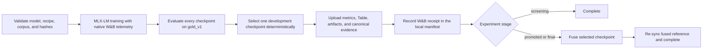

# W&B experiment platform

This repository uses Weights & Biases (W&B) as the mandatory online mirror for
experiment comparison, campaign orchestration, checkpoint inspection, and
artifact receipts. Local manifests, inventories, immutable revisions, and
SHA-256 values remain the canonical authority for reproducible bytes.

New experiments are therefore complete only when both sides agree:

- local training and evaluation evidence exists and is content-addressed; and
- W&B has accepted that evidence and returned a receipt recorded in the local
  training manifest.

W&B is not a replacement for `eval/training-runs/`, `model-manifest.json`, or
the artifact locks under `models/`. It is the collaboration and comparison
layer over those records.

## Implementation map

| Component | Responsibility |
| --- | --- |
| [`fine-tuning/tools/run_experiment.py`](../fine-tuning/tools/run_experiment.py) | Runs one immutable MLX-LM experiment, configures native online W&B telemetry, evaluates checkpoints, synchronizes evidence, and fuses only promoted/final runs. |
| [`fine-tuning/eval/experiment.py`](../fine-tuning/eval/experiment.py) | Validates the supported search space, hashes the recipe, creates collision-resistant run IDs, tags campaigns, and defines deterministic checkpoint ranking. |
| [`fine-tuning/tools/evaluate_checkpoints.py`](../fine-tuning/tools/evaluate_checkpoints.py) | Evaluates every saved checkpoint on the fixed `gold_v1` development protocol and selects the development checkpoint. |
| [`fine-tuning/eval/wandb_evidence.py`](../fine-tuning/eval/wandb_evidence.py) | Logs checkpoint metrics, the per-example Table, versioned artifacts, canonical evidence, and the W&B receipt. It also implements resumable synchronization. |
| [`fine-tuning/eval/campaign.py`](../fine-tuning/eval/campaign.py) and [`fine-tuning/tools/select_campaign.py`](../fine-tuning/tools/select_campaign.py) | Plan multi-seed promotions and select the winning recipe without reading `gold_v2`. |
| [`fine-tuning/tools/promote_experiment.py`](../fine-tuning/tools/promote_experiment.py) | Promotes an existing screening run without repeating seed-424242 training, re-synchronizes all promoted checkpoints, and performs receipt-gated fusion. |
| [`fine-tuning/tools/sync_wandb.py`](../fine-tuning/tools/sync_wandb.py) | Resumes a failed upload and attaches post-selection final evaluation or publication evidence. |
| [`fine-tuning/tools/import_wandb_history.py`](../fine-tuning/tools/import_wandb_history.py) | Mirrors the two committed legacy runs into a separate read-only W&B backfill group without modifying their historical manifests. |

The main lifecycle is:



## Identity and grouping

An experiment recipe is validated by `ExperimentConfig`. Its configuration
SHA-256 covers the byte-affecting training controls, including fine-tune type,
trainable layers, rank, effective scale, dropout, learning rate, iterations,
batching, sequence length, checkpoint cadence, prompt masking, and learning
rate schedule. Model family and seed are represented separately in the run
identity; campaign and stage are orchestration metadata.

The immutable local run ID is:

```text
<model-key>-<configuration-sha256>-seed-<seed>-wb-<wandb-run-id>
```

W&B uses the same W&B run ID and resumes it with `WANDB_RESUME=allow`. Online
runs are organized as follows:

- project: `WANDB_PROJECT`, defaulting to `creg-sql`;
- group: the campaign ID;
- job type: `screening`, `confirmation`, or `final` (the historical local
  stage name `promoted` maps to W&B `confirmation`);
- tags: model family, fine-tune type, corpus hash, prompt version, policy
  version, Git commit, status, and stage; and
- run name: the full immutable local run ID.

The corpus tag carries the complete SHA-256 in unpadded base64url so it stays
within W&B's 64-character tag limit. Canonical local manifests and W&B config
retain the hexadecimal digest.

The API key is read from the environment and is never written to the training
manifest. The entity, project, W&B run ID, run URL, and completed receipt are
recorded because they are part of the experiment provenance.

## What is logged

### Live training telemetry

`run_experiment` generates an `effective-config.yaml` with `report_to: wandb`
and starts MLX-LM with `WANDB_MODE=online`. MLX-LM reports live values such as:

- `train_loss` and `val_loss`;
- `learning_rate`;
- `iterations_per_second` and `tokens_per_second`;
- `trained_tokens`; and
- `peak_memory`.

The effective configuration contains the complete experiment configuration
and repository metadata used by the run. Git, hardware, base-model, corpus,
configuration, and input-file hashes are also retained in the local manifest
and canonical evidence artifact. Recorded phase durations (currently the
training duration) are added to the W&B run summary.

### Development checkpoint metrics

Every expected adapter checkpoint is evaluated. For a normal 600-iteration
run this means iterations 100, 200, 300, 400, 500, and 600. Each checkpoint
logs:

- `checkpoint/gold_v1/ex`;
- `checkpoint/gold_v1/valid_sql_rate`;
- `checkpoint/gold_v1/worst_tier_ex`;
- `checkpoint/gold_v1/p95_latency_us`;
- mean entropy for correct and incorrect results;
- adapter size;
- execution accuracy by tier; and
- failure-bucket counts.

The selected checkpoint is copied into the run summary as:

- `development/checkpoint_iteration`;
- `development/ex`;
- `development/valid_sql_rate`;
- `development/worst_tier_ex`; and
- `development/p95_latency_us`.

`development/ex` is the W&B Sweep objective. Intermediate synthetic validation
loss is useful for diagnosing training, but it is not the campaign-selection
objective.

### Per-example W&B Table

The run logs `checkpoint/gold_v1/examples`. It contains one row for every
checkpoint and every one of the 60 development items. Columns include the
checkpoint iteration, item ID, tier, tags, question, gold and predicted SQL,
canonical result rows, EX result, failure bucket, error, latency, generation
time, and entropy.

This is the primary online surface for understanding *why* runs differ. It
also means full evaluation questions, SQL, and result rows are uploaded to the
configured W&B entity; use an entity and project whose access controls are
appropriate for that data.

### Artifacts and receipts

Each synchronization registers versioned artifacts for the available evidence:

- `dataset`: regenerated train/validation data, gate statistics, and the
  corpus manifest;
- `evaluation`: the checkpoint comparison plus the selected development
  evaluation; later, the attached `gold_v2` final evaluation;
- `model`: `adapter_config.json` plus the selected checkpoint for screening
  runs, or every saved checkpoint for promoted/final runs;
- `model-reference`: immutable base-model and fused-model references, their
  Hugging Face revisions when available, and repository directory hashes; and
- `evidence`: the canonical `wandb-evidence.json` record.

Large base and fused model weights stay on Hugging Face or in the verified
local model store; W&B receives immutable references and hashes rather than a
second copy of those weights.

After winner selection, synchronization uploads separate immutable artifacts
for gold-v2 evaluation, schema-v3 policy calibration, Swift/Python parity and
explanations, publication, Release-bundle inspection, and physical-device
timing/thermal evidence. The winning run also receives their headline metrics.
W&B and Weave are never linked into the offline app, and production user
questions, conversations, or diagnostics are never uploaded.

Every artifact receipt records its name, version, W&B digest, type, and the
repository SHA-256 for each uploaded file. `wandb-evidence.json` deliberately
excludes the mutable top-level `manifest.json`. Its SHA-256 is uploaded first;
only after a successful upload is the returned receipt added to the manifest.
This ordering avoids a circular hash dependency.

## Fixed development protocol

Checkpoint evaluation is intentionally hard-wired to:

- `eval/gold/gold_v1.jsonl`;
- all 60 items;
- grammar-constrained decoding on;
- temperature `0`; and
- evaluation seed `0`.

The selected checkpoint is the first winner under this ordered comparison:

1. execution accuracy, descending;
2. valid-SQL rate, descending;
3. worst-tier execution accuracy, descending;
4. p95 latency, ascending; and
5. checkpoint iteration, ascending.

There is no `gold_v2` option in the checkpoint evaluator or campaign selector.
`gold_v2` is post-selection evidence only and must never influence sweep,
recipe, checkpoint, or seed selection.

## Online setup

Create a local, Git-ignored `.envrc` in the repository root to set the W&B
routing only while working in this repository:

```sh
printf '%s\n' \
  'export WANDB_ENTITY=pathlaw' \
  'export WANDB_PROJECT=creg-sql' > .envrc
```

Authorize it once from the repository root:

```sh
direnv allow
```

Run all commands from `fine-tuning/` and through the locked `uv` environment:

```sh
cd fine-tuning
uv sync --frozen

export WANDB_API_KEY="<secret>"
```

If `direnv` is unavailable, manually export `WANDB_ENTITY=pathlaw` and
`WANDB_PROJECT=creg-sql` before running the commands. If experiments should
belong to a W&B team rather than the `pathlaw` entity, change `.envrc` before
the first run.

Do not add `WANDB_API_KEY` to `.envrc`, commit it, or place it in generated
configs. Both `WANDB_API_KEY` and `WANDB_ENTITY` are required. Do not set
`WANDB_MODE=offline` for campaign runs: the runner explicitly requires the
online workflow and downstream gates require a completed receipt.

Verified base models must already be present under `models/`. If needed, fetch
them with:

```sh
uv run --frozen python tools/fetch_model.py
```

## Run one experiment online

Start with a short authenticated smoke run:

```sh
uv run --frozen python -m tools.run_experiment \
  --model-key qwen25-coder-3b \
  --campaign-id creg-sql-reliability-v2-smoke \
  --iterations 100
```

This still trains a real adapter, evaluates all 60 `gold_v1` items at the
iteration-100 checkpoint, uploads the Table and artifacts, and records a real
receipt. It is not a mocked connectivity check.

A complete explicit screening run looks like:

```sh
uv run --frozen python -m tools.run_experiment \
  --model-key qwen25-coder-3b \
  --campaign-id creg-sql-reliability-v2-qwen25-coder-3b-screening \
  --stage screening \
  --seed 424242 \
  --fine-tune-type dora \
  --trainable-layers all \
  --rank 16 \
  --scale-ratio 2.0 \
  --dropout 0.05 \
  --learning-rate 0.00005 \
  --iterations 600
```

The immutable local record is written to `../eval/training-runs/<run-id>/`.
MLX-LM writes adapter checkpoints and its W&B transport logs to per-run
scratch. After training exits, the runner accepts only the exact expected
adapter config/final/checkpoint files and transactionally materializes the
symlink-free artifact beneath `../models/adapters/<campaign-id>/<run-id>/`.
Screening runs do not fuse a model. Promoted and final runs synchronize once
to authorize fusion, fuse only the selected checkpoint, and synchronize again
to record the fused reference.

## Run the initial online sweep campaign

The repository defines two independent 18-run random sweeps:

- [`qwen25-coder-3b.yaml`](../fine-tuning/config/sweeps/qwen25-coder-3b.yaml)
- [`xiyansql-qwencoder-3b.yaml`](../fine-tuning/config/sweeps/xiyansql-qwencoder-3b.yaml)

Create them and save the two sweep IDs printed by W&B:

```sh
uv run --frozen wandb sweep \
  --entity "$WANDB_ENTITY" \
  --project "${WANDB_PROJECT:-creg-sql}" \
  config/sweeps/qwen25-coder-3b.yaml

uv run --frozen wandb sweep \
  --entity "$WANDB_ENTITY" \
  --project "${WANDB_PROJECT:-creg-sql}" \
  config/sweeps/xiyansql-qwencoder-3b.yaml
```

Start an agent for each sweep. Agents may run on separate eligible Apple
Silicon machines, but each must use the same repository revision, locked
environment, verified base models, and W&B project:

```sh
uv run --frozen wandb agent \
  "$WANDB_ENTITY/${WANDB_PROJECT:-creg-sql}/<sweep-id>"
```

Each sweep fixes seed `424242`, 600 iterations, checkpoints every 100, batch
size 4, accumulation 1, prompt masking, a 2,048-token maximum, and a constant
learning rate. Random search covers LoRA/DoRA, last-16/all layers, rank
4/8/16, scale ratio 1.0/2.0/2.5, dropout 0/0.05, and a log-uniform learning
rate from `2e-5` through `2e-4`. There is no Hyperband early termination
because the objective is post-training execution accuracy.

After all 36 screening runs complete, create the promotion plan by passing all
screening run directories:

```sh
uv run --frozen python -m tools.select_campaign plan-promotions \
  --training-run ../eval/training-runs/<screening-run-1> \
  --training-run ../eval/training-runs/<screening-run-2> \
  ... \
  --training-run ../eval/training-runs/<screening-run-36> \
  --output ../eval/promotion-plan.json
```

The plan selects two recipes per family. Confirm each recipe at seeds 424240,
424241, and 424242. Reuse seed 424242 instead of retraining it:

```sh
uv run --frozen python -m tools.promote_experiment \
  --training-run ../eval/training-runs/<reused-seed-424242-run> \
  --stage promoted
```

Run seeds 424240 and 424241 with `tools.run_experiment`, the exact recipe from
the plan, and `--stage promoted`. This adds eight training runs, for 44 total:
36 screening runs plus eight new confirmations.

Select the winner by passing all 12 promoted seed-results:

```sh
uv run --frozen python -m tools.select_campaign select-winner \
  --training-run ../eval/training-runs/<promoted-result-1> \
  ... \
  --training-run ../eval/training-runs/<promoted-result-12> \
  --output ../eval/campaign-winner.json
```

The selector compares four recipes by mean item-clustered `gold_v1` EX, then
valid-SQL rate, worst-tier EX, p95 latency, and lower trainable-parameter
count. The winning recipe's seed-424242 run is canonical. Promote that run to
the final stage before post-selection evaluation:

```sh
uv run --frozen python -m tools.promote_experiment \
  --training-run ../eval/training-runs/<winning-seed-424242-run> \
  --stage final
```

## How to use the W&B project online

Open `https://wandb.ai/<WANDB_ENTITY>/<WANDB_PROJECT>`; with the default this
is `https://wandb.ai/<WANDB_ENTITY>/creg-sql`.

Use the hosted project as a comparison and review surface:

1. Filter to `status:complete`, then select a campaign group. Do not compare
   incomplete runs with completed evidence.
2. Add run-table columns for the recipe fields (`model_key`,
   `fine_tune_type`, `trainable_layers`, `rank`, `scale_ratio`, `dropout`, and
   `learning_rate`) and the five `development/*` summary values.
3. Sort first by `development/ex`, then inspect valid-SQL rate, worst-tier EX,
   and p95 latency. The local selector remains authoritative for exact
   tie-breaking.
4. Plot live `train_loss`, `val_loss`, learning rate, throughput, and memory to
   diagnose optimization. Plot `checkpoint/gold_v1/ex` against checkpoint
   iteration to see whether the adapter peaked early.
5. For completed sweeps, use the sweep comparison views, parallel-coordinates
   plot, and parameter-importance views to understand the search space. Do not
   promote based on those visualizations alone; use `select_campaign`.
6. Open `checkpoint/gold_v1/examples` to compare the same item across
   checkpoints or runs. Filter on `ex = false`, failure bucket, tier, error,
   or high entropy to identify recurring failure modes.
7. Use the Artifacts view to inspect exact versions, W&B digests, repository
   SHA-256 metadata, and the producing run. Follow Hugging Face references for
   large base or fused weights.
8. Use tags to separate model families, fine-tune types, corpus revisions, Git
   revisions, and stages. Historical backfills belong to the
   `historical-backfill` group and are baselines, not selection candidates.

Treat W&B runs and artifact versions as immutable experiment history. Add
workspace panels, filters, and reports for interpretation, but do not delete
runs, rewrite configs or summaries, or substitute a UI edit for a new
content-addressed experiment. A W&B run page is convenient evidence; the
receipt embedded in the local manifest is what authorizes downstream gates.

## Failure recovery and run states

The normal manifest states are:

```text
training -> training_complete -> evaluating -> local_complete
         -> synchronizing_wandb -> wandb_complete/complete
```

Promoted/final runs pass through `wandb_complete`, fuse locally, return to
`local_complete`, synchronize the fused reference, and then become `complete`.
Failures use `training_failed`, `evaluation_failed`, or `awaiting_wandb`.

If W&B synchronization fails, local training, checkpoint evaluations, and
`wandb-evidence.json` remain intact. The manifest records the error and moves
to `awaiting_wandb`. After credentials or connectivity are restored, resume
the same run:

```sh
uv run --frozen python -m tools.sync_wandb \
  --training-run ../eval/training-runs/<run-id>
```

Synchronization is idempotent when the existing completed receipt matches the
current canonical-evidence SHA-256. Do not use this command to disguise a
training or evaluation failure; inspect `training.log` or the checkpoint logs
and create a new immutable experiment when computation itself failed.

Fusion, finalist registration, publication, and production finalization reject
new shared-authority runs whose W&B receipt is missing or incomplete.

## Historical backfill

To mirror the two committed legacy training runs and their matching
evaluations for visual baseline comparison:

```sh
uv run --frozen python -m tools.import_wandb_history
```

Backfill runs use fixed `historical`, `read-only`, and family tags, the
`historical-backfill` group, and `backfill` job type. Receipts are written
under `eval/wandb-backfill/`. Historical manifests are hash-checked before and
after upload and are never modified. These runs are not shared-authority
campaign inputs.

## Attach post-selection evidence

Only a run already marked `final` may receive final evaluation or publication
evidence. After the winning recipe and seed-424242 run have been selected, run
the existing `gold_v2` evaluation gate and attach its completed run:

```sh
uv run --frozen python -m tools.sync_wandb \
  --training-run ../eval/training-runs/<final-run> \
  --final-evaluation ../eval/runs/<gold-v2-run>
```

The attached artifact is marked `selection_use: forbidden`. Publish through
the repository's existing publication gate, verify a fresh pinned download,
then attach the immutable publication record:

```sh
uv run --frozen python -m tools.sync_wandb \
  --training-run ../eval/training-runs/<final-run> \
  --publication ../eval/publications/<publication>/publication.json
```

The publication record must belong to the same training run and show a
successful fresh-download verification. Its Hugging Face repository, pinned
revision, directory hash, and local lock hash are then added to W&B evidence.

## Verification

The W&B contract is covered by local tests that use test doubles rather than
network access:

```sh
uv run --frozen pytest \
  tests/test_experiment_platform.py \
  tests/test_campaign.py
```

Run the full suite before changing campaign, evidence, or publication code:

```sh
uv run --frozen pytest
```

The tests cover configuration hashing, run identities, environment
requirements, fixed checkpoint evaluation, metric and Table schemas, artifact
receipts, upload recovery, held-out-set isolation, multi-seed campaign
selection, and downstream W&B gates. They do not replace the short
authenticated smoke run, which is the end-to-end check of the real online
service.

## External references

- [W&B Runs](https://docs.wandb.ai/models/runs)
- [W&B Tables](https://docs.wandb.ai/models/tables)
- [W&B Artifacts](https://docs.wandb.ai/models/artifacts)
- [W&B Sweeps](https://docs.wandb.ai/models/sweeps)
- [MLX-LM LoRA and W&B logging](https://github.com/ml-explore/mlx-lm/blob/main/mlx_lm/LORA.md)
